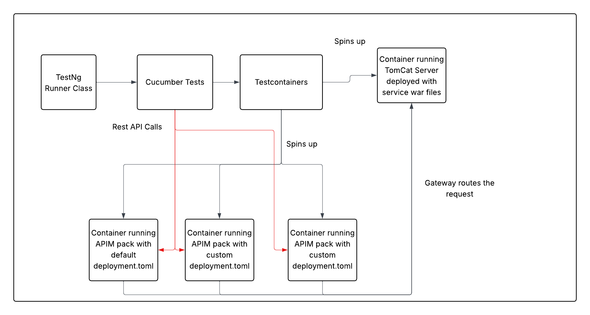

# Architecture Overview: Containerized Integration Test Framework for WSO2 API Manager

 

## Architecture Diagram

To better illustrate the framework, see the diagram below:

 

---

 

## 1. Test Execution Entry Point

### **TestNG Runner Class**

- Serves as the entry point for executing integration tests.
- Initializes and orchestrates the execution of **Cucumber Tests**.

 

## 2. Test Logic & Behavior-Driven Development

### **Cucumber Tests**

- Implements BDD (Behavior-Driven Development) style tests using Gherkin syntax.
- Interacts with API Manager through **REST API calls** to perform actions like API creation, publishing, and invocation.
- Works as the main test layer that validates API Manager functionality.

 

## 3. Container Orchestration

### **Testcontainers**

- Dynamically spins up required Docker containers for the test environment.
- Provides isolated and customizable container instances of WSO2 API Manager using different `deployment.toml` configurations.

 

## 4. Application Runtime Instances

### **Container running APIM pack with default `deployment.toml`**

- Acts as a baseline API Manager instance with default configurations.
- Useful for comparing behavior against customized instances.

 

### **Container(s) running APIM pack with custom `deployment.toml`**

- Created to test different configurations, features, or tuning parameters.
- Can simulate different deployment environments.

 

> All containers receive REST API calls from the Cucumber tests to execute API management operations like:
> - Creating APIs
> - Updating API lifecycle states
> - Deploying revisions
> - Subscribing applications

 

## 5. Additional Service Container

### **Container running NodeApp Server deployed with service WAR files**

- Hosts backend services (often mock services or sample applications).
- These services act as the **backend endpoints** for published APIs.
- **Spun up by Testcontainers** alongside API Manager instances.
- Serves responses that are routed through the API Gateway, allowing **end-to-end validation** of API invocation.

 

## 6. API Gateway

- Operates as the routing layer of WSO2 API Manager.
- Routes API requests (originating from test scenarios) to the backend service running on the NodeApp container.
- This ensures real-world simulation of API calls, from gateway to backend.

 

---

 

This architecture allows for:

- **Full lifecycle testing** of WSO2 API Manager using actual containerized deployments.
- **Dynamic configuration testing** with multiple `deployment.toml` setups.
- **Fast and isolated** testing environments using **Testcontainers**.
- **End-to-end validation** via a real API Gateway and service backend (NodeApp).

It is ideal for **automated integration testing** and **feature validation across different configurations**.

 

The framework is organized as follows:

- **tests-common/integration-test-utils/**: Utilities for test writing and API interactions.
- **tests-common/testcontainers/**: Custom Testcontainers for APIM.
- **tests-integration/cucumber-tests/**: Cucumber-based integration tests.

 

See [Code Structure](code-structure.md) for details.