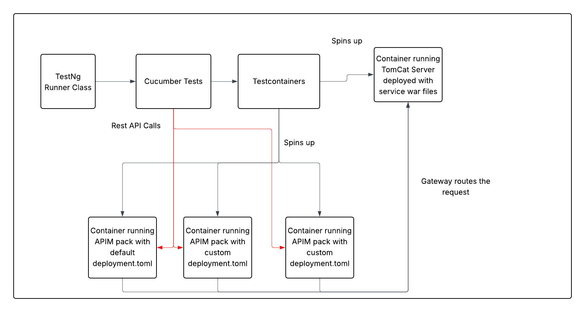

# Architecture Overview: Containerized Integration Test Framework for WSO2 API Manager

 

## Architecture Diagram

To better illustrate the framework, see the diagram below:

 

---

 

## 1. Test Execution Entry Point

### **TestNG Runner Class**

- Serves as the entry point for executing integration tests.
- Initializes and orchestrates the execution of **Cucumber Tests**.

 

## 2. Test Logic & Behavior-Driven Development

### **Cucumber Tests**

- Implements BDD (Behavior-Driven Development) style tests using Gherkin syntax.
- Interacts with API Manager through **REST API calls** to perform actions like API creation, publishing, and invocation.
- Works as the main test layer that validates API Manager functionality.

 

## 3. Container Orchestration

### **Testcontainers**

- Dynamically spins up required Docker containers for the test environment.
- Provides isolated container instances of WSO2 API Manager using different `deployment.toml` configurations.
- Provides container instance of Node app backend servers
- Testcontainers dynamically manage the lifecycle of those containers during test execution.
- The framework can start/stop containers as needed, inject custom configurations, and expose required ports to the test environment.
- Containers are isolated per test run, ensuring repeatable and reliable integration testing.

 

## 4. Application Runtime Instances

### **Container running APIM pack with a given `deployment.toml`**

- Used to API Manager instance with either default configurations or custom configurations
- All containers receive REST API calls from the Cucumber tests to execute API management operations like: - Creating APIs - Updating API lifecycle states - Deploying revisions - Subscribing applications

 

### **Container(s) running NodeApp Servers**

- Hosts backend services (often mock services or sample applications).
- These services act as the backend endpoints for published APIs.
- Spun up by Testcontainers alongside API Manager instances.
- Serves responses that are routed through the API Gateway, allowing end-to-end validation of API invocation.

 

This architecture allows for:

- **Full lifecycle testing** of WSO2 API Manager using actual containerized deployments.
- **Dynamic configuration testing** with multiple `deployment.toml` setups.
- **Fast and isolated** testing environments using **Testcontainers**.
- **End-to-end validation** via a real API Gateway and service backend (NodeApp).

It is ideal for **automated integration testing** and **feature validation across different configurations**.

 

The framework is organized as follows:

- **tests-common/integration-test-utils/**: Helper classes for API and test logic
- **tests-common/testcontainers/**: Containers implementation for APIM.
- **tests-integration/cucumber-tests/**: Cucumber-based integration tests.

 

See [Code Structure](code-structure.md) for details.