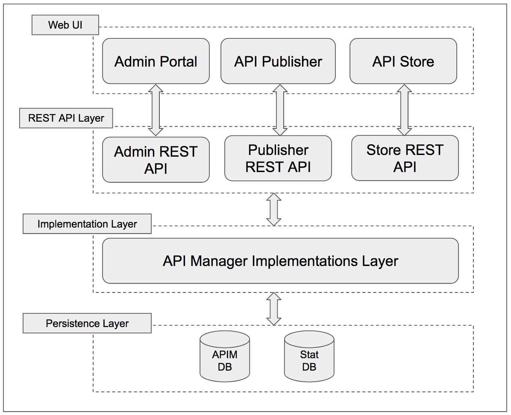

# WSO2 API Manager v3 Design and Architecture

API Manager consists of 5 main runtimes

1. APIM Core
1. API Gateway
1. Key Manager
1. Traffic Manager
1. Analytics

## APIM Core

API Core consits of several micro services.The following diagram depicts the aggregation of the sub-components of the API Manager Core.

(images/API-Core.png?raw=true "API Core")
*API Core diagram*

## API Geteway

 
