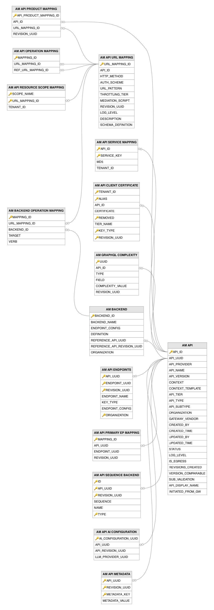
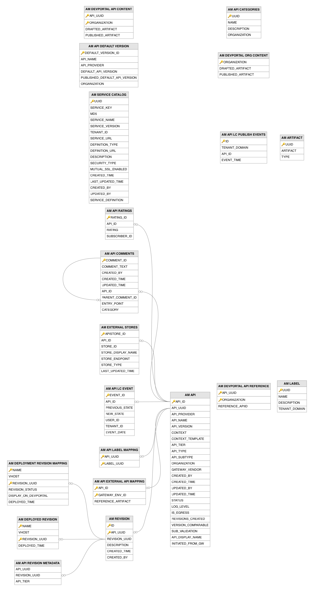

# API Management Core Related Tables

This section lists out all the API management core related tables and their attributes in the WSO2 API Manager database.

---

## Table Definitions

### AM_API

This table serves as the central registry for all APIs managed by WSO2 API Manager, storing the core metadata for each API version. A record is created when a publisher designs a new API or imports one via the REST API. It tracks the API lifecycle status, type, and revision history. Related resources such as URL mappings, subscriptions, and deployment information reference this table through the `API_ID` or `API_UUID` columns.

| Column | Description |
|--------|-------------|
| API_ID | Primary key. Auto-generated internal identifier for the API, used as a foreign key reference throughout the schema. |
| API_UUID | Unique. The universally unique identifier for the API, used in REST API references and cross-system integrations. |
| API_PROVIDER | The username of the API publisher who owns and manages this API. |
| API_NAME | The name of the API as displayed in the Publisher and Developer Portal. |
| API_VERSION | The version string of the API, combined with `API_NAME` and `API_PROVIDER` to form a unique identity. |
| CONTEXT | The URL context path under which the API is exposed at the Gateway. |
| CONTEXT_TEMPLATE | The context path template containing a `{version}` placeholder, used to generate versioned context paths dynamically. |
| API_TIER | The default throttling policy tier applied to this API, controlling the request rate limit for all resources unless overridden. |
| API_TYPE | The protocol type of the API (for example, HTTP, WS, SSE, GRAPHQL, ASYNC), determining how the Gateway handles traffic. |
| API_SUBTYPE | The subtype classification of the API within its primary type. Stores values such as `DEFAULT`, `AIAPI` (an LLM-proxy API), `SERVER_PROXY`, `DIRECT_BACKEND`, or `EXISTING_API`; an empty value is treated as `DEFAULT`. |
| ORGANIZATION | The organization to which this API belongs, enabling organization-scoped API management. |
| GATEWAY_VENDOR | The Gateway vendor that serves this API (defaults to `wso2`), supporting multi-vendor Gateway deployments. |
| CREATED_BY | The username of the user who created this API. |
| CREATED_TIME | The timestamp when this API was initially created. |
| UPDATED_BY | The username of the user who last modified this API. |
| UPDATED_TIME | The timestamp when this API was last modified. |
| STATUS | The current lifecycle status of the API (for example, CREATED, PUBLISHED, DEPRECATED, BLOCKED, RETIRED). |
| LOG_LEVEL | The per-API logging verbosity level used for diagnostic and debugging purposes (defaults to `OFF`). |
| IS_EGRESS | Integer flag (defaults to `0`) indicating whether this is an egress API that proxies outbound traffic to external services; `1` marks it as egress. |
| REVISIONS_CREATED | The running count of revisions created for this API, used to enforce the maximum revision limit. |
| VERSION_COMPARABLE | A normalized version string formatted for lexicographic sorting, enabling correct version ordering. |
| SUB_VALIDATION | Controls whether the Gateway validates subscription status before allowing API invocation. Stores `ENABLED` (the default) or `DISABLED`. |
| API_DISPLAY_NAME | The human-friendly display name shown in portal UIs, which may differ from the technical `API_NAME`. |
| INITIATED_FROM_GW | Integer flag (defaults to `0`) indicating whether this API was initiated/discovered from an existing Gateway deployment (`1`) rather than created through the Publisher portal (`0`). |

---

### AM_API_AI_CONFIGURATION

This table links APIs to their AI/LLM provider configurations, defining which LLM provider and settings an AI-proxied API should use at the Gateway. A record is created when a publisher configures an API to proxy requests to a specific LLM provider. The configuration is revision-aware, allowing different revisions of the same API to target different LLM providers.

| Column | Description |
|--------|-------------|
| AI_CONFIGURATION_UUID | Primary key. The universally unique identifier for this AI configuration entry. |
| API_UUID | Foreign key to the `AM_API` table. The API that is configured to proxy requests to an LLM provider. |
| API_REVISION_UUID | The revision of the API that this AI configuration applies to, enabling per-revision LLM routing. |
| LLM_PROVIDER_UUID | Foreign key to the `AM_LLM_PROVIDER` table. The LLM provider that this API routes inference requests to. |

---

### AM_API_CATEGORIES

This table defines categories for organizing and classifying APIs in the Developer Portal, helping consumers browse and discover APIs by business domain. Records are created when an administrator defines categories through the Admin portal. Categories are scoped to an organization, allowing different organizations to maintain independent category taxonomies.

| Column | Description |
|--------|-------------|
| UUID | Primary key. The universally unique identifier for this category. |
| NAME | The name of the category, unique within an organization. |
| DESCRIPTION | A human-readable description of what types of APIs this category encompasses. |
| ORGANIZATION | The organization to which this category belongs, allowing independent category taxonomies per organization. |

---

### AM_API_CLIENT_CERTIFICATE

This table stores client certificates for mutual SSL (mTLS) authentication on a per-API basis, enabling the Gateway to require and validate client certificates for specific APIs. Records are created when a publisher uploads client certificates for an API and associates them with a throttling tier. The `REMOVED` flag supports soft-deletion so that certificate history is preserved across revisions.

| Column | Description |
|--------|-------------|
| TENANT_ID | The identifier of the tenant that owns this client certificate. |
| ALIAS | Part of the composite primary key. The unique alias name identifying this client certificate. |
| API_ID | Foreign key to the `AM_API` table. The API that requires this client certificate for mutual TLS authentication. |
| CERTIFICATE | The client certificate content, stored as binary data. |
| REMOVED | Part of the composite primary key. Boolean flag (defaults to `0`/false) indicating whether this certificate has been soft-deleted, preserving history across revisions. |
| TIER_NAME | The throttling tier associated with requests authenticated using this client certificate. |
| KEY_TYPE | Part of the composite primary key. The environment type this certificate applies to, `PRODUCTION` (the default) or `SANDBOX`. |
| REVISION_UUID | Part of the composite primary key. The revision of the API that this certificate configuration is scoped to. |

---

### AM_API_COMMENTS

This table stores user comments posted on APIs in the Developer Portal, supporting threaded discussions through self-referencing parent comments. A record is created when a developer or publisher posts a comment or reply on an API's overview page. Comments support threading via the `PARENT_COMMENT_ID` column, which references the `AM_API_COMMENTS` table itself.

| Column | Description |
|--------|-------------|
| COMMENT_ID | Primary key. The universally unique identifier for this comment. |
| COMMENT_TEXT | The text content of the comment posted by the user. |
| CREATED_BY | The username of the user who authored this comment. |
| CREATED_TIME | The timestamp when this comment was initially posted. |
| UPDATED_TIME | The timestamp when this comment was last edited. |
| API_ID | Foreign key to the `AM_API` table. The API that this comment was posted on. |
| PARENT_COMMENT_ID | Foreign key to the `AM_API_COMMENTS` table. The parent comment this is a reply to, enabling threaded discussions (null for top-level comments). |
| ENTRY_POINT | The portal surface from which the comment was posted. Stores `PUBLISHER` (Publisher portal) or `DEVPORTAL` (Developer Portal). |
| CATEGORY | A free-text classification tag for the comment (defaults to `general`), allowing comments to be grouped or filtered by purpose. |

---

### AM_API_DEFAULT_VERSION

This table tracks which version of an API is designated as the default, allowing consumers to invoke the API without specifying a version in the URL. A record is created or updated when a publisher marks a particular API version as the default. The `PUBLISHED_DEFAULT_API_VERSION` column ensures the Gateway continues to route default-version traffic to a published version even when a newer version is still being designed.

| Column | Description |
|--------|-------------|
| DEFAULT_VERSION_ID | Primary key. Auto-generated unique identifier for this default version record. |
| API_NAME | The name of the API for which a default version is configured. |
| API_PROVIDER | The provider/owner of the API. |
| DEFAULT_API_VERSION | The version string currently designated as the default, used for versionless API invocation URLs. |
| PUBLISHED_DEFAULT_API_VERSION | The default version that is currently in the PUBLISHED lifecycle state, ensuring the Gateway routes to a live version. |
| ORGANIZATION | The organization to which this default version configuration belongs. |

---

### AM_API_ENDPOINTS

This table stores endpoint configurations for each API revision, defining how the Gateway routes requests to backend services. Records are created when a publisher configures production or sandbox endpoint URLs for an API, and new entries are generated for each revision snapshot. The `KEY_TYPE` column distinguishes between PRODUCTION and SANDBOX endpoints.

| Column | Description |
|--------|-------------|
| API_UUID | Part of the composite primary key. Foreign key to the `AM_API` table. The API that this endpoint configuration belongs to. |
| ENDPOINT_UUID | Part of the composite primary key. The unique identifier for this endpoint entry. |
| REVISION_UUID | Part of the composite primary key. The revision this endpoint configuration is associated with (defaults to `Current API`). |
| ENDPOINT_NAME | The human-readable name identifying this endpoint configuration. |
| KEY_TYPE | The environment type this endpoint serves (typically `PRODUCTION` or `SANDBOX`), allowing different backend targets per environment. |
| ENDPOINT_CONFIG | The endpoint details (such as URL, timeouts, retry policies, and load balancing settings), stored as binary content (serialized JSON). |
| ORGANIZATION | Part of the composite primary key. The organization to which this endpoint configuration belongs. |

---

### AM_API_EXTERNAL_API_MAPPING

This table maps APIs to their corresponding configurations on external Gateway environments, storing the reference artifacts needed to manage APIs that are deployed on third-party Gateway platforms. Records are created when an API is associated with an external Gateway environment. The `REFERENCE_ARTIFACT` column holds the external Gateway's API identifier and configuration details needed for lifecycle synchronization.

| Column | Description |
|--------|-------------|
| API_ID | Part of the composite primary key. Foreign key to the `API_UUID` column of the `AM_API` table. The API being managed on the external Gateway. |
| GATEWAY_ENV_ID | Part of the composite primary key. Foreign key to the `UUID` column of the `AM_GATEWAY_ENVIRONMENT` table. The external Gateway environment where the API is deployed. |
| REFERENCE_ARTIFACT | The reference artifact (stored as binary content) containing the external Gateway's API identifier and configuration for lifecycle synchronization. |

---

### AM_API_LABEL_MAPPING

This table associates APIs with labels, enabling many-to-many relationships between APIs and labels for flexible grouping and filtering. Records are created when a publisher assigns labels to an API through the Publisher portal. The `API_UUID` column references the `AM_API` table and the `LABEL_UUID` column corresponds to an entry in the `AM_LABEL` table.

| Column | Description |
|--------|-------------|
| API_UUID | Part of the composite primary key. Foreign key to the `AM_API` table. The API that this label is assigned to. |
| LABEL_UUID | Part of the composite primary key. The UUID of the label (from the `AM_LABEL` table) assigned to the API. |

---

### AM_API_LC_EVENT

This table provides an audit trail of all API lifecycle state transitions, recording who changed the state, when, and what the previous and new states were. A record is inserted each time a publisher transitions an API through its lifecycle. This history is used for compliance auditing, governance reporting, and displaying the lifecycle change log in the Publisher portal.

| Column | Description |
|--------|-------------|
| EVENT_ID | Primary key. Auto-generated unique identifier for this lifecycle event. |
| API_ID | Foreign key to the `AM_API` table. The API whose lifecycle state was changed. |
| PREVIOUS_STATE | The lifecycle state the API was in before this transition. |
| NEW_STATE | The lifecycle state the API transitioned to. |
| USER_ID | The username of the publisher who initiated the lifecycle state change. |
| TENANT_ID | The identifier of the tenant in which this lifecycle event occurred. |
| EVENT_DATE | The timestamp when the lifecycle state transition took place. |

---

### AM_API_LC_PUBLISH_EVENTS

This table records timestamp-based events whenever an API is published, providing a simplified event log for external integrations and notification systems. A record is created each time an API transitions to the PUBLISHED lifecycle state. Unlike the `AM_API_LC_EVENT` table which tracks all lifecycle transitions, this table specifically captures publication events and is optimized for querying publish history by tenant and time range.

| Column | Description |
|--------|-------------|
| ID | Primary key. Auto-generated unique identifier for this publish event. |
| TENANT_DOMAIN | The tenant domain in which the API was published. |
| API_ID | The identifier of the API that was published. |
| EVENT_TIME | The timestamp when the API transitioned to the PUBLISHED lifecycle state. |

---

### AM_API_METADATA

This table stores extensible key-value metadata associated with a specific API revision. Records are created or updated when a publisher attaches custom metadata properties to an API. Each entry is scoped to a particular revision, with the default value `Current API` representing the working copy before any revision is created.

| Column | Description |
|--------|-------------|
| API_UUID | Part of the composite primary key. Foreign key to the `AM_API` table. The API that this metadata entry belongs to. |
| REVISION_UUID | Part of the composite primary key. The revision this metadata is scoped to (defaults to `Current API` for the working copy). |
| METADATA_KEY | Part of the composite primary key. The key identifying the metadata property. |
| METADATA_VALUE | The value of the metadata property. |

---

### AM_API_OPERATION_MAPPING

This table creates references between API operations, primarily used in API Product scenarios where a product operation references an underlying API's operation. Records are created when an API Product is composed from constituent API resources. This mapping enables the system to trace which source API operation a product operation originates from.

| Column | Description |
|--------|-------------|
| MAPPING_ID | Primary key. Auto-generated unique identifier for this operation mapping. |
| URL_MAPPING_ID | Foreign key to the `AM_API_URL_MAPPING` table. The source operation, typically an API Product operation. |
| REF_URL_MAPPING_ID | Foreign key to the `AM_API_URL_MAPPING` table. The referenced operation from the underlying constituent API. |

---

### AM_API_PRIMARY_EP_MAPPING

This table associates each API revision with its primary endpoint, establishing the default backend target used when no operation-level endpoint override is specified. A record is created automatically when a publisher saves the API endpoint configuration. This mapping enables the Gateway to resolve which endpoint to invoke for incoming API requests when no more specific backend mapping applies.

| Column | Description |
|--------|-------------|
| MAPPING_ID | Primary key. Auto-generated unique identifier for this mapping record. |
| API_UUID | Foreign key to the `AM_API` table. The API for which this primary endpoint is configured. |
| ENDPOINT_UUID | The unique identifier of the primary endpoint used as the default backend target for this API. |
| REVISION_UUID | The revision of the API that this primary endpoint mapping applies to (defaults to `Current API`). |

---

### AM_API_PRODUCT_MAPPING

This table maps API Products to the individual API resources they aggregate, defining which operations from which APIs are bundled into the product. Records are created when a publisher composes an API Product by selecting resources from one or more existing APIs. Each row links a product (referenced by `API_ID` pointing to the `AM_API` table) to a specific operation in the `AM_API_URL_MAPPING` table.

| Column | Description |
|--------|-------------|
| API_PRODUCT_MAPPING_ID | Primary key. Auto-generated unique identifier for this product mapping entry. |
| API_ID | Foreign key to the `AM_API` table. The API Product that aggregates this resource. |
| URL_MAPPING_ID | Foreign key to the `AM_API_URL_MAPPING` table. The specific operation from a constituent API that is included in the product. |
| REVISION_UUID | The revision of the API Product that this resource mapping belongs to. |

---

### AM_API_RATINGS

This table stores numeric ratings that subscribers assign to APIs on the Developer Portal, used to calculate and display average API ratings. A record is created when a subscriber rates an API, and it is updated if the same subscriber changes their rating. The aggregated ratings help developers discover popular APIs in the Developer Portal.

| Column | Description |
|--------|-------------|
| RATING_ID | Primary key. The universally unique identifier for this rating entry. |
| API_ID | Foreign key to the `AM_API` table. The API that this rating was given to. |
| RATING | The numeric rating value assigned by the subscriber. |
| SUBSCRIBER_ID | Foreign key to the `AM_SUBSCRIBER` table. The subscriber who rated this API. |

---

### AM_API_RESOURCE_SCOPE_MAPPING

This table associates OAuth2 scopes with specific API operations (resources), controlling which scopes are required to invoke a particular endpoint. Records are created when a publisher assigns scopes to API resources. When a consumer invokes an API operation, the Gateway verifies that the access token carries the required scopes listed in this mapping.

| Column | Description |
|--------|-------------|
| SCOPE_NAME | Part of the composite primary key. The name of the OAuth2 scope required to access this resource. |
| URL_MAPPING_ID | Part of the composite primary key. Foreign key to the `AM_API_URL_MAPPING` table. The API operation that requires this scope for authorization. |
| TENANT_ID | The identifier of the tenant to which this scope-resource mapping belongs. |

---

### AM_API_REVISION_METADATA

This table stores per-revision overrides for API metadata properties that can differ between revisions, such as the throttling tier. Records are created when a revision is deployed with metadata values that differ from the base API definition. The `REVISION_UUID` column references the specific revision in the `AM_REVISION` table.

| Column | Description |
|--------|-------------|
| API_UUID | The UUID of the API that this revision metadata override applies to. |
| REVISION_UUID | Foreign key to the `AM_REVISION` table. The specific revision that this metadata override is scoped to. |
| API_TIER | The throttling tier override for this specific revision, allowing different deployed revisions to use different rate limits. |

---

### AM_API_SEQUENCE_BACKEND

This table stores custom backend sequences attached to an API, used to define a custom (Synapse) backend per endpoint environment for APIs configured with a custom backend. Records are created when a publisher uploads a custom backend sequence for an API. The `TYPE` column identifies which endpoint environment the sequence applies to, so an API can have separate production and sandbox custom backends.

| Column | Description |
|--------|-------------|
| ID | Part of the composite primary key. The unique identifier for this custom backend sequence entry. |
| API_UUID | Part of the composite primary key. Foreign key to the `AM_API` table. The API whose backend this sequence is attached to. |
| REVISION_UUID | The revision of the API that this sequence belongs to (defaults to `0` for the working copy). |
| SEQUENCE | The custom backend sequence content (for example, Synapse XML configuration), stored as binary content. |
| NAME | The name of the custom backend sequence, typically derived from the uploaded sequence file name. |
| TYPE | Part of the composite primary key. The endpoint environment this custom backend applies to, storing the key type such as `PRODUCTION` or `SANDBOX`. |

---

### AM_API_SERVICE_MAPPING

This table links APIs to their source Service Catalog entries, maintaining the relationship between an API and the backend service definition it was created from. A record is created when a publisher creates an API from a service in the Service Catalog. The `MD5` column tracks the service definition version at the time of API creation, enabling detection of upstream changes.

| Column | Description |
|--------|-------------|
| API_ID | Part of the composite primary key. Foreign key to the `AM_API` table. The API that was created from this service catalog entry. |
| SERVICE_KEY | Part of the composite primary key. The key of the source service in the Service Catalog. |
| MD5 | The MD5 hash of the service definition at the time the API was created, used to detect upstream changes. |
| TENANT_ID | The identifier of the tenant to which this mapping belongs. |

---

### AM_API_URL_MAPPING

This table defines the individual resources (operations) exposed by an API, mapping HTTP methods and URL patterns to throttling tiers and authentication schemes. Records are created when a publisher designs an API's resources, either manually or by importing an OpenAPI/AsyncAPI definition. Each row represents a single API operation and is referenced by scope mappings, operation policies, and product mappings.

| Column | Description |
|--------|-------------|
| URL_MAPPING_ID | Primary key. Auto-generated unique identifier for this URL mapping (operation). |
| API_ID | The internal identifier of the API that this operation belongs to. |
| HTTP_METHOD | The HTTP method for this operation (for example, GET, POST, PUT, DELETE, PATCH). |
| AUTH_SCHEME | The authentication scheme required to invoke this operation. Typical values are `Any` (application or user token), `Application`, `Application_User`, and `None` (no authentication required). |
| URL_PATTERN | The URL path pattern for this operation relative to the API context. |
| THROTTLING_TIER | The throttling policy tier applied to this specific operation, overriding the API-level default. |
| MEDIATION_SCRIPT | An optional inline mediation script (stored as binary content) executed during request processing for this operation. |
| REVISION_UUID | The revision of the API that this operation definition belongs to. |
| LOG_LEVEL | The logging verbosity level for this specific resource, enabling per-operation diagnostic tracing (defaults to `OFF`). |
| DESCRIPTION | A description of what this API operation does, stored as binary content. |
| SCHEMA_DEFINITION | The request/response schema definition for this operation (stored as binary content), typically derived from the API specification. |

---

### AM_ARTIFACT

This table provides generic binary artifact storage for APIM components, serving as a content-addressable blob store for various artifact types. Records are created when APIM components need to persist binary content such as API thumbnails, documentation files, or custom content. The `UUID` serves as the content reference used by other tables such as `AM_DEVPORTAL_ORG_CONTENT` and `AM_DEVPORTAL_API_CONTENT`.

| Column | Description |
|--------|-------------|
| UUID | Primary key. The universally unique identifier for this stored artifact, referenced by other tables. |
| ARTIFACT | The binary content of the stored artifact (for example, a thumbnail image, documentation file, or custom content). |
| TYPE | The type classification of the artifact. |

---

### AM_BACKEND

This table defines backend service targets that APIs route traffic to, supporting advanced routing scenarios where an API may proxy to multiple backend services. Records are created when a publisher configures backend definitions for an API. Each backend is scoped to a specific API and revision via the `REFERENCE_API_UUID` column, which references the `AM_API` table.

| Column | Description |
|--------|-------------|
| BACKEND_ID | Primary key. Auto-generated unique identifier for this backend service definition. |
| BACKEND_NAME | The name of the backend service, unique within the scope of an API and revision combination. |
| ENDPOINT_CONFIG | The endpoint configuration containing connection details for this backend service, stored as binary content. |
| DEFINITION | The API definition (for example, an OpenAPI spec) describing the backend service's interface, stored as binary content. |
| REFERENCE_API_UUID | Foreign key to the `AM_API` table. The API that references this backend service. |
| REFERENCE_API_REVISION_UUID | The revision of the API that this backend service definition is associated with (defaults to `Current API`). |
| ORGANIZATION | The organization to which this backend service belongs. |

---

### AM_BACKEND_OPERATION_MAPPING

This table maps individual API operations to their corresponding backend targets, enabling operation-level backend routing where different API resources can be forwarded to different backend services or paths. Records are created when a publisher configures per-operation backend routing. Each mapping links an `AM_API_URL_MAPPING` entry to a specific `AM_BACKEND` with a target path and HTTP verb.

| Column | Description |
|--------|-------------|
| MAPPING_ID | Primary key. Auto-generated unique identifier for this backend operation mapping. |
| URL_MAPPING_ID | Foreign key to the `AM_API_URL_MAPPING` table. The frontend API operation that this backend mapping routes traffic for. |
| BACKEND_ID | Foreign key to the `AM_BACKEND` table. The backend service that this operation routes requests to. |
| TARGET | The target path on the backend service that the frontend operation maps to. |
| VERB | The HTTP method used when invoking the backend service, which may differ from the frontend operation's method. |

---

### AM_DEPLOYED_REVISION

This table tracks the currently active (live) revision deployment for each Gateway environment, representing the revision that the Gateway is actively serving traffic for. A record is created or replaced when a new revision is deployed to an environment. Unlike the `AM_DEPLOYMENT_REVISION_MAPPING` table which maintains history, this table only holds the current deployment state.

| Column | Description |
|--------|-------------|
| NAME | Part of the composite primary key. The name of the Gateway environment that is actively serving this revision. |
| VHOST | The virtual host under which the API is currently accessible. |
| REVISION_UUID | Part of the composite primary key. Foreign key to the `AM_REVISION` table. The currently live revision being served by this environment. |
| DEPLOYED_TIME | The timestamp when this revision became the active deployment. |

---

### AM_DEPLOYMENT_REVISION_MAPPING

This table maps API revisions to their target deployment environments, tracking deployment status and visibility settings. A record is created when a publisher deploys a revision to a Gateway environment. The `DISPLAY_ON_DEVPORTAL` flag controls whether the API is visible in the Developer Portal for this particular environment, and `REVISION_STATUS` tracks whether the deployment is current or superseded.

| Column | Description |
|--------|-------------|
| NAME | Part of the composite primary key. The name of the Gateway environment this revision is deployed to. |
| VHOST | The virtual host under which the API is accessible in this deployment. |
| REVISION_UUID | Part of the composite primary key. Foreign key to the `AM_REVISION` table. The revision deployed to this environment. |
| REVISION_STATUS | The deployment status of this revision in the environment, for example `CREATED` for a recorded deployment mapping that is not yet live. |
| DISPLAY_ON_DEVPORTAL | Boolean flag (defaults to `0`/false) controlling whether this API is visible in the Developer Portal for this specific environment. |
| DEPLOYED_TIME | The timestamp when this revision was deployed to the environment. |

---

### AM_DEVPORTAL_API_CONTENT

This table manages API-level custom content for the Developer Portal, supporting per-API documentation, marketing content, or custom page configurations with a draft/publish workflow. A record is created when a publisher or organization administrator creates custom Developer Portal content for a specific API. The content itself is stored in the `AM_ARTIFACT` table and referenced by UUID.

| Column | Description |
|--------|-------------|
| API_UUID | Part of the composite primary key. The UUID of the API that this custom Developer Portal content belongs to. |
| ORGANIZATION | Part of the composite primary key. The organization that owns this API-level content. |
| DRAFTED_ARTIFACT | The UUID referencing the draft version of the API content in the `AM_ARTIFACT` table. |
| PUBLISHED_ARTIFACT | The UUID referencing the published (live) version of the API content in the `AM_ARTIFACT` table. |

---

### AM_DEVPORTAL_API_REFERENCE

This table stores cross-organization API references for the Developer Portal, enabling APIs from one organization to be referenced and displayed in another organization's portal. Records are created when an API is shared across organizations, linking the API's UUID and the consuming organization to the original API identifier.

| Column | Description |
|--------|-------------|
| API_UUID | Part of the composite primary key. The UUID of the API as it appears in the consuming organization's Developer Portal. |
| ORGANIZATION | Part of the composite primary key. The consuming organization that references this API. |
| REFERENCE_APIID | The original API identifier from the source organization that this entry references. |

---

### AM_DEVPORTAL_ORG_CONTENT

This table manages organization-level customization content for the Developer Portal, tracking both draft and published versions of custom landing pages, branding assets, or help content. A record is created when an organization administrator begins customizing their Developer Portal content. Both content fields reference artifact UUIDs in the `AM_ARTIFACT` table.

| Column | Description |
|--------|-------------|
| ORGANIZATION | Primary key. The organization that owns this Developer Portal customization content. |
| DRAFTED_ARTIFACT | The UUID referencing the draft version of the content in the `AM_ARTIFACT` table, available for preview before publishing. |
| PUBLISHED_ARTIFACT | The UUID referencing the published (live) version of the content in the `AM_ARTIFACT` table, visible to Developer Portal users. |

---

### AM_EXTERNAL_STORES

This table tracks the publication status of APIs to external API stores (third-party developer portals), enabling federated API discovery. A record is created when an API publisher publishes an API to an external store configured in the system. Each entry records the store's endpoint, display name, and the last time the API was synchronized.

| Column | Description |
|--------|-------------|
| APISTORE_ID | Primary key. Auto-generated unique identifier for this external store publication record. |
| API_ID | Foreign key to the `AM_API` table. The API that has been published to the external store. |
| STORE_ID | The unique identifier of the external API store. |
| STORE_DISPLAY_NAME | The human-readable display name of the external store. |
| STORE_ENDPOINT | The URL endpoint of the external store used for API synchronization. |
| STORE_TYPE | The type or platform of the external store. |
| LAST_UPDATED_TIME | The timestamp when the API was last synchronized with this external store. |

---

### AM_GRAPHQL_COMPLEXITY

This table stores per-field complexity values for GraphQL APIs, used by the Gateway to enforce query complexity-based throttling. Records are created when a publisher assigns complexity weights to individual GraphQL type/field combinations. During request processing, the Gateway sums up the complexity values of all fields in a query and rejects requests that exceed the subscription tier's maximum allowed complexity.

| Column | Description |
|--------|-------------|
| UUID | Primary key. The unique identifier for this complexity entry. |
| API_ID | Foreign key to the `AM_API` table. The GraphQL API that this complexity configuration belongs to. |
| TYPE | The GraphQL type name (for example, Query, Mutation, or a custom type) containing the field. |
| FIELD | The GraphQL field name within the type that this complexity value applies to. |
| COMPLEXITY_VALUE | The numeric complexity cost assigned to this field, summed across all fields in a query to enforce complexity-based throttling. |
| REVISION_UUID | The revision of the API that this complexity configuration is scoped to. |

---

### AM_LABEL

This table defines labels that can be applied to APIs for categorization, filtering, and microgateway grouping purposes. Records are created when an administrator defines labels through the Admin portal. Labels are distinct from categories (the `AM_API_CATEGORIES` table) in that they serve as lightweight tags for operational grouping. Labels are assigned to APIs through the `AM_API_LABEL_MAPPING` table.

| Column | Description |
|--------|-------------|
| UUID | Primary key. The universally unique identifier for this label. |
| NAME | The name of the label, unique within a tenant. |
| DESCRIPTION | A human-readable description of the label's purpose and intended use. |
| TENANT_DOMAIN | The tenant domain to which this label belongs (defaults to `carbon.super`). |

---

### AM_REVISION

This table stores immutable snapshots of API configurations, enabling publishers to version their API designs, roll back to previous states, and perform A/B testing by deploying different revisions to different Gateway environments. A record is created each time a publisher creates a new revision, capturing the API's current configuration as a frozen snapshot. Revisions are the unit of deployment; only revisions (not the working copy) can be deployed to Gateway environments.

| Column | Description |
|--------|-------------|
| ID | Part of the composite primary key. The sequential revision number within the API. |
| API_UUID | Part of the composite primary key. Foreign key to the `AM_API` table. The API that this revision is a snapshot of. |
| REVISION_UUID | Unique. The universally unique identifier for this revision, used for deployment references. |
| DESCRIPTION | A human-readable description provided by the publisher explaining what changed in this revision. |
| CREATED_TIME | The timestamp when this revision snapshot was created. |
| CREATED_BY | The username of the publisher who created this revision. |

---

### AM_SERVICE_CATALOG

This table stores backend service definitions in the APIM Service Catalog, providing a centralized registry of backend services that can be used when creating APIs. Records are created when a backend service definition is registered through the Service Catalog API. Publishers can browse the catalog and create APIs directly from these service definitions. The `MD5` column enables efficient change detection during re-imports.

| Column | Description |
|--------|-------------|
| UUID | Primary key. The universally unique identifier for this service catalog entry. |
| SERVICE_KEY | The unique key identifying this service within a tenant, used for deduplication during re-imports. |
| MD5 | The MD5 hash of the service definition content, enabling efficient change detection during re-imports. |
| SERVICE_NAME | The human-readable name of the backend service. |
| SERVICE_VERSION | The version string of the backend service. |
| TENANT_ID | The identifier of the tenant that owns this service catalog entry. |
| SERVICE_URL | The runtime endpoint URL where the backend service is accessible. |
| DEFINITION_TYPE | The type of API definition (for example, OAS for OpenAPI, WSDL, ASYNC_API, GRAPHQL_SDL). |
| DEFINITION_URL | The URL where the service definition can be fetched from, if hosted externally. |
| DESCRIPTION | A human-readable description of the backend service and its capabilities. |
| SECURITY_TYPE | The security mechanism required to access the backend service (for example, BASIC, OAUTH2, NONE). |
| MUTUAL_SSL_ENABLED | Boolean flag (defaults to `0`/false) indicating whether the backend service requires mutual TLS (mTLS) authentication. |
| CREATED_TIME | The timestamp when this service catalog entry was initially created. |
| LAST_UPDATED_TIME | The timestamp when this service catalog entry was last updated. |
| CREATED_BY | The username of the user who registered this service in the catalog. |
| UPDATED_BY | The username of the user who last updated this service catalog entry. |
| SERVICE_DEFINITION | The binary content of the service's API definition file (for example, OpenAPI JSON/YAML). |

---

## Entity Relationship Diagrams

