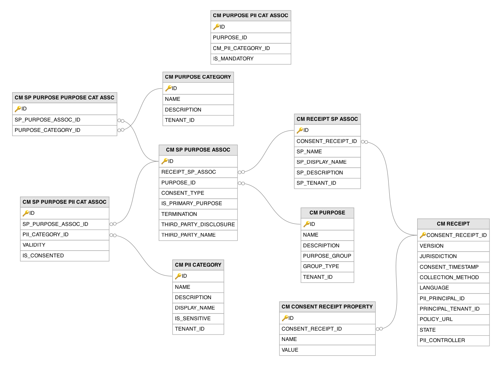

# Consent Management Related Tables

This section lists out all the consent management related tables and their attributes in the WSO2 API Manager database.

---

## Table Definitions

### CM_CONSENT_RECEIPT_PROPERTY

Stores extensible key-value properties on consent receipts from the `CM_RECEIPT` table, providing a mechanism to attach additional metadata to consent records without modifying the receipt table schema. Records are created when supplementary information needs to be associated with a consent receipt, such as consent collection channel identifiers, form version numbers, or custom compliance metadata. The `CONSENT_RECEIPT_ID` column is a foreign key to the `CM_RECEIPT` table.

| Column | Description |
|--------|-------------|
| ID | Primary key. The auto-generated row identifier for this consent receipt property. |
| CONSENT_RECEIPT_ID | Foreign key to the `CM_RECEIPT` table. The identifier of the consent receipt to which this property belongs. |
| NAME | The key name of the consent receipt property (e.g., collection channel, form version, custom compliance metadata). |
| VALUE | The value of the consent receipt property. |

---

### CM_PII_CATEGORY

Defines categories of Personally Identifiable Information (PII) that users may be asked to share with service providers, forming part of the GDPR-aligned consent management framework. Records are created by administrators to classify the types of personal data being collected (e.g., "Contact Information", "Financial Data", "Health Records"). The `IS_SENSITIVE` flag distinguishes between regular and sensitive PII categories, which may require additional consent safeguards. These categories are associated with consent purposes to describe exactly what personal data is being collected for each purpose.

| Column | Description |
|--------|-------------|
| ID | Primary key. The auto-generated identifier for this PII category. |
| NAME | The name of the PII category, unique within the tenant (e.g., `Contact Information`, `Financial Data`). |
| DESCRIPTION | A human-readable description of the type of personal data this category represents. |
| DISPLAY_NAME | The human-readable display name shown on consent screens and in privacy management interfaces. |
| IS_SENSITIVE | Indicates whether this PII category contains sensitive personal data that may require additional consent safeguards under privacy regulations. |
| TENANT_ID | The identifier of the tenant to which this PII category belongs. |

---

### CM_PURPOSE

Defines the purposes for which personal data is collected and processed, forming the core of the consent management framework. A `DEFAULT` purpose is seeded during initialization, and administrators can add additional purposes through the management console or consent management API. Purposes are organized into groups and types, and each purpose can be associated with PII categories (via the `CM_PURPOSE_PII_CAT_ASSOC` table) to describe exactly what personal data is collected for that purpose. Service providers reference these purposes when requesting user consent.

| Column | Description |
|--------|-------------|
| ID | Primary key. The auto-generated identifier for this consent purpose. |
| NAME | The name of the consent purpose, unique within the tenant, group, and type combination. |
| DESCRIPTION | A human-readable description of why personal data is being collected for this purpose. |
| PURPOSE_GROUP | The group to which this purpose belongs, used for organizing related purposes. |
| GROUP_TYPE | The type classification of the purpose group. |
| TENANT_ID | The identifier of the tenant to which this consent purpose belongs. |

---

### CM_PURPOSE_CATEGORY

Groups consent purposes into categories for organizational and display purposes. A `DEFAULT` category is seeded during initialization, and administrators can add additional categories to organize purposes logically (e.g., "Marketing", "Service Delivery", "Legal Requirements"). Purpose categories are linked to SP-purpose associations through the `CM_SP_PURPOSE_PURPOSE_CAT_ASSC` table, allowing consent screens to present grouped purposes to users in a structured manner.

| Column | Description |
|--------|-------------|
| ID | Primary key. The auto-generated identifier for this purpose category. |
| NAME | The name of the purpose category, unique within the tenant (e.g., `Marketing`, `Service Delivery`, `Legal Requirements`). |
| DESCRIPTION | A human-readable description of the types of consent purposes this category groups. |
| TENANT_ID | The identifier of the tenant to which this purpose category belongs. |

---

### CM_PURPOSE_PII_CAT_ASSOC

Links consent purposes from the `CM_PURPOSE` table to PII categories from the `CM_PII_CATEGORY` table, defining which types of personal data are collected for each purpose. A record is created when an administrator associates a PII category with a purpose through the consent management configuration. The `IS_MANDATORY` flag indicates whether sharing the PII category is mandatory for the purpose or optional, allowing the consent screen to distinguish between required and optional data sharing.

| Column | Description |
|--------|-------------|
| ID | Primary key. The auto-generated row identifier for this purpose-to-PII-category association. |
| PURPOSE_ID | The identifier of the consent purpose to which this PII category is linked. |
| CM_PII_CATEGORY_ID | The identifier of the PII category associated with this consent purpose. |
| IS_MANDATORY | Indicates whether sharing this category of personal data is mandatory for the purpose or optional for the user to consent to. |

---

### CM_RECEIPT

Stores consent receipts that record the fact and details of user consent for personal data collection and processing, following the Kantara Initiative consent receipt specification. A record is created when a user provides consent during registration, login, or through an explicit consent collection flow. Each receipt captures the jurisdiction, collection method, privacy policy URL, and PII controller details, providing an auditable record of consent that supports GDPR and privacy regulation compliance. The `STATE` column tracks whether the consent is `ACTIVE` or has been `REVOKED` by the user.

| Column | Description |
|--------|-------------|
| CONSENT_RECEIPT_ID | Primary key. The universally unique identifier for this consent receipt. |
| VERSION | The version of the Kantara Initiative consent receipt specification that this receipt conforms to. |
| JURISDICTION | The legal jurisdiction under which this consent was obtained (e.g., country or region code). |
| CONSENT_TIMESTAMP | The timestamp when the user provided consent. |
| COLLECTION_METHOD | The method through which consent was collected (e.g., web form, API, registration flow). |
| LANGUAGE | The language in which the consent information was presented to the user. |
| PII_PRINCIPAL_ID | The identifier of the user (PII principal) who provided consent. |
| PRINCIPAL_TENANT_ID | The identifier of the tenant to which the consenting user belongs. |
| POLICY_URL | The URL of the privacy policy that was in effect when consent was obtained. |
| STATE | The current state of this consent: `ACTIVE` (consent is valid) or `REVOKED` (user has withdrawn consent). |
| PII_CONTROLLER | A JSON representation of the PII controller details (the organization responsible for data processing). |

---

### CM_RECEIPT_SP_ASSOC

Links consent receipts from the `CM_RECEIPT` table to the service providers for which consent was given. A record is created for each service provider involved in a consent receipt, capturing the SP's name, display name, and description at the time consent was given. This association enables the system to determine which applications a user has consented to share data with and supports per-application consent revocation through the My Account portal. The `CONSENT_RECEIPT_ID` column is a foreign key to the `CM_RECEIPT` table.

| Column | Description |
|--------|-------------|
| ID | Primary key. The auto-generated row identifier for this receipt-SP association. |
| CONSENT_RECEIPT_ID | Foreign key to the `CM_RECEIPT` table. The identifier of the consent receipt to which this SP association belongs. |
| SP_NAME | The name of the service provider for which consent was given, captured at the time of consent. |
| SP_DISPLAY_NAME | The display name of the service provider, as shown to the user on the consent screen. |
| SP_DESCRIPTION | A description of the service provider, captured at the time of consent. |
| SP_TENANT_ID | The identifier of the tenant to which the service provider belongs. |

---

### CM_SP_PURPOSE_ASSOC

Associates service providers (within a consent receipt) with specific consent purposes, defining what each SP is collecting data for. A record is created for each purpose that applies to a service provider within a consent receipt. The table captures consent metadata such as the consent type, whether it is the primary purpose, termination conditions, and third-party disclosure details, providing the granular consent information required by privacy regulations like GDPR. The `RECEIPT_SP_ASSOC` column is a foreign key to the `CM_RECEIPT_SP_ASSOC` table and the `PURPOSE_ID` column is a foreign key to the `CM_PURPOSE` table.

| Column | Description |
|--------|-------------|
| ID | Primary key. The auto-generated row identifier for this SP-purpose association. |
| RECEIPT_SP_ASSOC | Foreign key to the `CM_RECEIPT_SP_ASSOC` table. The identifier of the receipt-SP association to which this purpose applies. |
| PURPOSE_ID | Foreign key to the `CM_PURPOSE` table. The identifier of the consent purpose for which personal data is collected. |
| CONSENT_TYPE | The type of consent obtained for this purpose (e.g., explicit, implicit). |
| IS_PRIMARY_PURPOSE | Indicates whether this is the primary purpose for data collection by this service provider. |
| TERMINATION | The conditions under which the consent for this purpose terminates (e.g., account deletion, time period). |
| THIRD_PARTY_DISCLOSURE | Indicates whether the data collected for this purpose may be disclosed to third parties. |
| THIRD_PARTY_NAME | The name of the third party to whom data may be disclosed, if applicable. |

---

### CM_SP_PURPOSE_PII_CAT_ASSOC

Records the actual consent given by a user for each PII category within a specific SP-purpose combination in a consent receipt. A record is created for each PII category associated with an SP-purpose pair when a user provides consent. The `IS_CONSENTED` column captures whether the user agreed to share that specific category of personal data (defaulting to TRUE), and `VALIDITY` can specify conditions under which the consent is valid. This is the most granular level of the consent model, enabling users to selectively consent to sharing different types of personal data for different purposes. The `SP_PURPOSE_ASSOC_ID` column is a foreign key to the `CM_SP_PURPOSE_ASSOC` table and the `PII_CATEGORY_ID` column is a foreign key to the `CM_PII_CATEGORY` table.

| Column | Description |
|--------|-------------|
| ID | Primary key. The auto-generated row identifier for this per-PII-category consent record. |
| SP_PURPOSE_ASSOC_ID | Foreign key to the `CM_SP_PURPOSE_ASSOC` table. The identifier of the SP-purpose association to which this PII consent applies. |
| PII_CATEGORY_ID | Foreign key to the `CM_PII_CATEGORY` table. The identifier of the PII category for which consent was given or denied. |
| VALIDITY | The conditions under which this consent is valid (e.g., time period, specific use cases). |
| IS_CONSENTED | Indicates whether the user consented to sharing this specific category of personal data (default TRUE). |

---

### CM_SP_PURPOSE_PURPOSE_CAT_ASSC

Associates SP-purpose combinations (from the `CM_SP_PURPOSE_ASSOC` table) with purpose categories from the `CM_PURPOSE_CATEGORY` table. A record is created for each category that applies to a given SP-purpose association within a consent receipt. This multi-level categorization enables structured consent reporting and helps consent management interfaces organize consent information by category for both end users and administrators. The `SP_PURPOSE_ASSOC_ID` column is a foreign key to the `CM_SP_PURPOSE_ASSOC` table and the `PURPOSE_CATEGORY_ID` column is a foreign key to the `CM_PURPOSE_CATEGORY` table.

| Column | Description |
|--------|-------------|
| ID | Primary key. The auto-generated row identifier for this SP-purpose-to-category association. |
| SP_PURPOSE_ASSOC_ID | Foreign key to the `CM_SP_PURPOSE_ASSOC` table. The identifier of the SP-purpose association to which this category applies. |
| PURPOSE_CATEGORY_ID | Foreign key to the `CM_PURPOSE_CATEGORY` table. The identifier of the purpose category associated with this SP-purpose combination. |

---

## Entity Relationship Diagram

