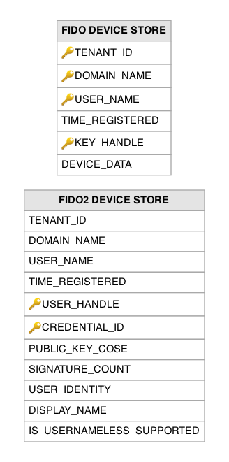

# FIDO Related Tables

This section lists out all the FIDO related tables and their attributes in the WSO2 API Manager database.

---

## Table Definitions

### FIDO_DEVICE_STORE

Stores FIDO U2F (Universal 2nd Factor) security key registrations for users, used as a second-factor authentication mechanism. This is a legacy table for the older U2F protocol; newer deployments use FIDO2/WebAuthn via the `FIDO2_DEVICE_STORE` table instead. A record is created when a user registers a U2F security key through the My Account portal or an authentication flow. The `KEY_HANDLE` uniquely identifies the registered security key and is used during the authentication ceremony to challenge the correct device.

| Column | Description |
|--------|-------------|
| TENANT_ID | Primary key (composite). The identifier of the tenant to which this U2F registration belongs. |
| DOMAIN_NAME | Primary key (composite). The user store domain of the user who registered this security key. |
| USER_NAME | Primary key (composite). The username of the user who registered this U2F security key. |
| TIME_REGISTERED | The timestamp when this U2F security key was registered. |
| KEY_HANDLE | Primary key (composite). The U2F key handle that uniquely identifies this registered security key and is used during authentication to challenge the correct device. |
| DEVICE_DATA | The serialized device registration data, including the public key and attestation information. |

---

### FIDO2_DEVICE_STORE

Stores FIDO2/WebAuthn credential registrations for users, supporting modern passwordless and second-factor authentication with security keys, platform authenticators (fingerprint, Face ID), and passkeys. A record is created when a user registers a FIDO2 credential through the My Account portal or during an authentication flow. The `PUBLIC_KEY_COSE` column stores the COSE-encoded public key used to verify authentication assertions, and `SIGNATURE_COUNT` is incremented on each use to detect cloned authenticators. The `IS_USERNAMELESS_SUPPORTED` flag indicates whether the credential supports resident/discoverable credential flows for true passwordless login.

| Column | Description |
|--------|-------------|
| TENANT_ID | The identifier of the tenant to which this FIDO2 credential belongs. |
| DOMAIN_NAME | The user store domain of the user who registered this FIDO2 credential. |
| USER_NAME | The username of the user who registered this FIDO2 credential. |
| TIME_REGISTERED | The timestamp when this FIDO2 credential was registered. |
| USER_HANDLE | Primary key (composite). The WebAuthn user handle, an opaque identifier for the user that does not reveal the username. |
| CREDENTIAL_ID | Primary key (composite). The unique identifier of the FIDO2 credential, generated by the authenticator during registration. |
| PUBLIC_KEY_COSE | The COSE-encoded public key of the registered credential, used to verify authentication assertion signatures. |
| SIGNATURE_COUNT | The signature counter value, incremented on each authentication to detect cloned authenticators. |
| USER_IDENTITY | Serialized user identity data associated with this credential registration. |
| DISPLAY_NAME | The human-readable name assigned to this credential by the user for identification (e.g., "My YubiKey", "MacBook Touch ID"). |
| IS_USERNAMELESS_SUPPORTED | Indicates whether this credential supports resident/discoverable credential flows (`1`), enabling true passwordless authentication. |

---

## Entity Relationship Diagram

