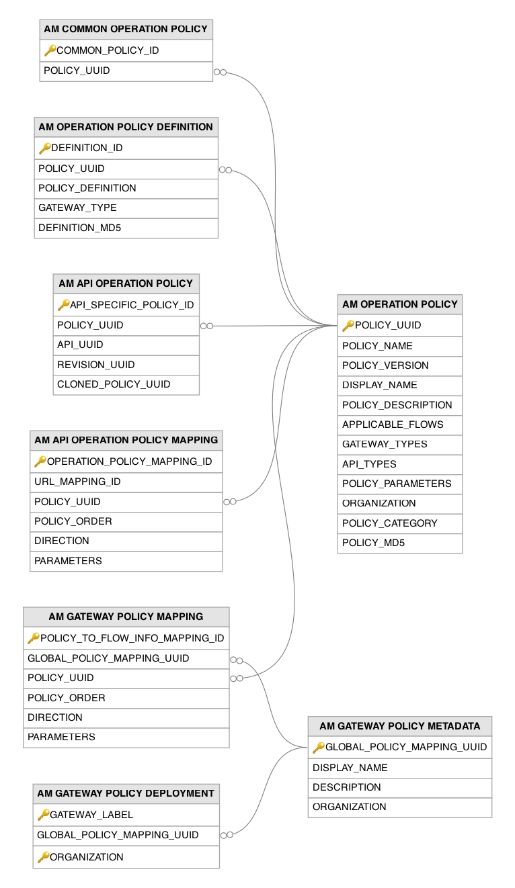
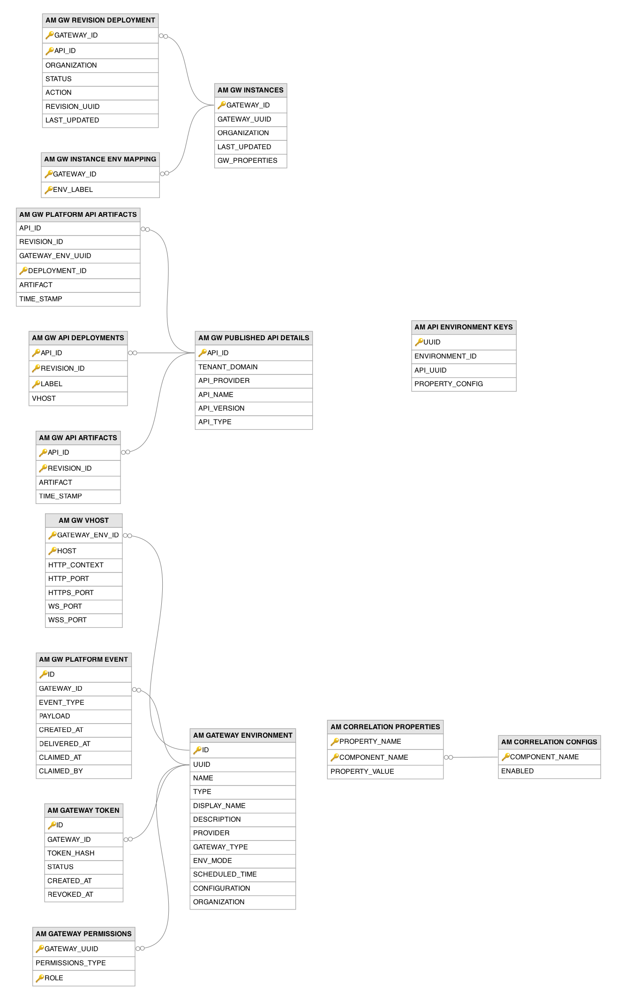

# Gateway and Runtime Related Tables

This section lists out all the gateway and runtime related tables and their attributes in the WSO2 API Manager database.

---

## Table Definitions

### AM_API_ENVIRONMENT_KEYS

Stores per-environment property configurations for APIs, enabling environment-specific settings that vary between Gateway deployments. A record is created when an API has environment-specific configurations, such as different API property values for production versus staging environments. The `API_UUID` column is a foreign key to the `AM_API` table, and the unique constraint on `ENVIRONMENT_ID` and `API_UUID` ensures exactly one configuration per API per environment.

| Column | Description |
|--------|-------------|
| UUID | Primary key. The universally unique identifier for this environment key entry. |
| ENVIRONMENT_ID | The Gateway environment that this configuration applies to (unique together with `API_UUID`). |
| API_UUID | Foreign key to the `AM_API` table. The API that this environment-specific configuration belongs to. |
| PROPERTY_CONFIG | The serialized configuration containing environment-specific property overrides for this API. |

---

### AM_API_OPERATION_POLICY

Associates operation policies with specific APIs and revisions, tracking which policies are API-specific and linking cloned policy instances to their originals. A record is created when a publisher attaches an operation policy to an API, either by selecting a common policy (which creates a clone) or by defining an API-specific policy. The `POLICY_UUID` column is a foreign key to the `AM_OPERATION_POLICY` table.

| Column | Description |
|--------|-------------|
| API_SPECIFIC_POLICY_ID | Primary key. Auto-generated unique identifier for this API-policy association. |
| POLICY_UUID | Foreign key to the `AM_OPERATION_POLICY` table. The operation policy attached to this API. |
| API_UUID | The UUID of the API that this policy is attached to. |
| REVISION_UUID | The revision of the API that this policy attachment is scoped to. |
| CLONED_POLICY_UUID | The UUID of the original common policy this was cloned from (null for API-specific policies created from scratch). |

---

### AM_API_OPERATION_POLICY_MAPPING

Maps operation policies to specific API operations (resources) with execution order and flow direction, defining the policy execution pipeline for each API resource. Records are created when a publisher attaches policies to individual API operations through the Publisher portal. The `URL_MAPPING_ID` column is a foreign key to the `AM_API_URL_MAPPING` table and the `POLICY_UUID` column is a foreign key to the `AM_OPERATION_POLICY` table.

| Column | Description |
|--------|-------------|
| OPERATION_POLICY_MAPPING_ID | Primary key. Auto-generated unique identifier for this operation-policy mapping. |
| URL_MAPPING_ID | Foreign key to the `AM_API_URL_MAPPING` table. The API operation (resource) that this policy is attached to. |
| POLICY_UUID | Foreign key to the `AM_OPERATION_POLICY` table. The operation policy to execute for this resource. |
| POLICY_ORDER | The sequential execution order when multiple policies are attached (lower numbers execute first). |
| DIRECTION | The mediation flow in which this policy executes (request, response, or fault). |
| PARAMETERS | The serialized JSON containing runtime parameter values that customize the policy behavior for this operation. |

---

### AM_COMMON_OPERATION_POLICY

Marks an operation policy as a common (shared) policy that is available across all APIs within the organization, as opposed to API-specific policies. A record is created when an administrator creates a policy at the organization level through the Admin portal or Publisher. Without an entry in this table, a policy in the `AM_OPERATION_POLICY` table is considered API-specific and only accessible to the API it was created for. The `POLICY_UUID` column is a foreign key to the `AM_OPERATION_POLICY` table.

| Column | Description |
|--------|-------------|
| COMMON_POLICY_ID | Primary key. Auto-generated unique identifier for this common policy entry. |
| POLICY_UUID | Foreign key to the `AM_OPERATION_POLICY` table. The operation policy that is marked as common (shared across all APIs in the organization). |

---

### AM_CORRELATION_CONFIGS

Stores component-level configuration for the correlation logging framework, controlling which APIM components have correlation ID tracking enabled. Records are created during system initialization and updated when administrators toggle correlation logging for specific components. When enabled for a component, APIM generates and propagates correlation IDs across all log entries and inter-service calls for that component, enabling end-to-end request tracing across distributed APIM deployments.

| Column | Description |
|--------|-------------|
| COMPONENT_NAME | Primary key. The name of the APIM component for which correlation logging is configured (e.g., HTTP, LDAP, JDBC). |
| ENABLED | Flag indicating whether correlation ID tracking is enabled for this component. |

---

### AM_CORRELATION_PROPERTIES

Stores fine-grained configuration properties for each correlation logging component, such as thread pool sizes, inclusion patterns, and logging verbosity. Records are created alongside their parent component configuration in the `AM_CORRELATION_CONFIGS` table. Each property is scoped to a specific component, allowing independent tuning of correlation logging behavior across different APIM subsystems.

| Column | Description |
|--------|-------------|
| PROPERTY_NAME | Part of the composite primary key. The name of the correlation logging configuration property. |
| COMPONENT_NAME | Part of the composite primary key. Foreign key to the `AM_CORRELATION_CONFIGS` table. The correlation logging component this property belongs to. |
| PROPERTY_VALUE | The value of the configuration property (e.g., thread pool size, inclusion pattern). |

---

### AM_GATEWAY_ENVIRONMENT

Defines the Gateway environments available for deploying API revisions, representing distinct runtime targets such as production, staging, or partner-facing Gateways. Records are created when an administrator configures Gateway environments through the Admin portal or during system initialization for the default environment. Each environment can have its own type, provider, and configuration, supporting hybrid deployment scenarios. The `ENV_MODE` and `SCHEDULED_TIME` columns control how artifacts are synchronized to the environment.

| Column | Description |
|--------|-------------|
| ID | Primary key. Auto-generated unique identifier for this Gateway environment. |
| UUID | Unique. The universally unique identifier for this Gateway environment. |
| NAME | The name of the Gateway environment, unique within an organization. |
| TYPE | The type classification of the environment (e.g., production, sandbox, hybrid). |
| DISPLAY_NAME | The human-readable display name shown in portal UIs when deploying API revisions. |
| DESCRIPTION | A human-readable description of the Gateway environment and its purpose. |
| PROVIDER | The provider of the Gateway runtime (e.g., wso2, third-party vendor name). |
| GATEWAY_TYPE | The Gateway runtime type determining the artifact format and deployment mechanism. |
| ENV_MODE | The synchronization mode controlling how artifacts are propagated to the environment (defaults to `WRITE_ONLY`). |
| SCHEDULED_TIME | The interval in seconds between automatic artifact synchronization cycles. |
| CONFIGURATION | Serialized environment-specific configuration settings. |
| ORGANIZATION | The organization to which this Gateway environment belongs. |

---

### AM_GATEWAY_PERMISSIONS

Controls which user roles have access to specific Gateway environments, restricting who can deploy API revisions to each environment. Records are created when an administrator configures role-based access for a Gateway environment. This enables security policies such as allowing only senior developers to deploy to production environments while permitting all developers to deploy to staging. The `GATEWAY_UUID` column is a foreign key to the `UUID` column of the `AM_GATEWAY_ENVIRONMENT` table.

| Column | Description |
|--------|-------------|
| GATEWAY_UUID | Part of the composite primary key. Foreign key to the `UUID` column of the `AM_GATEWAY_ENVIRONMENT` table. The Gateway environment whose access is being controlled. |
| PERMISSIONS_TYPE | The permission model applied (allow to whitelist specific roles, deny to blacklist them). |
| ROLE | Part of the composite primary key. The user role that this permission rule applies to. |

---

### AM_GATEWAY_POLICY_DEPLOYMENT

Tracks which Gateway environments have a global policy deployed, linking global policies to specific Gateway labels. Records are created when an administrator deploys a global policy to one or more Gateway environments. Each entry associates a policy with a Gateway label and organization, and the Gateway nodes with matching labels pull and activate these policies during artifact synchronization. The `GLOBAL_POLICY_MAPPING_UUID` column is a foreign key to the `AM_GATEWAY_POLICY_METADATA` table.

| Column | Description |
|--------|-------------|
| GATEWAY_LABEL | Part of the composite primary key. The Gateway environment label that this global policy is deployed to. |
| GLOBAL_POLICY_MAPPING_UUID | Foreign key to the `AM_GATEWAY_POLICY_METADATA` table. The global Gateway policy being deployed. |
| ORGANIZATION | Part of the composite primary key. The organization to which this deployment belongs. |

---

### AM_GATEWAY_POLICY_MAPPING

Links individual operation policies to global Gateway policy containers with execution order and flow direction, defining the mediation pipeline for global policies. Records are created when an administrator adds operation policies to a global Gateway policy configuration. The `GLOBAL_POLICY_MAPPING_UUID` column is a foreign key to the `AM_GATEWAY_POLICY_METADATA` table and the `POLICY_UUID` column is a foreign key to the `AM_OPERATION_POLICY` table. This reuses the same operation policy definitions but applies them at the global Gateway level rather than per-API.

| Column | Description |
|--------|-------------|
| POLICY_TO_FLOW_INFO_MAPPING_ID | Primary key. Auto-generated unique identifier for this global policy-to-operation-policy mapping. |
| GLOBAL_POLICY_MAPPING_UUID | Foreign key to the `AM_GATEWAY_POLICY_METADATA` table. The global Gateway policy container this operation policy belongs to. |
| POLICY_UUID | Foreign key to the `AM_OPERATION_POLICY` table. The operation policy to execute as part of this global Gateway policy. |
| POLICY_ORDER | The sequential execution order of this policy within the global Gateway policy pipeline. |
| DIRECTION | The mediation flow in which this policy executes (request, response, or fault). |
| PARAMETERS | The parameter values that customize the operation policy behavior in this global context. |

---

### AM_GATEWAY_POLICY_METADATA

Stores metadata for global Gateway policies that apply across all APIs deployed to a Gateway environment, providing cross-cutting mediation capabilities. Records are created when an administrator defines a global Gateway policy through the Admin portal. Unlike API-specific operation policies, these policies execute for every API request passing through the Gateway, making them suitable for organization-wide concerns such as logging, security headers, or traffic management. Each policy is identified by a UUID and scoped to an organization.

| Column | Description |
|--------|-------------|
| GLOBAL_POLICY_MAPPING_UUID | Primary key. The universally unique identifier for this global Gateway policy. |
| DISPLAY_NAME | The human-readable display name of the global Gateway policy. |
| DESCRIPTION | A human-readable description explaining the cross-cutting mediation this policy provides. |
| ORGANIZATION | The organization to which this global Gateway policy belongs. |

---

### AM_GATEWAY_TOKEN

Stores authentication tokens issued to Gateway environments so that Gateway runtimes can securely authenticate with the control plane during artifact synchronization and event delivery. A record is created when a token is generated for a Gateway environment, and the `TOKEN_HASH` stores the hashed token value rather than the plaintext token. The `GATEWAY_ID` column is a foreign key to the `UUID` column of the `AM_GATEWAY_ENVIRONMENT` table. The `STATUS` and `REVOKED_AT` columns track the token lifecycle, allowing tokens to be revoked.

| Column | Description |
|--------|-------------|
| ID | Primary key. The unique identifier for this Gateway token entry. |
| GATEWAY_ID | Foreign key to the `UUID` column of the `AM_GATEWAY_ENVIRONMENT` table. The Gateway environment that this token is issued for. |
| TOKEN_HASH | The hashed value of the Gateway authentication token. |
| STATUS | The current status of the token (defaults to `active`). |
| CREATED_AT | The timestamp when this token was created. |
| REVOKED_AT | The timestamp when this token was revoked, if applicable. |

---

### AM_GW_API_ARTIFACTS

Stores serialized API runtime artifacts (Synapse configurations, API definitions, and policy files) that Gateway nodes retrieve during artifact synchronization. Records are created or updated when a revision is deployed and the control plane serializes the API configuration into a binary artifact. The `API_ID` column is a foreign key to the `AM_GW_PUBLISHED_API_DETAILS` table. The `TIME_STAMP` enables incremental synchronization, so Gateways only fetch artifacts that have changed since their last sync.

| Column | Description |
|--------|-------------|
| API_ID | Part of the composite primary key. Foreign key to the `AM_GW_PUBLISHED_API_DETAILS` table. The API that this artifact belongs to. |
| REVISION_ID | Part of the composite primary key. The revision of the API that this serialized artifact represents. |
| ARTIFACT | The serialized binary artifact containing Synapse configurations, API definitions, and policy files for Gateway deployment. |
| TIME_STAMP | The timestamp when this artifact was last updated, used by Gateways for incremental synchronization. |

---

### AM_GW_API_DEPLOYMENTS

Tracks which API revisions are deployed to which Gateway environments and virtual hosts, providing a deployment manifest for Gateway artifact synchronization. Records are created when a publisher deploys a revision to a Gateway environment through the Publisher portal. The `API_ID` column is a foreign key to the `AM_GW_PUBLISHED_API_DETAILS` table. The composite key of API ID, revision ID, and Gateway label allows the same revision to be deployed to multiple environments.

| Column | Description |
|--------|-------------|
| API_ID | Part of the composite primary key. Foreign key to the `AM_GW_PUBLISHED_API_DETAILS` table. The API being deployed. |
| REVISION_ID | Part of the composite primary key. The revision of the API deployed to this environment. |
| LABEL | Part of the composite primary key. The Gateway environment label that determines which Gateway nodes serve this API. |
| VHOST | The virtual host under which the API is accessible in this Gateway environment. |

---

### AM_GW_INSTANCES

Tracks active Gateway runtime instances that have registered with the control plane, enabling the control plane to monitor Gateway health and coordinate deployments. A record is created when a Gateway node starts up and registers itself with the control plane, providing its UUID and organization. The `LAST_UPDATED` timestamp serves as a heartbeat, periodically updated by the Gateway to indicate it is still operational.

| Column | Description |
|--------|-------------|
| GATEWAY_ID | Primary key. Auto-generated internal identifier for this Gateway instance. |
| GATEWAY_UUID | The universally unique identifier of the Gateway instance, unique within an organization. |
| ORGANIZATION | The organization to which this Gateway instance belongs. |
| LAST_UPDATED | The timestamp of the last heartbeat received from this Gateway node, used for health monitoring. |
| GW_PROPERTIES | Serialized Gateway-specific metadata such as supported API types, runtime version, and resource information. |

---

### AM_GW_INSTANCE_ENV_MAPPING

Associates Gateway instances with the environment labels they serve, determining which APIs each Gateway node should deploy. Records are created during Gateway registration when a node reports which environment labels it is configured to handle. A single Gateway instance can serve multiple environment labels, and multiple Gateway instances can share the same label for high availability. The `GATEWAY_ID` column is a foreign key to the `AM_GW_INSTANCES` table.

| Column | Description |
|--------|-------------|
| GATEWAY_ID | Part of the composite primary key. Foreign key to the `AM_GW_INSTANCES` table. The Gateway instance serving this environment. |
| ENV_LABEL | Part of the composite primary key. The environment label that this Gateway instance is configured to serve. |

---

### AM_GW_PLATFORM_API_ARTIFACTS

Stores serialized API runtime artifacts for Platform Gateway environments, scoped per Gateway environment and deployment so that each Platform Gateway pulls the artifact for the specific revision deployed to it. A record is created when an API revision is deployed to a Platform Gateway environment. The `API_ID` column is a foreign key to the `AM_GW_PUBLISHED_API_DETAILS` table, and the unique constraint on `GATEWAY_ENV_UUID`, `API_ID`, and `REVISION_ID` ensures one artifact per API revision per Gateway environment.

| Column | Description |
|--------|-------------|
| API_ID | Foreign key to the `AM_GW_PUBLISHED_API_DETAILS` table. The API that this artifact belongs to. |
| REVISION_ID | The revision of the API that this serialized artifact represents. |
| GATEWAY_ENV_UUID | The Platform Gateway environment that this artifact is deployed to. |
| DEPLOYMENT_ID | Primary key. The unique identifier of this Platform Gateway deployment. |
| ARTIFACT | The serialized binary artifact deployed to the Platform Gateway environment. |
| TIME_STAMP | The timestamp when this artifact was created. |

---

### AM_GW_PLATFORM_EVENT

Stores Platform Gateway events used to synchronize state across multiple control plane nodes via WebSocket delivery to Platform Gateways. A record is created when an event needs to be dispatched to a Gateway, and the `PAYLOAD` holds the UTF-8 JSON event content. The `GATEWAY_ID` column is a foreign key to the `UUID` column of the `AM_GATEWAY_ENVIRONMENT` table. The `DELIVERED_AT`, `CLAIMED_AT`, and `CLAIMED_BY` columns coordinate at-most-once delivery and claiming of pending events across control plane nodes.

| Column | Description |
|--------|-------------|
| ID | Primary key. The unique identifier for this Platform Gateway event. |
| GATEWAY_ID | Foreign key to the `UUID` column of the `AM_GATEWAY_ENVIRONMENT` table. The Gateway environment that this event targets. |
| EVENT_TYPE | The type of the event being delivered to the Platform Gateway. |
| PAYLOAD | The event content serialized as UTF-8 JSON. |
| CREATED_AT | The timestamp when this event was created (defaults to the current timestamp). |
| DELIVERED_AT | The timestamp when this event was delivered to the Gateway, if applicable. |
| CLAIMED_AT | The timestamp when a control plane node claimed this event for delivery. |
| CLAIMED_BY | The identifier of the control plane node that claimed this event for delivery. |

---

### AM_GW_PUBLISHED_API_DETAILS

Stores API metadata that Gateway nodes need for artifact synchronization, serving as the header record for the Gateway's local API registry. Records are created when an API revision is deployed to a Gateway environment and the publisher triggers artifact synchronization. This table, together with the `AM_GW_API_ARTIFACTS` and `AM_GW_API_DEPLOYMENTS` tables, forms the database-backed artifact synchronization mechanism that allows Gateway nodes to pull API definitions from the database instead of relying on file system-based deployment.

| Column | Description |
|--------|-------------|
| API_ID | Primary key. The unique identifier of the API in the Gateway's artifact registry. |
| TENANT_DOMAIN | The tenant domain that owns this API. |
| API_PROVIDER | The username of the API publisher who owns this API. |
| API_NAME | The name of the API. |
| API_VERSION | The version string of the API. |
| API_TYPE | The protocol type of the API (e.g., HTTP, WS, GRAPHQL). |

---

### AM_GW_REVISION_DEPLOYMENT

Tracks the deployment status of individual API revisions on each Gateway instance, providing per-node deployment visibility. Records are created or updated when a Gateway node processes an API deployment or undeployment action. The `GATEWAY_ID` column is a foreign key to the `AM_GW_INSTANCES` table and the `API_ID` column is a foreign key to the `API_UUID` column of the `AM_API` table. This fine-grained tracking enables the control plane to detect deployment inconsistencies across Gateway nodes and trigger re-synchronization when needed.

| Column | Description |
|--------|-------------|
| GATEWAY_ID | Part of the composite primary key. Foreign key to the `AM_GW_INSTANCES` table. The Gateway node on which this deployment is tracked. |
| API_ID | Part of the composite primary key. Foreign key to the `API_UUID` column of the `AM_API` table. The API whose deployment status is being tracked on this Gateway node. |
| ORGANIZATION | The organization to which the deployed API belongs. |
| STATUS | The current deployment status of the API revision on this specific Gateway node (e.g., DEPLOYED, FAILED, PENDING). |
| ACTION | The last deployment operation requested for this API on this node (e.g., DEPLOY, UNDEPLOY). |
| REVISION_UUID | The UUID of the API revision that is deployed or being deployed to this Gateway node. |
| LAST_UPDATED | The epoch timestamp when the deployment status was last updated on this Gateway node. |

---

### AM_GW_VHOST

Defines virtual hosts (vhosts) associated with each Gateway environment, enabling multiple domain names to be served by a single Gateway deployment. Records are created when an administrator configures virtual hosts for a Gateway environment. Each vhost specifies the hostname and port mappings for HTTP, HTTPS, WebSocket, and secure WebSocket protocols. The `GATEWAY_ENV_ID` column is a foreign key to the `ID` column of the `AM_GATEWAY_ENVIRONMENT` table.

| Column | Description |
|--------|-------------|
| GATEWAY_ENV_ID | Part of the composite primary key. Foreign key to the `ID` column of the `AM_GATEWAY_ENVIRONMENT` table. The Gateway environment this virtual host belongs to. |
| HOST | Part of the composite primary key. The hostname or domain name for this virtual host. |
| HTTP_CONTEXT | The base HTTP context path for APIs served under this virtual host. |
| HTTP_PORT | The port number for HTTP traffic on this virtual host. |
| HTTPS_PORT | The port number for HTTPS traffic on this virtual host. |
| WS_PORT | The port number for WebSocket (WS) traffic on this virtual host. |
| WSS_PORT | The port number for secure WebSocket (WSS) traffic on this virtual host. |

---

### AM_OPERATION_POLICY

Defines reusable operation-level mediation policies that can be attached to API operations to transform, validate, or enrich requests and responses. Records are created when an administrator or publisher creates a new operation policy, either as a common (organization-wide) policy or an API-specific policy. Policies are authored either in **YAML** (which can embed JavaScript or Python scripting for inline logic) or in **XML** for sequence-based (Synapse) mediation; this table holds the policy specification (name, applicable flows, supported gateway types, and accepted parameters), while the compiled gateway-specific policy definition content is stored in the related `AM_OPERATION_POLICY_DEFINITION` table. The `POLICY_MD5` hash enables efficient change detection, and the `POLICY_CATEGORY` classifies policies for organized browsing in the Publisher portal.

| Column | Description |
|--------|-------------|
| POLICY_UUID | Primary key. The universally unique identifier for this operation policy. |
| POLICY_NAME | The internal name of the operation policy. |
| POLICY_VERSION | The version of the policy definition (defaults to `v1`). |
| DISPLAY_NAME | The human-readable display name shown in the Publisher portal's policy palette. |
| POLICY_DESCRIPTION | A human-readable description explaining what this policy does and when to use it. |
| APPLICABLE_FLOWS | The mediation flows this policy can be applied to (request, response, fault, or combinations). |
| GATEWAY_TYPES | The Gateway runtime types that support this policy. |
| API_TYPES | The API protocol types this policy is compatible with (e.g., HTTP, SOAP, GraphQL). |
| POLICY_PARAMETERS | The schema (derived from the policy's YAML or XML specification) defining the configurable parameters this policy accepts; the corresponding runtime values are supplied per attachment in the mapping tables. |
| ORGANIZATION | The organization to which this policy belongs. |
| POLICY_CATEGORY | The classification category for organized browsing in the Publisher portal (e.g., Mediation, Security, Transform). |
| POLICY_MD5 | The MD5 hash of the policy content, enabling efficient change detection during deployment synchronization. |

---

### AM_OPERATION_POLICY_DEFINITION

Stores the gateway-specific implementation of an operation policy, containing the actual mediation logic (e.g., Synapse sequence XML for the WSO2 Gateway, or configuration for third-party gateways). Records are created alongside the parent policy definition, with separate entries for each supported gateway type. The `POLICY_UUID` column is a foreign key to the `AM_OPERATION_POLICY` table, and the unique constraint on `POLICY_UUID` and `GATEWAY_TYPE` ensures one definition per policy per gateway type. The `DEFINITION_MD5` hash tracks content changes for deployment synchronization.

| Column | Description |
|--------|-------------|
| DEFINITION_ID | Primary key. Auto-generated unique identifier for this policy definition. |
| POLICY_UUID | Foreign key to the `AM_OPERATION_POLICY` table. The operation policy that this definition implements. |
| POLICY_DEFINITION | The gateway-specific implementation content (e.g., Synapse sequence XML or third-party Gateway configuration). |
| GATEWAY_TYPE | The Gateway runtime type this definition targets, unique per policy. |
| DEFINITION_MD5 | The MD5 hash of the definition content, used for tracking changes during deployment synchronization. |

---

## Entity Relationship Diagrams

