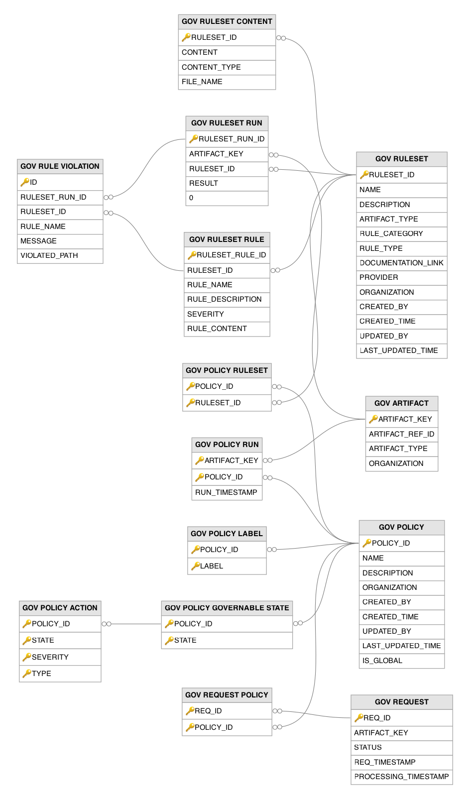

# Governance Related Tables

This section lists out all the governance related tables and their attributes in the WSO2 API Manager database.

---

## Table Definitions

### GOV_ARTIFACT

Registers artifacts (typically APIs) that are subject to governance evaluation, providing a stable reference point for tracking governance status across evaluation runs. A record is created when an API or other governable artifact first undergoes governance evaluation. The `ARTIFACT_KEY` is a governance-specific surrogate key (UUID) used internally, while the natural key by which the governance engine looks up an artifact is the combination of `ARTIFACT_REF_ID` (the external identifier such as the API UUID), `ARTIFACT_TYPE`, and `ORGANIZATION`, enforced by a unique constraint. This table is referenced by the `GOV_REQUEST`, `GOV_POLICY_RUN`, and `GOV_RULESET_RUN` tables (via `ARTIFACT_KEY`) to associate evaluation results with specific artifacts.

| Column | Description |
|--------|-------------|
| ARTIFACT_KEY | Primary key. The governance-specific surrogate key (UUID) for this artifact, used internally to associate evaluation runs. |
| ARTIFACT_REF_ID | The external identifier of the artifact (e.g., the API UUID) linking to the source system. Part of the unique natural key together with `ARTIFACT_TYPE` and `ORGANIZATION`. |
| ARTIFACT_TYPE | The type of governable artifact (e.g., API, AsyncAPI). |
| ORGANIZATION | The organization to which this artifact belongs. |

---

### GOV_POLICY

Defines governance policies that combine one or more rulesets with enforcement actions and lifecycle state bindings. Records are created when a governance administrator defines a policy specifying which rulesets to apply, at which API lifecycle states, and what actions to take on violations. The `IS_GLOBAL` flag indicates whether the policy applies to all APIs in the organization or only to specifically labeled APIs. Governance policies are the top-level enforcement mechanism that connects rulesets to the API lifecycle, ensuring that APIs meet quality and compliance standards before progressing through lifecycle states.

| Column | Description |
|--------|-------------|
| POLICY_ID | Primary key. The universally unique identifier for this governance policy. |
| NAME | The name of the governance policy, unique within an organization. |
| DESCRIPTION | A human-readable description explaining the governance standards this policy enforces. |
| ORGANIZATION | The organization to which this governance policy belongs. |
| CREATED_BY | The username of the governance administrator who created this policy. |
| CREATED_TIME | The timestamp when this governance policy was initially created. |
| UPDATED_BY | The username of the user who last modified this governance policy. |
| LAST_UPDATED_TIME | The timestamp when this governance policy was last modified. |
| IS_GLOBAL | Flag indicating whether this policy applies to all APIs in the organization (1) or only to APIs with matching labels (0). |

---

### GOV_POLICY_ACTION

Defines what action the governance system should take when rule violations of a given severity are detected at a specific lifecycle state. Records are created as part of the policy configuration, specifying the response for each combination of lifecycle state and violation severity. The action types include BLOCK (prevent the lifecycle transition), WARN (allow but show warnings), and LOG (silently record the violation). This granular action model allows organizations to enforce strict rules for critical severities while being lenient for informational findings. The `POLICY_ID` and `STATE` columns are a foreign key to the `GOV_POLICY_GOVERNABLE_STATE` table.

| Column | Description |
|--------|-------------|
| POLICY_ID | Primary key (composite). The governance policy this action belongs to. |
| STATE | Primary key (composite). The API lifecycle state at which this action applies. |
| SEVERITY | Primary key (composite). The violation severity level this action responds to (error, warn, info). |
| TYPE | Primary key (composite). The enforcement action to take (BLOCK to prevent transition, WARN to allow with warnings, LOG to silently record). |

---

### GOV_POLICY_GOVERNABLE_STATE

Specifies which API lifecycle states trigger governance policy evaluation, binding enforcement to specific lifecycle transitions. Records are created when a governance administrator configures the lifecycle states at which a policy should be enforced (e.g., enforce on transition to PUBLISHED or DEPRECATED). When an API publisher attempts to move an API to a governed state, the system evaluates all applicable policies and their rulesets. The evaluation results determine whether the lifecycle transition is allowed, warned, or blocked. The `POLICY_ID` column is a foreign key to the `GOV_POLICY` table.

| Column | Description |
|--------|-------------|
| POLICY_ID | Primary key (composite). Foreign key to the `GOV_POLICY` table. The governance policy that is triggered at this lifecycle state. |
| STATE | Primary key (composite). The API lifecycle state that triggers governance evaluation (e.g., PUBLISHED, DEPRECATED). |

---

### GOV_POLICY_LABEL

Associates governance policies with labels, enabling targeted policy enforcement for APIs tagged with specific labels. Records are created when a governance administrator assigns labels to a policy to narrow its scope. For non-global policies, only APIs that carry matching labels are subject to the policy's rules. This enables differentiated governance: for example, public-facing APIs might require stricter security rulesets while internal APIs follow relaxed standards. The `POLICY_ID` column is a foreign key to the `GOV_POLICY` table.

| Column | Description |
|--------|-------------|
| POLICY_ID | Primary key (composite). Foreign key to the `GOV_POLICY` table. The governance policy that is scoped by this label. |
| LABEL | Primary key (composite). The label that APIs must carry to be subject to this governance policy. |

---

### GOV_POLICY_RULESET

Links governance policies to their constituent rulesets, defining which collections of validation rules are evaluated when a policy is triggered. Records are created when a governance administrator adds rulesets to a policy. A single policy can reference multiple rulesets, and a single ruleset can be shared across multiple policies, creating a flexible many-to-many composition model. When a policy is evaluated, all linked rulesets are executed against the target artifact. The `POLICY_ID` column is a foreign key to the `GOV_POLICY` table and the `RULESET_ID` column is a foreign key to the `GOV_RULESET` table.

| Column | Description |
|--------|-------------|
| POLICY_ID | Primary key (composite). Foreign key to the `GOV_POLICY` table. The governance policy that includes this ruleset. |
| RULESET_ID | Primary key (composite). Foreign key to the `GOV_RULESET` table. The ruleset of validation rules to evaluate when this policy is triggered. |

---

### GOV_POLICY_RUN

Records the outcome of a governance policy evaluation against a specific artifact, capturing when the policy was last evaluated. A record is inserted each time a governance policy is evaluated for an artifact, storing the timestamp of the run; any prior row for the same artifact-policy pair is deleted before re-insertion, so the row always reflects the most recent evaluation. The detailed pass/fail results are captured at the ruleset level in the `GOV_RULESET_RUN` table, while this table provides the policy-level summary. The composite primary key (`ARTIFACT_KEY`, `POLICY_ID`) ensures one record per artifact-policy pair. The `ARTIFACT_KEY` column is a foreign key to the `GOV_ARTIFACT` table and the `POLICY_ID` column is a foreign key to the `GOV_POLICY` table.

| Column | Description |
|--------|-------------|
| ARTIFACT_KEY | Primary key (composite). Foreign key to the `GOV_ARTIFACT` table. The artifact that was evaluated by this policy. |
| POLICY_ID | Primary key (composite). Foreign key to the `GOV_POLICY` table. The governance policy that was evaluated against the artifact. |
| RUN_TIMESTAMP | The timestamp of the most recent evaluation of this policy against this artifact. |

---

### GOV_REQUEST

Tracks governance evaluation requests, representing a single evaluation cycle where all applicable policies are assessed against an artifact. A record is created with `STATUS` set to PENDING when a governance evaluation is triggered, typically by an API lifecycle state change or an on-demand evaluation request. A background worker picks up pending requests and transitions them to PROCESSING (recording `PROCESSING_TIMESTAMP`); once evaluation finishes, the request row is deleted while the results persist in `GOV_POLICY_RUN`, `GOV_RULESET_RUN`, and `GOV_RULE_VIOLATION`. A unique constraint on (`STATUS`, `ARTIFACT_KEY`) prevents duplicate pending or processing requests for the same artifact. Associated policy evaluations are tracked in the `GOV_REQUEST_POLICY` table.

| Column | Description |
|--------|-------------|
| REQ_ID | Primary key. The universally unique identifier for this governance evaluation request. |
| ARTIFACT_KEY | The `ARTIFACT_KEY` from the `GOV_ARTIFACT` table identifying the artifact being evaluated. |
| STATUS | The current processing state of the evaluation request, either PENDING (queued) or PROCESSING (being evaluated by the engine). Defaults to PENDING. Completed requests are removed from this table. |
| REQ_TIMESTAMP | The timestamp when the governance evaluation was requested. Defaults to the current time. |
| PROCESSING_TIMESTAMP | The timestamp when the evaluation engine began processing this request. Null until the request transitions to PROCESSING. |

---

### GOV_REQUEST_POLICY

Links governance evaluation requests to the specific policies that need to be evaluated as part of the request. Records are created when a governance request is initiated, capturing which policies are applicable based on the artifact's labels and the target lifecycle state. This join table enables tracking which policies were evaluated for each request, and the results of each policy evaluation are stored in the `GOV_POLICY_RUN` table. The `REQ_ID` column is a foreign key to the `GOV_REQUEST` table and the `POLICY_ID` column is a foreign key to the `GOV_POLICY` table.

| Column | Description |
|--------|-------------|
| REQ_ID | Primary key (composite). Foreign key to the `GOV_REQUEST` table. The governance evaluation request this policy evaluation is part of. |
| POLICY_ID | Primary key (composite). Foreign key to the `GOV_POLICY` table. The governance policy being evaluated as part of this request. |

---

### GOV_RULESET

Defines governance rulesets that contain collections of validation rules for evaluating API artifacts against organizational standards and best practices. Records are created when a governance administrator defines a new ruleset through the governance administration interface. Each ruleset targets a specific artifact type (e.g., OpenAPI specification, AsyncAPI specification) and is categorized by rule type (e.g., spectral linting rules). Rulesets serve as reusable building blocks that can be composed into governance policies (in the `GOV_POLICY` table) and applied across the API lifecycle.

| Column | Description |
|--------|-------------|
| RULESET_ID | Primary key. The universally unique identifier for this governance ruleset. |
| NAME | The name of the ruleset, unique within an organization. |
| DESCRIPTION | A human-readable description explaining the validation rules contained in this ruleset. |
| ARTIFACT_TYPE | The type of artifact this ruleset validates (e.g., OpenAPI specification, AsyncAPI specification). |
| RULE_CATEGORY | The category classification of the rules (e.g., security, naming, documentation). |
| RULE_TYPE | The type of validation engine used (e.g., spectral for linting rules). |
| DOCUMENTATION_LINK | A URL linking to external documentation or guidelines related to this ruleset. |
| PROVIDER | The provider or author of this ruleset. |
| ORGANIZATION | The organization to which this ruleset belongs. |
| CREATED_BY | The username of the governance administrator who created this ruleset. |
| CREATED_TIME | The timestamp when this ruleset was initially created. |
| UPDATED_BY | The username of the user who last modified this ruleset. |
| LAST_UPDATED_TIME | The timestamp when this ruleset was last modified. |

---

### GOV_RULESET_CONTENT

Stores the actual ruleset definition file content (e.g., Spectral YAML/JSON files) that contains the validation rules. A record is created alongside its parent `GOV_RULESET` entry when the governance administrator uploads or defines the ruleset content. The `CONTENT_TYPE` indicates the MIME type of the ruleset file, and `FILE_NAME` preserves the original file name for reference. Each ruleset has exactly one content entry, maintaining a one-to-one relationship with the `GOV_RULESET` table. The `RULESET_ID` column is a foreign key to the `GOV_RULESET` table.

| Column | Description |
|--------|-------------|
| RULESET_ID | Primary key. Foreign key to the `GOV_RULESET` table. The governance ruleset that this content file belongs to. |
| CONTENT | The binary content of the ruleset definition file (e.g., Spectral YAML/JSON containing validation rules). |
| CONTENT_TYPE | The MIME type of the ruleset file (e.g., application/yaml, application/json). |
| FILE_NAME | The original file name of the uploaded ruleset definition. |

---

### GOV_RULESET_RULE

Stores individual rules extracted from a governance ruleset, representing discrete validation checks with their own severity levels. Records are created when a ruleset is processed and its constituent rules are parsed and indexed. Each rule has a name (unique within its ruleset), a description explaining what it validates, and a severity level (error, warn, info) that determines how violations are handled by governance policies. The `RULE_CONTENT` stores the rule's implementation or definition for evaluation. The `RULESET_ID` column is a foreign key to the `GOV_RULESET` table.

| Column | Description |
|--------|-------------|
| RULESET_RULE_ID | Primary key. The universally unique identifier for this individual rule. |
| RULESET_ID | Foreign key to the `GOV_RULESET` table. The governance ruleset that this rule was extracted from. |
| RULE_NAME | The name of the rule, unique within its parent ruleset. |
| RULE_DESCRIPTION | A human-readable description explaining what this rule validates. |
| SEVERITY | The severity level of violations of this rule (error, warn, or info), determining how governance policies handle violations. |
| RULE_CONTENT | The binary content holding the implementation or definition of the rule used for evaluation. |

---

### GOV_RULESET_RUN

Records the results of individual ruleset evaluations within a governance run, capturing whether each ruleset passed or failed against the target artifact. A record is created for each ruleset evaluated during a governance request, with the `RESULT` field indicating pass (1) or fail (0). A unique constraint on (`ARTIFACT_KEY`, `RULESET_ID`) ensures one row per artifact-ruleset pair, so a row reflects the latest evaluation of that ruleset against the artifact. Each run is assigned a unique UUID (`RULESET_RUN_ID`) that serves as the parent reference for individual rule violations stored in the `GOV_RULE_VIOLATION` table. This table provides the ruleset-level granularity needed to identify which specific validation categories an artifact failed. The `ARTIFACT_KEY` column is a foreign key to the `GOV_ARTIFACT` table and the `RULESET_ID` column is a foreign key to the `GOV_RULESET` table.

| Column | Description |
|--------|-------------|
| RULESET_RUN_ID | Primary key. The universally unique identifier for this ruleset evaluation run. |
| ARTIFACT_KEY | Foreign key to the `GOV_ARTIFACT` table. The artifact that was evaluated by this ruleset. |
| RULESET_ID | Foreign key to the `GOV_RULESET` table. The ruleset that was evaluated against the artifact. |
| RESULT | The overall evaluation result for this ruleset (1 = all rules passed, 0 = one or more rules failed). |
| RUN_TIMESTAMP | The timestamp when this ruleset evaluation was executed. |

---

### GOV_RULE_VIOLATION

Records individual rule violations detected during governance evaluation, providing the most granular level of governance feedback. A record is created for each rule that an artifact violates during a ruleset evaluation run. The `MESSAGE` provides a human-readable explanation of the violation, and `VIOLATED_PATH` indicates the specific location in the artifact (e.g., a JSON path in an OpenAPI specification) where the violation was found. These detailed findings are presented to API publishers to guide remediation before retrying the lifecycle transition. The `RULESET_RUN_ID` column is a foreign key to the `GOV_RULESET_RUN` table and the `RULESET_ID` and `RULE_NAME` columns are a foreign key to the `GOV_RULESET_RULE` table.

| Column | Description |
|--------|-------------|
| ID | Primary key. The universally unique identifier for this rule violation record. |
| RULESET_RUN_ID | Foreign key to the `GOV_RULESET_RUN` table. The ruleset evaluation run during which this violation was detected. |
| RULESET_ID | The identifier of the ruleset containing the violated rule. |
| RULE_NAME | The name of the specific rule that was violated. |
| MESSAGE | A human-readable explanation of the violation, guiding the publisher on how to remediate. |
| VIOLATED_PATH | The specific location in the artifact where the violation was found (e.g., a JSON path in an OpenAPI specification). |

---

## Entity Relationship Diagram

