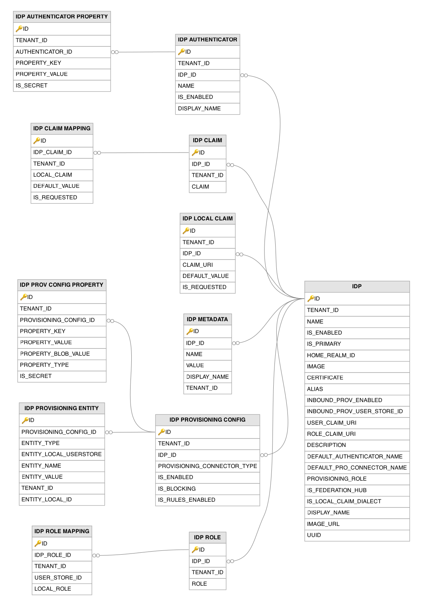

# Identity Provider Related Tables

This section lists out all the identity provider related tables and their attributes in the WSO2 API Manager database.

---

## Table Definitions

### IDP

Stores the master configuration of each federated identity provider registered in the system, such as Google, Facebook, enterprise SAML identity providers, or OIDC providers. A record is created when a new identity provider is registered through the management console or the identity provider management API. The table holds high-level identity provider metadata including its certificate for signature validation, claim and role mapping URIs, provisioning settings, and whether it serves as a federation hub. The `UUID` column provides a stable identifier for API-based management.

| Column | Description |
|--------|-------------|
| ID | Primary key. The auto-generated internal identifier for this identity provider. |
| TENANT_ID | The identifier of the tenant to which this identity provider configuration belongs. |
| NAME | The name of the identity provider, unique within the tenant, used for configuration references. |
| IS_ENABLED | Indicates whether this identity provider is currently active and available for authentication (`1` = enabled). |
| IS_PRIMARY | Indicates whether this is the primary identity provider for the tenant (`1` = primary). |
| HOME_REALM_ID | The home realm identifier used for automatic identity provider discovery during federated authentication. |
| IMAGE | The binary content of the identity provider's logo image, used in login page branding. |
| CERTIFICATE | The PEM-encoded X.509 certificate of the identity provider, used for signature validation of SAML assertions and JWT tokens. |
| ALIAS | An alias for the identity provider, used as the audience or entity ID in protocol-specific contexts. |
| INBOUND_PROV_ENABLED | Indicates whether inbound provisioning is enabled (`1`), allowing the identity provider to provision users into WSO2 via SCIM or SPML. |
| INBOUND_PROV_USER_STORE_ID | The user store domain where inbound-provisioned users from this identity provider are created. |
| USER_CLAIM_URI | The claim URI used to uniquely identify users from this identity provider during federated authentication. |
| ROLE_CLAIM_URI | The claim URI used to extract role information from this identity provider's assertions for role mapping. |
| DESCRIPTION | A human-readable description of this identity provider's purpose and configuration. |
| DEFAULT_AUTHENTICATOR_NAME | The name of the default authenticator to use when multiple authenticators are configured for this identity provider. |
| DEFAULT_PRO_CONNECTOR_NAME | The name of the default provisioning connector to use for outbound provisioning through this identity provider. |
| PROVISIONING_ROLE | The local role automatically assigned to users provisioned through this identity provider. |
| IS_FEDERATION_HUB | Indicates whether this identity provider acts as a federation hub (`1`), routing authentication requests to downstream identity providers. |
| IS_LOCAL_CLAIM_DIALECT | Indicates whether this identity provider uses the local WSO2 claim dialect (`1`) for claim communication. |
| DISPLAY_NAME | The human-readable display name of the identity provider, shown on login pages and management interfaces. |
| IMAGE_URL | The URL of the identity provider's logo image, used as an alternative to the binary `IMAGE` column. |
| UUID | The universally unique identifier for this identity provider, used for API-based management. |

---

### IDP_AUTHENTICATOR

Stores the authenticator configurations available for each federated identity provider, defining the specific authentication mechanisms offered by the identity provider. A record is created when an authenticator is configured for an identity provider (e.g. SAML2 SSO, OIDC, or a custom authenticator). Each authenticator has its own configuration properties stored in the `IDP_AUTHENTICATOR_PROPERTY` table. The `IDP_ID` column points to the `IDP` table.

| Column | Description |
|--------|-------------|
| ID | Primary key. The auto-generated identifier for this authenticator configuration. |
| TENANT_ID | The identifier of the tenant to which this authenticator configuration belongs. |
| IDP_ID | Foreign key to the `IDP` table. The identifier of the identity provider to which this authenticator belongs. |
| NAME | The name of the authenticator, unique within the identity provider and tenant (e.g. `SAMLSSOAuthenticator`, `OpenIDConnectAuthenticator`). |
| IS_ENABLED | Indicates whether this authenticator is currently active and available for use in authentication flows (`1` = enabled). |
| DISPLAY_NAME | The human-readable display name for this authenticator, shown on login pages and configuration interfaces. |

---

### IDP_AUTHENTICATOR_PROPERTY

Stores the configuration properties for each identity provider authenticator defined in the `IDP_AUTHENTICATOR` table, such as endpoint URLs, client IDs, and protocol-specific settings. Records are created when authenticator-specific properties are configured. The `IS_SECRET` flag indicates whether a property value is encrypted, ensuring sensitive configuration is protected at rest. The `AUTHENTICATOR_ID` column points to the `IDP_AUTHENTICATOR` table.

| Column | Description |
|--------|-------------|
| ID | Primary key. The auto-generated row identifier for this authenticator property. |
| TENANT_ID | The identifier of the tenant to which this authenticator property belongs. |
| AUTHENTICATOR_ID | Foreign key to the `IDP_AUTHENTICATOR` table. The identifier of the authenticator to which this property belongs. |
| PROPERTY_KEY | The name of the configuration property (e.g. `SSOUrl`, `TokenEndpoint`, `ClientId`). |
| PROPERTY_VALUE | The value of the configuration property, stored encrypted if `IS_SECRET` is set. |
| IS_SECRET | Indicates whether the property value is stored in encrypted form (`1`), used for sensitive data such as client secrets and API keys. |

---

### IDP_CLAIM

Records the claim URIs that are recognized from a federated identity provider, enabling claim mapping between external identity provider claims and local WSO2 claims. A record is created when the expected claims from a federated identity provider are defined through the management console's claim configuration. These claims are mapped to local claims via the `IDP_CLAIM_MAPPING` table. The `IDP_ID` column points to the `IDP` table.

| Column | Description |
|--------|-------------|
| ID | Primary key. The auto-generated row identifier for this identity provider claim definition. |
| IDP_ID | Foreign key to the `IDP` table. The identifier of the identity provider from which this claim originates. |
| TENANT_ID | The identifier of the tenant to which this identity provider claim definition belongs. |
| CLAIM | The claim URI as recognized from the federated identity provider, unique within the identity provider. |

---

### IDP_CLAIM_MAPPING

Defines the mapping between federated identity provider claim URIs and local WSO2 claim URIs, enabling claim translation during federated authentication. A record is created when a claim mapping is configured for an identity provider. The `DEFAULT_VALUE` column allows a fallback value to be specified when the identity provider does not return a particular claim. The `IDP_CLAIM_ID` column points to the `IDP_CLAIM` table.

| Column | Description |
|--------|-------------|
| ID | Primary key. The auto-generated row identifier for this claim mapping. |
| IDP_CLAIM_ID | Foreign key to the `IDP_CLAIM` table. The identifier of the federated identity provider claim being mapped to a local claim. |
| TENANT_ID | The identifier of the tenant to which this claim mapping belongs. |
| LOCAL_CLAIM | The local WSO2 claim URI to which the federated identity provider claim is mapped. |
| DEFAULT_VALUE | The fallback value to use when the federated identity provider does not return this claim in its assertion. |
| IS_REQUESTED | Indicates whether this claim should be actively requested from the identity provider during the authentication flow. |

---

### IDP_LOCAL_CLAIM

Stores the local claim URIs that are configured for use with a specific identity provider when the identity provider is set to use the local claim dialect. Records are created when local claims to be requested from or provisioned to the identity provider are selected. The `IS_REQUESTED` flag indicates whether the claim should be actively requested from the identity provider during authentication. The `IDP_ID` column points to the `IDP` table.

| Column | Description |
|--------|-------------|
| ID | Primary key. The auto-generated row identifier for this local claim configuration. |
| TENANT_ID | The identifier of the tenant to which this claim configuration belongs. |
| IDP_ID | Foreign key to the `IDP` table. The identifier of the identity provider for which this local claim is configured. |
| CLAIM_URI | The local claim URI that should be requested from or provisioned to this identity provider. |
| DEFAULT_VALUE | The fallback value to use when the identity provider does not return this claim. |
| IS_REQUESTED | Indicates whether this claim should be actively requested from the identity provider during authentication. |

---

### IDP_METADATA

Stores extensible key-value metadata properties for identity providers that do not have dedicated columns in the `IDP` table. Records are created when additional identity provider properties are configured through the management console or API. This provides a flexible extension mechanism for storing identity provider-specific configuration without requiring schema modifications to the main `IDP` table. The `IDP_ID` column points to the `IDP` table.

| Column | Description |
|--------|-------------|
| ID | Primary key. The auto-generated row identifier for this identity provider metadata entry. |
| IDP_ID | Foreign key to the `IDP` table. The identifier of the identity provider to which this metadata belongs. |
| NAME | The key name of the metadata property, unique within the identity provider. |
| VALUE | The value of the metadata property. |
| DISPLAY_NAME | The human-readable display name for this metadata property. |
| TENANT_ID | The identifier of the tenant to which this metadata entry belongs. |

---

### IDP_PROV_CONFIG_PROPERTY

Stores the detailed configuration properties for outbound provisioning connectors defined in the `IDP_PROVISIONING_CONFIG` table. Records are created when provisioning connector settings such as endpoint URLs, credentials, and attribute mappings are configured. The `PROPERTY_BLOB_VALUE` column accommodates large property values that exceed the VARCHAR limit, and `IS_SECRET` indicates whether the property value is stored encrypted. The `PROVISIONING_CONFIG_ID` column points to the `IDP_PROVISIONING_CONFIG` table.

| Column | Description |
|--------|-------------|
| ID | Primary key. The auto-generated row identifier for this provisioning configuration property. |
| TENANT_ID | The identifier of the tenant to which this property belongs. |
| PROVISIONING_CONFIG_ID | Foreign key to the `IDP_PROVISIONING_CONFIG` table. The identifier of the provisioning configuration to which this property belongs. |
| PROPERTY_KEY | The name of the provisioning configuration property (e.g. endpoint URL, credentials, attribute mappings). |
| PROPERTY_VALUE | The value of the provisioning configuration property. |
| PROPERTY_BLOB_VALUE | The value for large provisioning configuration properties that exceed the VARCHAR column size limit. |
| PROPERTY_TYPE | The data type of this property, indicating how the value should be interpreted. |
| IS_SECRET | Indicates whether the property value is stored in encrypted form (`1`), used for sensitive data such as provisioning credentials. |

---

### IDP_PROVISIONING_CONFIG

Stores the outbound provisioning connector configurations for each identity provider, defining how users should be provisioned to external systems when they authenticate through the identity provider. A record is created when a provisioning connector type (e.g. SCIM, SPML, Google, Salesforce) is configured for an identity provider. The connector's detailed properties are stored in the `IDP_PROV_CONFIG_PROPERTY` table, and provisioned entities are tracked in the `IDP_PROVISIONING_ENTITY` table. The `IDP_ID` column points to the `IDP` table.

| Column | Description |
|--------|-------------|
| ID | Primary key. The auto-generated row identifier for this provisioning configuration. |
| TENANT_ID | The identifier of the tenant to which this provisioning configuration belongs. |
| IDP_ID | Foreign key to the `IDP` table. The identifier of the identity provider for which this outbound provisioning connector is configured. |
| PROVISIONING_CONNECTOR_TYPE | The type of provisioning connector (e.g. `scim`, `spml`, `google`, `salesforce`). |
| IS_ENABLED | Indicates whether this provisioning connector is currently active (`1` = enabled). |
| IS_BLOCKING | Indicates whether provisioning is synchronous (`1`), blocking the authentication flow until the external system confirms completion. |
| IS_RULES_ENABLED | Indicates whether rule-based provisioning is enabled (`1`), applying conditional logic to determine when provisioning should trigger. |

---

### IDP_PROVISIONING_ENTITY

Tracks all users and groups that have been provisioned to external systems through the outbound provisioning framework. A record is created each time a user or group is successfully provisioned to an external system via a connector configured in the `IDP_PROVISIONING_CONFIG` table. The table maintains the mapping between local entity identifiers and their remote counterparts (`ENTITY_VALUE`), enabling the system to update or de-provision entities in the external system when changes occur locally. The `PROVISIONING_CONFIG_ID` column points to the `IDP_PROVISIONING_CONFIG` table.

| Column | Description |
|--------|-------------|
| ID | Primary key. The auto-generated row identifier for this provisioned entity record. |
| PROVISIONING_CONFIG_ID | Foreign key to the `IDP_PROVISIONING_CONFIG` table. The identifier of the provisioning configuration through which this entity was provisioned. |
| ENTITY_TYPE | The type of entity that was provisioned to the external system (`USER` or `GROUP`). |
| ENTITY_LOCAL_USERSTORE | The local user store domain from which the entity originates. |
| ENTITY_NAME | The name of the entity in the local system. |
| ENTITY_VALUE | The identifier of the entity in the external system, used for subsequent update and de-provisioning operations. |
| TENANT_ID | The identifier of the tenant to which this provisioned entity belongs. |
| ENTITY_LOCAL_ID | The local identifier of the entity, providing an alternative lookup key. |

---

### IDP_ROLE

Records the roles that are recognized from a federated identity provider, enabling role mapping between external identity provider roles and local WSO2 roles. A record is created when the expected roles from a federated identity provider are defined through the management console's role configuration section. These roles are mapped to local roles via the `IDP_ROLE_MAPPING` table. The `IDP_ID` column points to the `IDP` table.

| Column | Description |
|--------|-------------|
| ID | Primary key. The auto-generated row identifier for this identity provider role definition. |
| IDP_ID | Foreign key to the `IDP` table. The identifier of the identity provider from which this role originates. |
| TENANT_ID | The identifier of the tenant to which this identity provider role definition belongs. |
| ROLE | The role name as recognized from the federated identity provider, unique within the identity provider. |

---

### IDP_ROLE_MAPPING

Defines the mapping between federated identity provider roles and local WSO2 roles, enabling role translation during federated authentication. A record is created when a role mapping is configured for an identity provider, specifying which local role and user store domain should be assigned for each incoming identity provider role. The `IDP_ROLE_ID` column points to the `IDP_ROLE` table.

| Column | Description |
|--------|-------------|
| ID | Primary key. The auto-generated row identifier for this role mapping. |
| IDP_ROLE_ID | Foreign key to the `IDP_ROLE` table. The identifier of the federated identity provider role being mapped to a local role. |
| TENANT_ID | The identifier of the tenant to which this role mapping belongs. |
| USER_STORE_ID | The local user store domain in which the target local role is defined. |
| LOCAL_ROLE | The name of the local WSO2 role to which the federated identity provider role is mapped. |

---

## Entity Relationship Diagram

