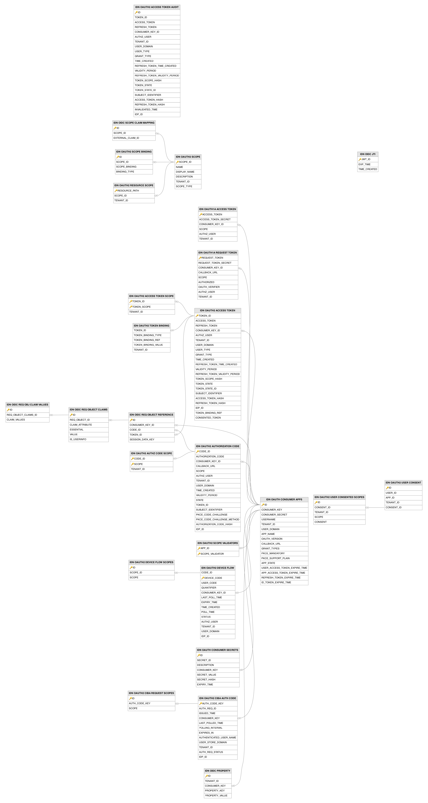
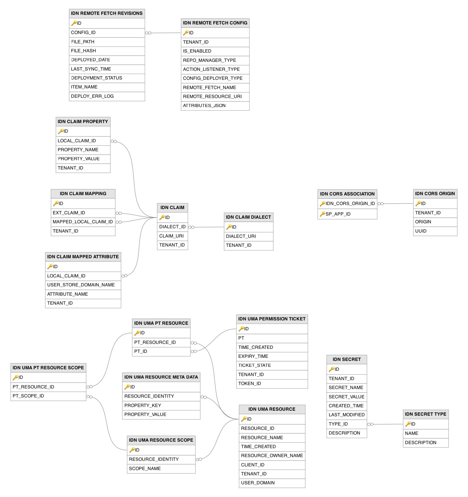
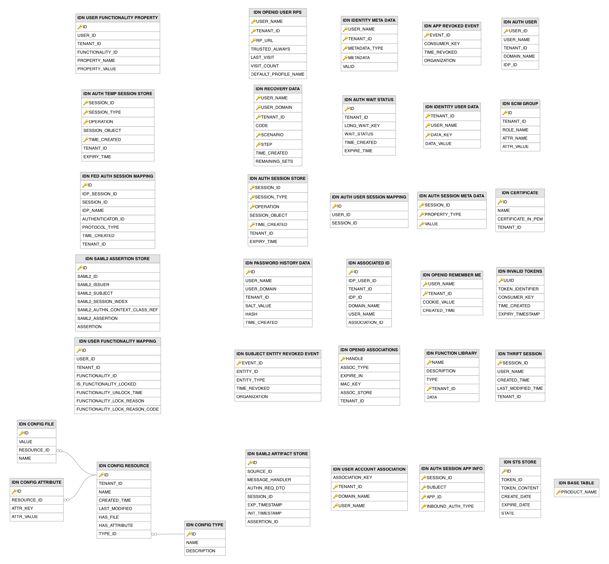

# Identity Related Tables

This section lists out all the identity related tables and their attributes in the WSO2 API Manager database.

---

## Table Definitions

### IDN_APP_REVOKED_EVENT

This table records application-level token revocation events. When all tokens issued to an OAuth application are revoked, a record is added here so that previously issued JWT tokens for that consumer key can be treated as invalid by token validators.

| Column | Description |
|--------|-------------|
| EVENT_ID | Primary key. The unique identifier of the revocation event. |
| CONSUMER_KEY | The OAuth consumer key of the application whose tokens were revoked. |
| TIME_REVOKED | The timestamp at which the revocation event occurred. |
| ORGANIZATION | The organization to which the revoked application belongs. |

---

### IDN_ASSOCIATED_ID

This table maps a federated identity provider user ID to a local user account, allowing a user authenticated through an external identity provider to be associated with a local identity. The `IDP_ID` column points to the `IDP` table.

| Column | Description |
|--------|-------------|
| ID | Primary key. The auto-incremented identifier of the association. |
| IDP_USER_ID | The user identifier as known by the federated identity provider. |
| TENANT_ID | The tenant ID to which the association belongs. |
| IDP_ID | Foreign key to the `IDP` table. The identity provider that authenticated the user. |
| DOMAIN_NAME | The user store domain of the local user. |
| USER_NAME | The username of the local user associated with the federated identity. |
| ASSOCIATION_ID | The unique identifier (UUID) of the association. |

---

### IDN_AUTH_SESSION_APP_INFO

This table stores information about the applications accessed within an authentication session. It links a session to the service providers (applications) and inbound authentication types used during that session.

| Column | Description |
|--------|-------------|
| SESSION_ID | Primary key. The identifier of the authentication session. |
| SUBJECT | Primary key. The subject (authenticated user) of the session for the application. |
| APP_ID | Primary key. The identifier of the application accessed in the session. |
| INBOUND_AUTH_TYPE | Primary key. The inbound authentication protocol type (for example, OAuth2 or SAML) used to access the application. |

---

### IDN_AUTH_SESSION_META_DATA

This table stores metadata properties associated with an authentication session, such as the user agent, IP address, and login time, as key-value pairs keyed by the session identifier.

| Column | Description |
|--------|-------------|
| SESSION_ID | Primary key. The identifier of the authentication session. |
| PROPERTY_TYPE | Primary key. The type of the metadata property (for example, User Agent or IP Address). |
| VALUE | Primary key. The value of the metadata property. |

---

### IDN_AUTH_SESSION_STORE

This table persists the authentication session objects of the framework. Each row holds a serialized session object together with its type, the operation performed, the creation time, and the expiry time, enabling session persistence and clustering.

| Column | Description |
|--------|-------------|
| SESSION_ID | Primary key. The identifier of the authentication session. |
| SESSION_TYPE | Primary key. The type of the stored session. |
| OPERATION | Primary key. The operation performed on the session (for example, store or delete). |
| SESSION_OBJECT | The serialized session object stored as a binary large object. |
| TIME_CREATED | Primary key. The time at which the session entry was created. |
| TENANT_ID | The tenant ID to which the session belongs. |
| EXPIRY_TIME | The time at which the session entry expires. |

---

### IDN_AUTH_TEMP_SESSION_STORE

This table is a temporary counterpart of the `IDN_AUTH_SESSION_STORE` table. It holds short-lived authentication session entries before they are moved to the permanent session store, improving the performance of session persistence operations.

| Column | Description |
|--------|-------------|
| SESSION_ID | Primary key. The identifier of the authentication session. |
| SESSION_TYPE | Primary key. The type of the stored session. |
| OPERATION | Primary key. The operation performed on the session. |
| SESSION_OBJECT | The serialized session object stored as a binary large object. |
| TIME_CREATED | Primary key. The time at which the session entry was created. |
| TENANT_ID | The tenant ID to which the session belongs. |
| EXPIRY_TIME | The time at which the session entry expires. |

---

### IDN_AUTH_USER

This table stores the distinct users who have established authenticated sessions. Each user is uniquely identified by the combination of username, tenant, user store domain, and identity provider.

| Column | Description |
|--------|-------------|
| USER_ID | Primary key. The unique identifier of the user. |
| USER_NAME | The username of the user. |
| TENANT_ID | The tenant ID to which the user belongs. |
| DOMAIN_NAME | The user store domain of the user. |
| IDP_ID | The identifier of the identity provider that authenticated the user. |

---

### IDN_AUTH_USER_SESSION_MAPPING

This table maps users to their authentication sessions, establishing a many-to-many relationship between users in `IDN_AUTH_USER` and sessions in `IDN_AUTH_SESSION_STORE`.

| Column | Description |
|--------|-------------|
| ID | Primary key. The auto-incremented identifier of the mapping. |
| USER_ID | The identifier of the user, referencing the `IDN_AUTH_USER` table. |
| SESSION_ID | The identifier of the session associated with the user. |

---

### IDN_AUTH_WAIT_STATUS

This table tracks long-waiting authentication operations, such as those that pause for asynchronous external responses (for example, push notification or pending approval). The `LONG_WAIT_KEY` uniquely identifies a waiting operation and its status.

| Column | Description |
|--------|-------------|
| ID | Primary key. The auto-incremented identifier of the wait status entry. |
| TENANT_ID | The tenant ID to which the wait operation belongs. |
| LONG_WAIT_KEY | The unique key identifying the long-waiting authentication operation. |
| WAIT_STATUS | The current wait status flag of the operation. |
| TIME_CREATED | The time at which the wait status entry was created. |
| EXPIRE_TIME | The time at which the wait status entry expires. |

---

### IDN_BASE_TABLE

This table is used to provide information related to the server setup. It has only one column, `PRODUCT_NAME`, which contains a row with the value `WSO2 Identity Server`.

| Column | Description |
|--------|-------------|
| PRODUCT_NAME | Primary key. The name of the product. |

---

### IDN_CERTIFICATE

This table stores certificates that are managed by the identity server certificate management framework. Each certificate is stored in PEM format and is uniquely identified by its name within a tenant.

| Column | Description |
|--------|-------------|
| ID | Primary key. The auto-incremented identifier of the certificate. |
| NAME | The name of the certificate. |
| CERTIFICATE_IN_PEM | The certificate content stored in PEM format as a binary large object. |
| TENANT_ID | The tenant ID to which the certificate belongs. |

---

### IDN_CLAIM

This table stores the claims defined under each claim dialect. The `DIALECT_ID` column points to the `IDN_CLAIM_DIALECT` table, and each claim is identified by its claim URI within the dialect and tenant.

| Column | Description |
|--------|-------------|
| ID | Primary key. The auto-incremented identifier of the claim. |
| DIALECT_ID | Foreign key to the `IDN_CLAIM_DIALECT` table. The dialect to which this claim belongs. |
| CLAIM_URI | The URI that uniquely identifies the claim within the dialect. |
| TENANT_ID | The tenant ID to which the claim belongs. |

---

### IDN_CLAIM_DIALECT

This table stores the claim dialects defined in the system. A claim dialect groups a set of related claims under a common namespace (dialect URI).

| Column | Description |
|--------|-------------|
| ID | Primary key. The auto-incremented identifier of the claim dialect. |
| DIALECT_URI | The URI that uniquely identifies the claim dialect. |
| TENANT_ID | The tenant ID to which the claim dialect belongs. |

---

### IDN_CLAIM_MAPPED_ATTRIBUTE

This table maps local claims to the underlying user store attributes. The `LOCAL_CLAIM_ID` column points to the `IDN_CLAIM` table, and each mapping associates a claim with an attribute name in a specific user store domain.

| Column | Description |
|--------|-------------|
| ID | Primary key. The auto-incremented identifier of the mapped attribute. |
| LOCAL_CLAIM_ID | Foreign key to the `IDN_CLAIM` table. The local claim that is mapped to the attribute. |
| USER_STORE_DOMAIN_NAME | The user store domain in which the attribute resides. |
| ATTRIBUTE_NAME | The name of the user store attribute mapped to the local claim. |
| TENANT_ID | The tenant ID to which the mapping belongs. |

---

### IDN_CLAIM_MAPPING

This table stores mappings between external claims and local claims. The `EXT_CLAIM_ID` and `MAPPED_LOCAL_CLAIM_ID` columns both reference the `IDN_CLAIM` table, linking an external claim to the local claim it maps to.

| Column | Description |
|--------|-------------|
| ID | Primary key. The auto-incremented identifier of the claim mapping. |
| EXT_CLAIM_ID | Foreign key to the `IDN_CLAIM` table. The external claim being mapped. |
| MAPPED_LOCAL_CLAIM_ID | Foreign key to the `IDN_CLAIM` table. The local claim to which the external claim is mapped. |
| TENANT_ID | The tenant ID to which the mapping belongs. |

---

### IDN_CLAIM_PROPERTY

This table stores additional properties of local claims as key-value pairs. The `LOCAL_CLAIM_ID` column points to the `IDN_CLAIM` table, allowing arbitrary metadata (such as display name, description, or regular expression) to be attached to a claim.

| Column | Description |
|--------|-------------|
| ID | Primary key. The auto-incremented identifier of the claim property. |
| LOCAL_CLAIM_ID | Foreign key to the `IDN_CLAIM` table. The local claim to which this property belongs. |
| PROPERTY_NAME | The name of the property. |
| PROPERTY_VALUE | The value of the property. |
| TENANT_ID | The tenant ID to which the property belongs. |

---

### IDN_CONFIG_ATTRIBUTE

This table stores the key-value attributes of configuration resources. The `RESOURCE_ID` column points to the `IDN_CONFIG_RESOURCE` table, holding the attribute-based content of a configuration resource.

| Column | Description |
|--------|-------------|
| ID | Primary key. The unique identifier of the configuration attribute. |
| RESOURCE_ID | Foreign key to the `IDN_CONFIG_RESOURCE` table. The configuration resource to which this attribute belongs. |
| ATTR_KEY | The key of the configuration attribute. |
| ATTR_VALUE | The value of the configuration attribute. |

---

### IDN_CONFIG_FILE

This table stores the file-based content of configuration resources. The `RESOURCE_ID` column points to the `IDN_CONFIG_RESOURCE` table, holding the binary file associated with a configuration resource.

| Column | Description |
|--------|-------------|
| ID | Primary key. The unique identifier of the configuration file. |
| VALUE | The file content stored as a binary large object. |
| RESOURCE_ID | Foreign key to the `IDN_CONFIG_RESOURCE` table. The configuration resource to which this file belongs. |
| NAME | The name of the configuration file. |

---

### IDN_CONFIG_RESOURCE

This table stores individual configuration resource instances, each belonging to a type defined in the `IDN_CONFIG_TYPE` table. A resource can carry its data as key-value attributes (in `IDN_CONFIG_ATTRIBUTE`) or as file content (in `IDN_CONFIG_FILE`), with the `HAS_FILE` and `HAS_ATTRIBUTE` flags indicating which storage mode is used.

| Column | Description |
|--------|-------------|
| ID | Primary key. The unique identifier of the configuration resource. |
| TENANT_ID | The tenant ID to which the resource belongs. |
| NAME | The name of the configuration resource. |
| CREATED_TIME | The time at which the resource was created. |
| LAST_MODIFIED | The time at which the resource was last modified. |
| HAS_FILE | A flag indicating whether the resource has file-based content. |
| HAS_ATTRIBUTE | A flag indicating whether the resource has attribute-based content. |
| TYPE_ID | Foreign key to the `IDN_CONFIG_TYPE` table. The configuration type to which this resource belongs. |

---

### IDN_CONFIG_TYPE

This table defines the types of configuration resources that can be managed through the configuration management framework. Records are seeded during database initialization with built-in types such as `CORS_CONFIGURATION`, `IDP_TEMPLATE`, and `BRANDING_PREFERENCES`.

| Column | Description |
|--------|-------------|
| ID | Primary key. The unique identifier of the configuration type. |
| NAME | The unique name of the configuration type. |
| DESCRIPTION | A description of the configuration type. |

---

### IDN_CORS_ASSOCIATION

This table associates CORS origins from the `IDN_CORS_ORIGIN` table with specific service providers in the `SP_APP` table, establishing which applications are permitted to receive cross-origin requests from which origins.

| Column | Description |
|--------|-------------|
| IDN_CORS_ORIGIN_ID | Primary key. Foreign key to the `IDN_CORS_ORIGIN` table. The CORS origin being associated with an application. |
| SP_APP_ID | Primary key. Foreign key to the `SP_APP` table. The service provider associated with the CORS origin. |

---

### IDN_CORS_ORIGIN

This table stores the allowed CORS (Cross-Origin Resource Sharing) origins registered in the system for each tenant. These origins are checked during preflight and actual CORS requests to determine whether a browser should be allowed to make cross-origin requests. Each origin is assigned a UUID for stable API-based management.

| Column | Description |
|--------|-------------|
| ID | Primary key. The auto-incremented identifier of the CORS origin. |
| TENANT_ID | The tenant ID to which the origin belongs. |
| ORIGIN | The allowed origin URL. |
| UUID | The unique identifier (UUID) of the CORS origin. |

---

### IDN_FED_AUTH_SESSION_MAPPING

This table maps a federated identity provider session to the local authentication session, enabling single logout. It records the federated session index, the local session identifier, the identity provider name, and the authenticator and protocol used.

| Column | Description |
|--------|-------------|
| ID | Primary key. The auto-incremented identifier of the mapping. |
| IDP_SESSION_ID | The session identifier at the federated identity provider. |
| SESSION_ID | The local authentication session identifier. |
| IDP_NAME | The name of the federated identity provider. |
| AUTHENTICATOR_ID | The identifier of the authenticator used for the federated authentication. |
| PROTOCOL_TYPE | The protocol type used for the federated authentication. |
| TIME_CREATED | The time at which the mapping was created. |
| TENANT_ID | The tenant ID to which the mapping belongs. |

---

### IDN_FUNCTION_LIBRARY

This table stores the JavaScript function libraries used by adaptive authentication scripts. Each library holds reusable functions that can be imported into conditional authentication scripts.

| Column | Description |
|--------|-------------|
| NAME | Primary key. The name of the function library. |
| DESCRIPTION | A description of the function library. |
| TYPE | The type of the function library. |
| TENANT_ID | Primary key. The tenant ID to which the function library belongs. |
| DATA | The content of the function library stored as a binary large object. |

---

### IDN_IDENTITY_META_DATA

This table stores identity metadata associated with users, such as the metadata used for multi-factor authentication enrollment (for example, TOTP or backup codes). Each entry is keyed by tenant, username, metadata type, and metadata value.

| Column | Description |
|--------|-------------|
| USER_NAME | Primary key. The username of the user to whom the metadata belongs. |
| TENANT_ID | Primary key. The tenant ID to which the user belongs. |
| METADATA_TYPE | Primary key. The type of the identity metadata. |
| METADATA | Primary key. The value of the identity metadata. |
| VALID | A flag indicating whether the metadata entry is valid. |

---

### IDN_IDENTITY_USER_DATA

This table stores identity-related data for users as key-value pairs, such as account lock status, failed login attempt counts, and other identity governance information. Each entry is keyed by tenant, username, and data key.

| Column | Description |
|--------|-------------|
| TENANT_ID | Primary key. The tenant ID to which the user belongs. |
| USER_NAME | Primary key. The username of the user to whom the data belongs. |
| DATA_KEY | Primary key. The key of the identity data entry. |
| DATA_VALUE | The value of the identity data entry. |

---

### IDN_INVALID_TOKENS

This table records token identifiers that have been invalidated (for example, revoked JWT access tokens) along with their consumer key and expiry timestamp, so that they can be rejected during token validation until they expire.

| Column | Description |
|--------|-------------|
| UUID | Primary key. The unique identifier of the invalid token entry. |
| TOKEN_IDENTIFIER | The identifier of the invalidated token. |
| CONSUMER_KEY | The OAuth consumer key associated with the token. |
| TIME_CREATED | The time at which the entry was created. |
| EXPIRY_TIMESTAMP | The time at which the invalid token entry expires and can be purged. |

---

### IDN_OAUTH_CONSUMER_APPS

This table is used when adding OAuth/OpenID Connect configuration as the inbound authentication configuration for a service provider. It stores the OAuth client credentials and per-application token settings.

| Column | Description |
|--------|-------------|
| ID | Primary key. The auto-incremented identifier of the OAuth application. |
| CONSUMER_KEY | The OAuth client key. |
| CONSUMER_SECRET | The OAuth client secret. |
| USERNAME | The username of the user who created the application. |
| TENANT_ID | The tenant ID to which the application belongs. |
| USER_DOMAIN | The user store domain of the application owner. |
| APP_NAME | The name of the service provider. |
| OAUTH_VERSION | The supported OAuth version of the application. |
| CALLBACK_URL | The URL to be redirected to when authorization is complete. |
| GRANT_TYPES | All the grant types allowed for the application. |
| PKCE_MANDATORY | A flag indicating whether PKCE is mandatory for the application. |
| PKCE_SUPPORT_PLAIN | A flag indicating whether the plain PKCE code challenge method is supported. |
| APP_STATE | The state of the application (for example, ACTIVE). |
| USER_ACCESS_TOKEN_EXPIRE_TIME | The validity period, in seconds, of user access tokens issued to the application. |
| APP_ACCESS_TOKEN_EXPIRE_TIME | The validity period, in seconds, of application access tokens issued to the application. |
| REFRESH_TOKEN_EXPIRE_TIME | The validity period, in seconds, of refresh tokens issued to the application. |
| ID_TOKEN_EXPIRE_TIME | The validity period, in seconds, of ID tokens issued to the application. |

---

### IDN_OAUTH_CONSUMER_SECRETS

This table stores the secrets associated with OAuth applications, supporting secret rotation and expiry. The `CONSUMER_KEY` column points to the `IDN_OAUTH_CONSUMER_APPS` table.

| Column | Description |
|--------|-------------|
| ID | Primary key. The auto-incremented identifier of the secret entry. |
| SECRET_ID | The unique identifier of the secret. |
| DESCRIPTION | A description of the secret. |
| CONSUMER_KEY | Foreign key to the `IDN_OAUTH_CONSUMER_APPS` table. The OAuth client key to which the secret belongs. |
| SECRET_VALUE | The value of the secret. |
| SECRET_HASH | The hash of the secret value. |
| EXPIRY_TIME | The time at which the secret expires. |

---

### IDN_OAUTH1A_ACCESS_TOKEN

When using OAuth 1.0a, this table stores the access tokens issued to OAuth clients. The `CONSUMER_KEY_ID` column points to the `IDN_OAUTH_CONSUMER_APPS` table.

| Column | Description |
|--------|-------------|
| ACCESS_TOKEN | Primary key. The generated access token value. |
| ACCESS_TOKEN_SECRET | The access token secret. |
| CONSUMER_KEY_ID | Foreign key to the `IDN_OAUTH_CONSUMER_APPS` table. The OAuth application to which the token was issued. |
| SCOPE | The scope of the access token. |
| AUTHZ_USER | The authorized user of the access token. |
| TENANT_ID | The tenant ID to which the token belongs. |

---

### IDN_OAUTH1A_REQUEST_TOKEN

When using OAuth 1.0a, OAuth clients send the consumer key, consumer secret, and scope to obtain a request token, which is recorded in this table. Once the client exchanges it for an access token, the record is deleted and a new row is added to the `IDN_OAUTH1A_ACCESS_TOKEN` table. The `CONSUMER_KEY_ID` column points to the `IDN_OAUTH_CONSUMER_APPS` table.

| Column | Description |
|--------|-------------|
| REQUEST_TOKEN | Primary key. The generated request token value. |
| REQUEST_TOKEN_SECRET | The request token secret. |
| CONSUMER_KEY_ID | Foreign key to the `IDN_OAUTH_CONSUMER_APPS` table. The OAuth application that requested the token. |
| CALLBACK_URL | The callback URL to which the user is redirected after authorization. |
| SCOPE | The scope requested with the request token. |
| AUTHORIZED | A flag indicating whether the request token has been authorized. |
| OAUTH_VERIFIER | The OAuth verifier returned to the client after authorization. |
| AUTHZ_USER | The authorized user of the request token. |
| TENANT_ID | The tenant ID to which the token belongs. |

---

### IDN_OAUTH2_ACCESS_TOKEN

This table stores the OAuth 2.0 access tokens and refresh tokens issued by the server. The `CONSUMER_KEY_ID` column points to the `IDN_OAUTH_CONSUMER_APPS` table, and each row captures the token state, validity periods, scopes, and the authorized user.

| Column | Description |
|--------|-------------|
| TOKEN_ID | Primary key. The unique identifier of the access token. |
| ACCESS_TOKEN | The access token value. |
| REFRESH_TOKEN | The refresh token value. |
| CONSUMER_KEY_ID | Foreign key to the `IDN_OAUTH_CONSUMER_APPS` table. The OAuth application to which the token was issued. |
| AUTHZ_USER | The authorized user of the token. |
| TENANT_ID | The tenant ID to which the token belongs. |
| USER_DOMAIN | The user store domain of the authorized user. |
| USER_TYPE | The type of the user (for example, APPLICATION or APPLICATION_USER). |
| GRANT_TYPE | The grant type used to issue the token. |
| TIME_CREATED | The time at which the access token was created. |
| REFRESH_TOKEN_TIME_CREATED | The time at which the refresh token was created. |
| VALIDITY_PERIOD | The validity period, in milliseconds, of the access token. |
| REFRESH_TOKEN_VALIDITY_PERIOD | The validity period, in milliseconds, of the refresh token. |
| TOKEN_SCOPE_HASH | The hash of the token scopes. |
| TOKEN_STATE | The state of the token (for example, ACTIVE or REVOKED). |
| TOKEN_STATE_ID | An additional identifier used to distinguish token states. |
| SUBJECT_IDENTIFIER | The subject identifier of the authenticated user. |
| ACCESS_TOKEN_HASH | The hash of the access token value. |
| REFRESH_TOKEN_HASH | The hash of the refresh token value. |
| IDP_ID | The identifier of the identity provider that authenticated the user. |
| TOKEN_BINDING_REF | The reference to the token binding, if any. |
| CONSENTED_TOKEN | A flag indicating whether the token was issued with user consent. |

---

### IDN_OAUTH2_ACCESS_TOKEN_AUDIT

This table maintains an audit trail of OAuth 2.0 access tokens. When a token is revoked or replaced, its details are copied here, recording the invalidation time so that historical token activity can be tracked.

| Column | Description |
|--------|-------------|
| ID | Primary key. The auto-incremented identifier of the audit entry. |
| TOKEN_ID | The identifier of the audited token. |
| ACCESS_TOKEN | The access token value. |
| REFRESH_TOKEN | The refresh token value. |
| CONSUMER_KEY_ID | The identifier of the OAuth application to which the token was issued. |
| AUTHZ_USER | The authorized user of the token. |
| TENANT_ID | The tenant ID to which the token belongs. |
| USER_DOMAIN | The user store domain of the authorized user. |
| USER_TYPE | The type of the user. |
| GRANT_TYPE | The grant type used to issue the token. |
| TIME_CREATED | The time at which the access token was created. |
| REFRESH_TOKEN_TIME_CREATED | The time at which the refresh token was created. |
| VALIDITY_PERIOD | The validity period, in milliseconds, of the access token. |
| REFRESH_TOKEN_VALIDITY_PERIOD | The validity period, in milliseconds, of the refresh token. |
| TOKEN_SCOPE_HASH | The hash of the token scopes. |
| TOKEN_STATE | The state of the token at the time of auditing. |
| TOKEN_STATE_ID | An additional identifier used to distinguish token states. |
| SUBJECT_IDENTIFIER | The subject identifier of the authenticated user. |
| ACCESS_TOKEN_HASH | The hash of the access token value. |
| REFRESH_TOKEN_HASH | The hash of the refresh token value. |
| INVALIDATED_TIME | The time at which the token was invalidated. |
| IDP_ID | The identifier of the identity provider that authenticated the user. |

---

### IDN_OAUTH2_ACCESS_TOKEN_SCOPE

This table stores the individual scopes associated with an OAuth 2.0 access token. The `TOKEN_ID` column points to the `IDN_OAUTH2_ACCESS_TOKEN` table.

| Column | Description |
|--------|-------------|
| TOKEN_ID | Primary key. Foreign key to the `IDN_OAUTH2_ACCESS_TOKEN` table. The access token to which the scope belongs. |
| TOKEN_SCOPE | Primary key. A scope granted to the access token. |
| TENANT_ID | The tenant ID to which the token belongs. |

---

### IDN_OAUTH2_AUTHORIZATION_CODE

This table stores the OAuth 2.0 authorization codes issued during the authorization code grant flow. The `CONSUMER_KEY_ID` column points to the `IDN_OAUTH_CONSUMER_APPS` table, and the code is later exchanged for an access token recorded in `IDN_OAUTH2_ACCESS_TOKEN`.

| Column | Description |
|--------|-------------|
| CODE_ID | Primary key. The unique identifier of the authorization code. |
| AUTHORIZATION_CODE | The authorization code value. |
| CONSUMER_KEY_ID | Foreign key to the `IDN_OAUTH_CONSUMER_APPS` table. The OAuth application that requested the code. |
| CALLBACK_URL | The callback URL provided with the authorization request. |
| SCOPE | The scope requested with the authorization code. |
| AUTHZ_USER | The authorized user of the code. |
| TENANT_ID | The tenant ID to which the code belongs. |
| USER_DOMAIN | The user store domain of the authorized user. |
| TIME_CREATED | The time at which the authorization code was created. |
| VALIDITY_PERIOD | The validity period, in milliseconds, of the authorization code. |
| STATE | The state of the authorization code (for example, ACTIVE or INACTIVE). |
| TOKEN_ID | The identifier of the access token issued in exchange for the code. |
| SUBJECT_IDENTIFIER | The subject identifier of the authenticated user. |
| PKCE_CODE_CHALLENGE | The PKCE code challenge provided with the authorization request. |
| PKCE_CODE_CHALLENGE_METHOD | The PKCE code challenge method (for example, plain or S256). |
| AUTHORIZATION_CODE_HASH | The hash of the authorization code value. |
| IDP_ID | The identifier of the identity provider that authenticated the user. |

---

### IDN_OAUTH2_AUTHZ_CODE_SCOPE

This table stores the individual scopes associated with an OAuth 2.0 authorization code. The `CODE_ID` column points to the `IDN_OAUTH2_AUTHORIZATION_CODE` table.

| Column | Description |
|--------|-------------|
| CODE_ID | Primary key. Foreign key to the `IDN_OAUTH2_AUTHORIZATION_CODE` table. The authorization code to which the scope belongs. |
| SCOPE | Primary key. A scope associated with the authorization code. |
| TENANT_ID | The tenant ID to which the code belongs. |

---

### IDN_OAUTH2_CIBA_AUTH_CODE

This table stores the authentication codes used in the OAuth 2.0 Client Initiated Backchannel Authentication (CIBA) flow. The `CONSUMER_KEY` column points to the `IDN_OAUTH_CONSUMER_APPS` table, and each row tracks the authentication request status and polling details.

| Column | Description |
|--------|-------------|
| AUTH_CODE_KEY | Primary key. The unique key of the CIBA authentication code. |
| AUTH_REQ_ID | The authentication request identifier returned to the client. |
| ISSUED_TIME | The time at which the authentication code was issued. |
| CONSUMER_KEY | Foreign key to the `IDN_OAUTH_CONSUMER_APPS` table. The OAuth application that initiated the request. |
| LAST_POLLED_TIME | The time at which the client last polled for the result. |
| POLLING_INTERVAL | The minimum interval, in seconds, between client polling requests. |
| EXPIRES_IN | The validity period, in seconds, of the authentication request. |
| AUTHENTICATED_USER_NAME | The username of the user being authenticated. |
| USER_STORE_DOMAIN | The user store domain of the authenticated user. |
| TENANT_ID | The tenant ID to which the request belongs. |
| AUTH_REQ_STATUS | The status of the authentication request (for example, REQUESTED). |
| IDP_ID | The identifier of the identity provider that authenticated the user. |

---

### IDN_OAUTH2_CIBA_REQUEST_SCOPES

This table stores the scopes requested in an OAuth 2.0 CIBA authentication request. The `AUTH_CODE_KEY` column points to the `IDN_OAUTH2_CIBA_AUTH_CODE` table.

| Column | Description |
|--------|-------------|
| ID | Primary key. The auto-incremented identifier of the scope entry. |
| AUTH_CODE_KEY | Foreign key to the `IDN_OAUTH2_CIBA_AUTH_CODE` table. The CIBA authentication code to which the scope belongs. |
| SCOPE | A scope requested in the CIBA authentication request. |

---

### IDN_OAUTH2_DEVICE_FLOW

This table stores the state of OAuth 2.0 device authorization grant flows. The `CONSUMER_KEY_ID` column points to the `IDN_OAUTH_CONSUMER_APPS` table, and each row tracks the device code, user code, and polling status.

| Column | Description |
|--------|-------------|
| CODE_ID | The unique identifier of the device flow entry. |
| DEVICE_CODE | Primary key. The device code issued to the device. |
| USER_CODE | The user code displayed to the end user for verification. |
| QUANTIFIER | A quantifier used to ensure uniqueness of the user code. |
| CONSUMER_KEY_ID | Foreign key to the `IDN_OAUTH_CONSUMER_APPS` table. The OAuth application that initiated the device flow. |
| LAST_POLL_TIME | The time at which the device last polled for the result. |
| EXPIRY_TIME | The time at which the device flow entry expires. |
| TIME_CREATED | The time at which the device flow entry was created. |
| POLL_TIME | The minimum interval, in milliseconds, between device polling requests. |
| STATUS | The status of the device flow (for example, PENDING). |
| AUTHZ_USER | The authorized user of the device flow. |
| TENANT_ID | The tenant ID to which the flow belongs. |
| USER_DOMAIN | The user store domain of the authorized user. |
| IDP_ID | The identifier of the identity provider that authenticated the user. |

---

### IDN_OAUTH2_DEVICE_FLOW_SCOPES

This table stores the scopes requested in an OAuth 2.0 device authorization grant flow. The `SCOPE_ID` column references the `CODE_ID` of the `IDN_OAUTH2_DEVICE_FLOW` table.

| Column | Description |
|--------|-------------|
| ID | Primary key. The auto-incremented identifier of the scope entry. |
| SCOPE_ID | Foreign key to the `IDN_OAUTH2_DEVICE_FLOW` table. The device flow entry to which the scope belongs. |
| SCOPE | A scope requested in the device flow. |

---

### IDN_OAUTH2_RESOURCE_SCOPE

This table maps protected resource paths to the OAuth 2.0 scopes required to access them. The `SCOPE_ID` column points to the `IDN_OAUTH2_SCOPE` table.

| Column | Description |
|--------|-------------|
| RESOURCE_PATH | Primary key. The path of the protected resource. |
| SCOPE_ID | Foreign key to the `IDN_OAUTH2_SCOPE` table. The scope required to access the resource. |
| TENANT_ID | The tenant ID to which the resource scope mapping belongs. |

---

### IDN_OAUTH2_SCOPE

This table stores the OAuth 2.0 scopes defined in the system. Each scope has a name, display name, description, and scope type, and is unique within a tenant.

| Column | Description |
|--------|-------------|
| SCOPE_ID | Primary key. The auto-incremented identifier of the scope. |
| NAME | The unique name of the scope within the tenant. |
| DISPLAY_NAME | The display name of the scope. |
| DESCRIPTION | A description of the scope. |
| TENANT_ID | The tenant ID to which the scope belongs. |
| SCOPE_TYPE | The type of the scope. |

---

### IDN_OAUTH2_SCOPE_BINDING

This table stores the bindings associated with OAuth 2.0 scopes, such as the roles or permissions bound to a scope. The `SCOPE_ID` column points to the `IDN_OAUTH2_SCOPE` table.

| Column | Description |
|--------|-------------|
| ID | Primary key. The auto-incremented identifier of the binding. |
| SCOPE_ID | Foreign key to the `IDN_OAUTH2_SCOPE` table. The scope to which the binding belongs. |
| SCOPE_BINDING | The value of the scope binding. |
| BINDING_TYPE | The type of the scope binding. |

---

### IDN_OAUTH2_SCOPE_VALIDATORS

This table stores the scope validators configured for an OAuth application. The `APP_ID` column points to the `IDN_OAUTH_CONSUMER_APPS` table.

| Column | Description |
|--------|-------------|
| APP_ID | Primary key. Foreign key to the `IDN_OAUTH_CONSUMER_APPS` table. The OAuth application to which the validator applies. |
| SCOPE_VALIDATOR | Primary key. The name of the scope validator. |

---

### IDN_OAUTH2_TOKEN_BINDING

This table stores the token bindings used to bind OAuth 2.0 access tokens to a particular client context (for example, a cookie or certificate). The `TOKEN_ID` column points to the `IDN_OAUTH2_ACCESS_TOKEN` table.

| Column | Description |
|--------|-------------|
| TOKEN_ID | Foreign key to the `IDN_OAUTH2_ACCESS_TOKEN` table. The access token to which the binding belongs. |
| TOKEN_BINDING_TYPE | The type of the token binding. |
| TOKEN_BINDING_REF | The reference identifier of the token binding. |
| TOKEN_BINDING_VALUE | The value of the token binding. |
| TENANT_ID | The tenant ID to which the binding belongs. |

---

### IDN_OAUTH2_USER_CONSENT

This table records the consent given by a user to an application. The `APP_ID` column references the `UUID` of the `SP_APP` table, and the consent is uniquely identified by the combination of user, application, and tenant.

| Column | Description |
|--------|-------------|
| ID | Primary key. The auto-incremented identifier of the consent entry. |
| USER_ID | The identifier of the user who granted the consent. |
| APP_ID | Foreign key to the `SP_APP` table. The application to which the consent applies. |
| TENANT_ID | The tenant ID to which the consent belongs. |
| CONSENT_ID | The unique identifier of the consent. |

---

### IDN_OAUTH2_USER_CONSENTED_SCOPES

This table stores the individual scopes consented to (or declined) by a user for an application. The `CONSENT_ID` column points to the `IDN_OAUTH2_USER_CONSENT` table.

| Column | Description |
|--------|-------------|
| ID | Primary key. The auto-incremented identifier of the consented scope entry. |
| CONSENT_ID | Foreign key to the `IDN_OAUTH2_USER_CONSENT` table. The consent record to which the scope belongs. |
| TENANT_ID | The tenant ID to which the consent belongs. |
| SCOPE | The scope that was consented to or declined. |
| CONSENT | A flag indicating whether the user consented to the scope. |

---

### IDN_OIDC_JTI

This table stores the JWT token identifiers (JTI) of OpenID Connect JWTs along with their expiry, in order to detect and prevent token replay.

| Column | Description |
|--------|-------------|
| JWT_ID | Primary key. The unique JWT token identifier (JTI). |
| EXP_TIME | The expiry time of the JWT. |
| TIME_CREATED | The time at which the entry was created. |

---

### IDN_OIDC_PROPERTY

This table stores additional OpenID Connect properties of OAuth applications as key-value pairs. The `CONSUMER_KEY` column points to the `IDN_OAUTH_CONSUMER_APPS` table.

| Column | Description |
|--------|-------------|
| ID | Primary key. The auto-incremented identifier of the property. |
| TENANT_ID | The tenant ID to which the property belongs. |
| CONSUMER_KEY | Foreign key to the `IDN_OAUTH_CONSUMER_APPS` table. The OAuth application to which the property belongs. |
| PROPERTY_KEY | The key of the OpenID Connect property. |
| PROPERTY_VALUE | The value of the OpenID Connect property. |

---

### IDN_OIDC_REQ_OBJECT_CLAIMS

This table stores the claims defined in an OpenID Connect request object. The `REQ_OBJECT_ID` column points to the `IDN_OIDC_REQ_OBJECT_REFERENCE` table.

| Column | Description |
|--------|-------------|
| ID | Primary key. The auto-incremented identifier of the claim. |
| REQ_OBJECT_ID | Foreign key to the `IDN_OIDC_REQ_OBJECT_REFERENCE` table. The request object to which the claim belongs. |
| CLAIM_ATTRIBUTE | The name of the requested claim attribute. |
| ESSENTIAL | A flag indicating whether the claim is essential. |
| VALUE | The requested value of the claim, if any. |
| IS_USERINFO | A flag indicating whether the claim is requested for the UserInfo endpoint. |

---

### IDN_OIDC_REQ_OBJ_CLAIM_VALUES

This table stores the permissible values requested for an OpenID Connect request object claim. The `REQ_OBJECT_CLAIMS_ID` column points to the `IDN_OIDC_REQ_OBJECT_CLAIMS` table.

| Column | Description |
|--------|-------------|
| ID | Primary key. The auto-incremented identifier of the claim value. |
| REQ_OBJECT_CLAIMS_ID | Foreign key to the `IDN_OIDC_REQ_OBJECT_CLAIMS` table. The request object claim to which this value belongs. |
| CLAIM_VALUES | A requested value of the claim. |

---

### IDN_OIDC_REQ_OBJECT_REFERENCE

This table references the OpenID Connect request objects associated with authorization codes and tokens. The `CONSUMER_KEY_ID` column points to the `IDN_OAUTH_CONSUMER_APPS` table, the `CODE_ID` column to the `IDN_OAUTH2_AUTHORIZATION_CODE` table, and the `TOKEN_ID` column to the `IDN_OAUTH2_ACCESS_TOKEN` table.

| Column | Description |
|--------|-------------|
| ID | Primary key. The auto-incremented identifier of the request object reference. |
| CONSUMER_KEY_ID | Foreign key to the `IDN_OAUTH_CONSUMER_APPS` table. The OAuth application associated with the request object. |
| CODE_ID | Foreign key to the `IDN_OAUTH2_AUTHORIZATION_CODE` table. The authorization code associated with the request object. |
| TOKEN_ID | Foreign key to the `IDN_OAUTH2_ACCESS_TOKEN` table. The access token associated with the request object. |
| SESSION_DATA_KEY | The session data key of the authentication request. |

---

### IDN_OIDC_SCOPE_CLAIM_MAPPING

This table maps OpenID Connect scopes to the claims that they return. The `SCOPE_ID` column points to the `IDN_OAUTH2_SCOPE` table, and the `EXTERNAL_CLAIM_ID` column points to the `IDN_CLAIM` table.

| Column | Description |
|--------|-------------|
| ID | Primary key. The auto-incremented identifier of the mapping. |
| SCOPE_ID | Foreign key to the `IDN_OAUTH2_SCOPE` table. The scope to which the claim is mapped. |
| EXTERNAL_CLAIM_ID | Foreign key to the `IDN_CLAIM` table. The claim returned by the scope. |

---

### IDN_OPENID_ASSOCIATIONS

This table stores the OpenID associations established between the server and relying parties, including the association handle, type, MAC key, and expiry, used in the OpenID 2.0 protocol.

| Column | Description |
|--------|-------------|
| HANDLE | Primary key. The unique handle of the association. |
| ASSOC_TYPE | The type of the association. |
| EXPIRE_IN | The expiry time of the association. |
| MAC_KEY | The MAC key used to sign and verify messages. |
| ASSOC_STORE | The association store type (for example, SHARED or PRIVATE). |
| TENANT_ID | The tenant ID to which the association belongs. |

---

### IDN_OPENID_REMEMBER_ME

This table stores the remember-me tokens for OpenID users, holding the cookie value used to recognize a returning user without re-authentication.

| Column | Description |
|--------|-------------|
| USER_NAME | Primary key. The username of the user. |
| TENANT_ID | Primary key. The tenant ID to which the user belongs. |
| COOKIE_VALUE | The remember-me cookie value. |
| CREATED_TIME | The time at which the remember-me entry was created. |

---

### IDN_OPENID_USER_RPS

This table stores the relying parties (RPs) that an OpenID user has interacted with, including whether the user has chosen to always trust each relying party and the profile used.

| Column | Description |
|--------|-------------|
| USER_NAME | Primary key. The username of the user. |
| TENANT_ID | Primary key. The tenant ID to which the user belongs. |
| RP_URL | Primary key. The URL of the relying party. |
| TRUSTED_ALWAYS | A flag indicating whether the relying party is always trusted by the user. |
| LAST_VISIT | The date of the user's last visit to the relying party. |
| VISIT_COUNT | The number of times the user has visited the relying party. |
| DEFAULT_PROFILE_NAME | The default profile used for the relying party. |

---

### IDN_PASSWORD_HISTORY_DATA

This table stores the password history of users so that the password history policy can prevent the reuse of previous passwords. Each entry holds the salt and hash of a previously used password.

| Column | Description |
|--------|-------------|
| ID | Primary key. The auto-incremented identifier of the password history entry. |
| USER_NAME | The username of the user. |
| USER_DOMAIN | The user store domain of the user. |
| TENANT_ID | The tenant ID to which the user belongs. |
| SALT_VALUE | The salt value used to hash the password. |
| HASH | The hash of the previously used password. |
| TIME_CREATED | The time at which the password history entry was created. |

---

### IDN_RECOVERY_DATA

This table stores the data used for account recovery operations, such as password reset and account confirmation. Each entry holds a recovery code, the recovery scenario, and the current step.

| Column | Description |
|--------|-------------|
| USER_NAME | Primary key. The username of the user undergoing recovery. |
| USER_DOMAIN | Primary key. The user store domain of the user. |
| TENANT_ID | The tenant ID to which the user belongs. |
| CODE | The unique recovery code. |
| SCENARIO | Primary key. The recovery scenario (for example, password recovery or account confirmation). |
| STEP | Primary key. The current step in the recovery flow. |
| TIME_CREATED | The time at which the recovery data entry was created. |
| REMAINING_SETS | The remaining set of recovery data, if any. |

---

### IDN_REMOTE_FETCH_CONFIG

This table stores the configurations for remotely fetching deployment artifacts (for example, from a Git repository). Each configuration specifies the repository manager, action listener, and config deployer types used to synchronize remote resources.

| Column | Description |
|--------|-------------|
| ID | Primary key. The unique identifier of the remote fetch configuration. |
| TENANT_ID | The tenant ID to which the configuration belongs. |
| IS_ENABLED | A flag indicating whether the configuration is enabled. |
| REPO_MANAGER_TYPE | The type of the repository manager. |
| ACTION_LISTENER_TYPE | The type of the action listener. |
| CONFIG_DEPLOYER_TYPE | The type of the configuration deployer. |
| REMOTE_FETCH_NAME | The name of the remote fetch configuration. |
| REMOTE_RESOURCE_URI | The URI of the remote resource to fetch. |
| ATTRIBUTES_JSON | The additional configuration attributes stored as JSON. |

---

### IDN_REMOTE_FETCH_REVISIONS

This table tracks the revisions of files fetched and deployed by a remote fetch configuration. The `CONFIG_ID` column points to the `IDN_REMOTE_FETCH_CONFIG` table, and each row records the deployment status of an individual file.

| Column | Description |
|--------|-------------|
| ID | Primary key. The unique identifier of the revision. |
| CONFIG_ID | Foreign key to the `IDN_REMOTE_FETCH_CONFIG` table. The remote fetch configuration that manages this file. |
| FILE_PATH | The path of the fetched file. |
| FILE_HASH | The hash of the fetched file content. |
| DEPLOYED_DATE | The date on which the file was deployed. |
| LAST_SYNC_TIME | The time at which the file was last synchronized. |
| DEPLOYMENT_STATUS | The deployment status of the file. |
| ITEM_NAME | The name of the deployed item. |
| DEPLOY_ERR_LOG | The error log recorded if the deployment failed. |

---

### IDN_SAML2_ARTIFACT_STORE

This table stores SAML 2.0 artifacts during the artifact binding flow. Each entry holds the source ID, message handler, serialized authentication request, and the associated session and assertion identifiers until the artifact is resolved.

| Column | Description |
|--------|-------------|
| ID | Primary key. The auto-incremented identifier of the artifact entry. |
| SOURCE_ID | The source identifier of the artifact. |
| MESSAGE_HANDLER | The message handler associated with the artifact. |
| AUTHN_REQ_DTO | The serialized authentication request data object. |
| SESSION_ID | The session identifier associated with the artifact. |
| EXP_TIMESTAMP | The time at which the artifact expires. |
| INIT_TIMESTAMP | The time at which the artifact was created. |
| ASSERTION_ID | The identifier of the SAML2 assertion associated with the artifact. |

---

### IDN_SAML2_ASSERTION_STORE

This table persists SAML 2.0 assertions issued by the server, storing both the assertion metadata (issuer, subject, session index) and the serialized assertion itself for later retrieval.

| Column | Description |
|--------|-------------|
| ID | Primary key. The auto-incremented identifier of the assertion entry. |
| SAML2_ID | The identifier of the SAML2 assertion. |
| SAML2_ISSUER | The issuer of the SAML2 assertion. |
| SAML2_SUBJECT | The subject of the SAML2 assertion. |
| SAML2_SESSION_INDEX | The session index of the SAML2 assertion. |
| SAML2_AUTHN_CONTEXT_CLASS_REF | The authentication context class reference of the assertion. |
| SAML2_ASSERTION | The SAML2 assertion stored as a string. |
| ASSERTION | The serialized SAML2 assertion stored as a binary large object. |

---

### IDN_SCIM_GROUP

This table stores the SCIM attributes of user roles (groups) as attribute name-value pairs keyed by role name and tenant.

| Column | Description |
|--------|-------------|
| ID | Primary key. The auto-incremented identifier of the entry. |
| TENANT_ID | The tenant ID to which the group belongs. |
| ROLE_NAME | The name of the role (group). |
| ATTR_NAME | The name of the SCIM attribute. |
| ATTR_VALUE | The value of the SCIM attribute. |

---

### IDN_SECRET

This table stores the secrets managed by the secret management framework. The `TYPE_ID` column points to the `IDN_SECRET_TYPE` table, and each secret holds an encrypted value identified uniquely by name within its type and tenant.

| Column | Description |
|--------|-------------|
| ID | Primary key. The unique identifier of the secret. |
| TENANT_ID | The tenant ID to which the secret belongs. |
| SECRET_NAME | The name of the secret. |
| SECRET_VALUE | The value of the secret. |
| CREATED_TIME | The time at which the secret was created. |
| LAST_MODIFIED | The time at which the secret was last modified. |
| TYPE_ID | Foreign key to the `IDN_SECRET_TYPE` table. The secret type to which this secret belongs. |
| DESCRIPTION | A description of the secret. |

---

### IDN_SECRET_TYPE

This table defines the categories of secrets that can be managed through the secret management framework. Records are seeded during database initialization with built-in types such as `ADAPTIVE_AUTH_CALL_CHOREO`, and additional types can be registered by extensions.

| Column | Description |
|--------|-------------|
| ID | Primary key. The unique identifier of the secret type. |
| NAME | The unique name of the secret type. |
| DESCRIPTION | A description of the secret type. |

---

### IDN_STS_STORE

This table stores the security tokens issued by the Security Token Service (STS), holding the serialized token content along with its creation and expiry times.

| Column | Description |
|--------|-------------|
| ID | Primary key. The auto-incremented identifier of the token entry. |
| TOKEN_ID | The identifier of the security token. |
| TOKEN_CONTENT | The serialized token content stored as a binary large object. |
| CREATE_DATE | The time at which the token was created. |
| EXPIRE_DATE | The time at which the token expires. |
| STATE | The state of the token. |

---

### IDN_SUBJECT_ENTITY_REVOKED_EVENT

This table records subject entity-level token revocation events. When tokens issued to a particular subject entity (for example, a user) are revoked, a record is added here so that previously issued tokens for that entity can be treated as invalid.

| Column | Description |
|--------|-------------|
| EVENT_ID | Primary key. The unique identifier of the revocation event. |
| ENTITY_ID | The identifier of the subject entity whose tokens were revoked. |
| ENTITY_TYPE | The type of the subject entity. |
| TIME_REVOKED | The timestamp at which the revocation event occurred. |
| ORGANIZATION | The organization to which the subject entity belongs. |

---

### IDN_THRIFT_SESSION

This table stores the sessions established through the Thrift authentication service, holding the session identifier, the associated user, and the session timestamps.

| Column | Description |
|--------|-------------|
| SESSION_ID | Primary key. The identifier of the Thrift session. |
| USER_NAME | The username of the authenticated user. |
| CREATED_TIME | The time at which the session was created. |
| LAST_MODIFIED_TIME | The time at which the session was last modified. |
| TENANT_ID | The tenant ID to which the session belongs. |

---

### IDN_UMA_PERMISSION_TICKET

This table stores the permission tickets issued in the User-Managed Access (UMA) flow. A permission ticket represents a set of requested resources and scopes and is later exchanged for a requesting party token.

| Column | Description |
|--------|-------------|
| ID | Primary key. The auto-incremented identifier of the permission ticket. |
| PT | The permission ticket value. |
| TIME_CREATED | The time at which the permission ticket was created. |
| EXPIRY_TIME | The time at which the permission ticket expires. |
| TICKET_STATE | The state of the permission ticket (for example, ACTIVE). |
| TENANT_ID | The tenant ID to which the ticket belongs. |
| TOKEN_ID | The identifier of the token associated with the permission ticket. |

---

### IDN_UMA_PT_RESOURCE

This table associates UMA permission tickets with the resources they authorize access to. The `PT_ID` column points to the `IDN_UMA_PERMISSION_TICKET` table, and the `PT_RESOURCE_ID` column points to the `IDN_UMA_RESOURCE` table.

| Column | Description |
|--------|-------------|
| ID | Primary key. The auto-incremented identifier of the entry. |
| PT_RESOURCE_ID | Foreign key to the `IDN_UMA_RESOURCE` table. The UMA resource that the permission ticket authorizes access to. |
| PT_ID | Foreign key to the `IDN_UMA_PERMISSION_TICKET` table. The permission ticket associated with this resource. |

---

### IDN_UMA_PT_RESOURCE_SCOPE

This table stores the scopes requested for each resource in a UMA permission ticket. The `PT_RESOURCE_ID` column points to the `IDN_UMA_PT_RESOURCE` table, and the `PT_SCOPE_ID` column points to the `IDN_UMA_RESOURCE_SCOPE` table.

| Column | Description |
|--------|-------------|
| ID | Primary key. The auto-incremented identifier of the entry. |
| PT_RESOURCE_ID | Foreign key to the `IDN_UMA_PT_RESOURCE` table. The permission ticket resource entry that this scope applies to. |
| PT_SCOPE_ID | Foreign key to the `IDN_UMA_RESOURCE_SCOPE` table. The specific access scope being requested for the resource in this ticket. |

---

### IDN_UMA_RESOURCE

This table stores the resources registered in the User-Managed Access (UMA) framework. Each resource is owned by a resource owner and registered through a particular client, allowing the owner to control access to it.

| Column | Description |
|--------|-------------|
| ID | Primary key. The auto-incremented identifier of the resource. |
| RESOURCE_ID | The unique identifier of the UMA resource. |
| RESOURCE_NAME | The name of the UMA resource. |
| TIME_CREATED | The time at which the resource was created. |
| RESOURCE_OWNER_NAME | The name of the resource owner. |
| CLIENT_ID | The client through which the resource was registered. |
| TENANT_ID | The tenant ID to which the resource belongs. |
| USER_DOMAIN | The user store domain of the resource owner. |

---

### IDN_UMA_RESOURCE_META_DATA

This table stores metadata properties of UMA resources as key-value pairs. The `RESOURCE_IDENTITY` column points to the `IDN_UMA_RESOURCE` table.

| Column | Description |
|--------|-------------|
| ID | Primary key. The auto-incremented identifier of the metadata entry. |
| RESOURCE_IDENTITY | Foreign key to the `IDN_UMA_RESOURCE` table. The UMA resource that this metadata property belongs to. |
| PROPERTY_KEY | The key of the metadata property. |
| PROPERTY_VALUE | The value of the metadata property. |

---

### IDN_UMA_RESOURCE_SCOPE

This table stores the scopes defined for UMA resources. The `RESOURCE_IDENTITY` column points to the `IDN_UMA_RESOURCE` table.

| Column | Description |
|--------|-------------|
| ID | Primary key. The auto-incremented identifier of the scope entry. |
| RESOURCE_IDENTITY | Foreign key to the `IDN_UMA_RESOURCE` table. The UMA resource that this scope is defined for. |
| SCOPE_NAME | The name of the scope. |

---

### IDN_USER_ACCOUNT_ASSOCIATION

This table associates multiple user accounts that belong to the same person, enabling account linking so that a user can switch between associated accounts. Accounts sharing the same `ASSOCIATION_KEY` are considered linked.

| Column | Description |
|--------|-------------|
| ASSOCIATION_KEY | The key that links associated user accounts. |
| TENANT_ID | Primary key. The tenant ID to which the user account belongs. |
| DOMAIN_NAME | Primary key. The user store domain of the user account. |
| USER_NAME | Primary key. The username of the associated user account. |

---

### IDN_USER_FUNCTIONALITY_MAPPING

This table stores the lock state of functionalities (such as self-service flows) per user. Each entry records whether a functionality is locked for a user, when it will be unlocked, and the reason for the lock.

| Column | Description |
|--------|-------------|
| ID | Primary key. The unique identifier of the mapping. |
| USER_ID | The identifier of the user. |
| TENANT_ID | The tenant ID to which the user belongs. |
| FUNCTIONALITY_ID | The identifier of the functionality. |
| IS_FUNCTIONALITY_LOCKED | A flag indicating whether the functionality is locked for the user. |
| FUNCTIONALITY_UNLOCK_TIME | The time at which the functionality will be unlocked. |
| FUNCTIONALITY_LOCK_REASON | The reason for which the functionality was locked. |
| FUNCTIONALITY_LOCK_REASON_CODE | The code of the lock reason. |

---

### IDN_USER_FUNCTIONALITY_PROPERTY

This table stores extensible key-value properties associated with user-functionality lock mappings in the `IDN_USER_FUNCTIONALITY_MAPPING` table, such as the number of remaining unlock attempts or other context needed by the governance framework.

| Column | Description |
|--------|-------------|
| ID | Primary key. The unique identifier of the property. |
| USER_ID | The identifier of the user. |
| TENANT_ID | The tenant ID to which the user belongs. |
| FUNCTIONALITY_ID | The identifier of the functionality. |
| PROPERTY_NAME | The name of the property. |
| PROPERTY_VALUE | The value of the property. |

---

## Entity Relationship Diagrams

