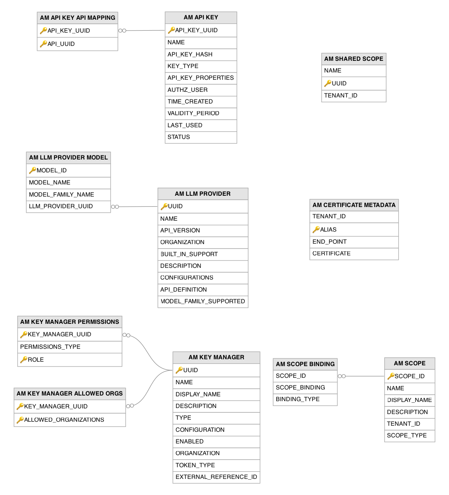
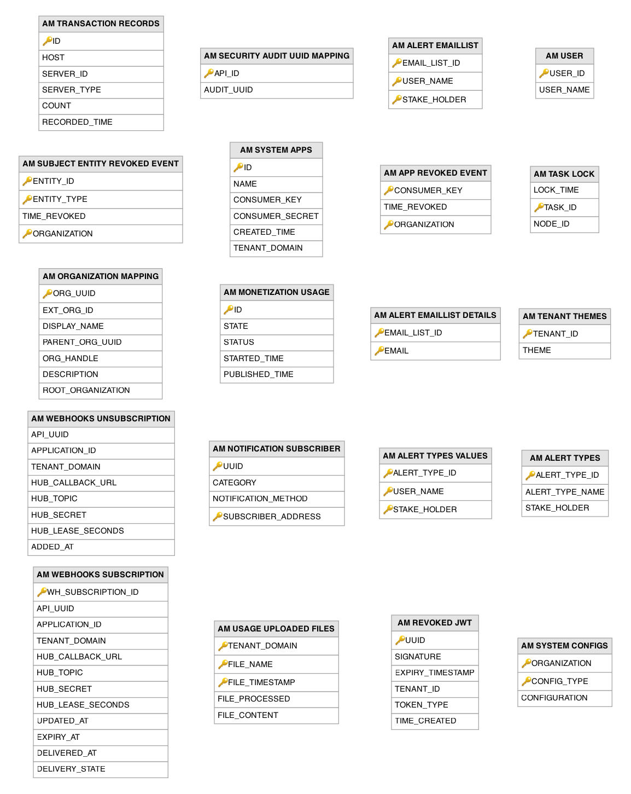

# Key Management and Miscellaneous Related Tables

This section lists out all the key management and miscellaneous related tables and their attributes in the WSO2 API Manager database.

---

## Table Definitions

### AM_ALERT_EMAILLIST

Maintains per-user email notification lists for the APIM alert system, grouping email addresses that should receive alert notifications. A record is created when a user configures alert email recipients through the Publisher or Developer Portal. Each user can have one email list per stakeholder role, and the actual email addresses within each list are stored in the `AM_ALERT_EMAILLIST_DETAILS` table.

| Column | Description |
|--------|-------------|
| EMAIL_LIST_ID | Primary key (composite). Auto-generated unique identifier for this email notification list. |
| USER_NAME | Primary key (composite). The username of the user who owns this email notification list. |
| STAKE_HOLDER | Primary key (composite). The stakeholder role context for this email list (`publisher` or `subscriber`). |

---

### AM_ALERT_EMAILLIST_DETAILS

Stores individual email addresses belonging to an alert email notification list. Records are created when a user adds email recipients to their alert configuration. Each entry links an email address to a list defined in the `AM_ALERT_EMAILLIST` table, and the composite primary key ensures no duplicate email entries within the same list.

| Column | Description |
|--------|-------------|
| EMAIL_LIST_ID | Primary key (composite). The parent email notification list that this email address belongs to. |
| EMAIL | Primary key (composite). The email address that receives alert notifications for this list. |

---

### AM_ALERT_TYPES

Defines the types of alerts available in the APIM analytics alert system, seeded with default alert types during installation. Each alert type is categorized by stakeholder role: `publisher` alerts cover abnormal backend behavior and response time anomalies, while `subscriber` alerts cover abnormal request patterns and frequency spikes.

| Column | Description |
|--------|-------------|
| ALERT_TYPE_ID | Primary key. Auto-generated unique identifier for this alert type. |
| ALERT_TYPE_NAME | The descriptive name of the alert type (e.g., AbnormalResponseTime, UnusualIPAccess). |
| STAKE_HOLDER | The stakeholder role this alert type is relevant to (`publisher` for API owners, `subscriber` for API consumers). |

---

### AM_ALERT_TYPES_VALUES

Records which alert types each user has subscribed to, allowing publishers and subscribers to opt into specific alert categories. A record is created when a user configures their alert preferences through the Publisher or Developer Portal. The composite key ensures each user can subscribe to each alert type exactly once per stakeholder role.

| Column | Description |
|--------|-------------|
| ALERT_TYPE_ID | Primary key (composite). The alert type the user has subscribed to receive notifications for. |
| USER_NAME | Primary key (composite). The username of the user who subscribed to this alert type. |
| STAKE_HOLDER | Primary key (composite). The stakeholder role context for this subscription (`publisher` or `subscriber`). |

---

### AM_API_KEY

Stores self-contained API keys that provide a simplified authentication mechanism for API consumers, as an alternative to full OAuth2 flows. A record is created when a developer generates an API key for a specific application. API keys are hashed before storage for security, and the original key is returned to the developer only once at creation time. The `STATUS` column supports key lifecycle management without deleting keys.

| Column | Description |
|--------|-------------|
| API_KEY_UUID | Primary key. The universally unique identifier for this API key. |
| NAME | The human-readable name assigned to this API key by the developer. |
| API_KEY_HASH | Unique. The cryptographic hash of the API key, used for validation without storing the original key. |
| KEY_TYPE | The type of the API key indicating its intended environment or usage context. |
| API_KEY_PROPERTIES | Serialized additional properties and metadata associated with this API key. |
| AUTHZ_USER | The username of the developer who is authorized to use this API key. |
| TIME_CREATED | The timestamp when this API key was generated. |
| VALIDITY_PERIOD | The validity period of this API key in milliseconds from the creation time. |
| LAST_USED | The timestamp when this API key was last used to invoke an API. |
| STATUS | The current lifecycle status of the API key (defaults to `ACTIVE`, can be set to `REVOKED`). |

---

### AM_API_KEY_API_MAPPING

Associates API keys with the specific APIs they are authorized to access, enabling fine-grained key-to-API access control. Records are created when an API key is generated, linking it to the APIs that the key holder is permitted to invoke. The `API_KEY_UUID` column is a foreign key to the `AM_API_KEY` table and the `API_UUID` column is a foreign key to the `AM_API` table.

| Column | Description |
|--------|-------------|
| API_KEY_UUID | Primary key (composite). Foreign key to the `AM_API_KEY` table. The API key being granted access. |
| API_UUID | Primary key (composite). Foreign key to the `AM_API` table. The specific API that this key is authorized to invoke. |

---

### AM_APP_REVOKED_EVENT

Records application-level token revocation events, triggered when all tokens issued to a specific OAuth consumer key are revoked. A record is created when an administrator or the system revokes all active tokens for an application. Gateway nodes consume these events to invalidate cached tokens, ensuring that revoked application tokens are rejected even before the Gateway's token cache expires.

| Column | Description |
|--------|-------------|
| CONSUMER_KEY | Primary key (composite). The OAuth2 consumer key whose tokens have been revoked. |
| TIME_REVOKED | The timestamp when the application-level token revocation was triggered. |
| ORGANIZATION | Primary key (composite). The organization in which this revocation event occurred. |

---

### AM_CERTIFICATE_METADATA

Stores metadata for SSL certificates used to establish secure connections between the Gateway and backend endpoints. A record is created when an administrator uploads a backend server certificate, enabling the Gateway to trust the backend's TLS certificate. The certificate is stored as a binary blob and is identified by an alias that is unique within the tenant.

| Column | Description |
|--------|-------------|
| TENANT_ID | The identifier of the tenant that uploaded this certificate. |
| ALIAS | Primary key. The unique alias name used to identify this certificate within the tenant's certificate store. |
| END_POINT | The backend endpoint URL that this certificate is associated with for TLS trust validation. |
| CERTIFICATE | The binary content of the SSL certificate in PEM or DER format. |

---

### AM_KEY_MANAGER

Stores configurations for OAuth2 key manager integrations, allowing APIM to work with multiple identity providers simultaneously. A record is created when an administrator configures a key manager, connecting APIM to identity providers such as the built-in Resident Key Manager, Keycloak, Okta, Auth0, Azure AD, any provider exposed through the standard OIDC protocol, or any custom OAuth2 server. The `CONFIGURATION` blob stores provider-specific settings including token endpoints and credential details.

| Column | Description |
|--------|-------------|
| UUID | Primary key. The universally unique identifier for this key manager configuration. |
| NAME | The name of the key manager, unique within an organization (e.g., Resident Key Manager, Keycloak). |
| DISPLAY_NAME | The human-readable display name shown in portal UIs when selecting a key manager. |
| DESCRIPTION | A human-readable description of the key manager and its purpose. |
| TYPE | The key manager type identifying the IdP implementation (free-form `VARCHAR(45)`), e.g., default, KeyCloak, Okta, Auth0, AzureAD, or OIDC. OIDC denotes the open/standard OpenID Connect protocol type used to integrate generic, standards-compliant providers that do not have a dedicated connector. |
| CONFIGURATION | The serialized configuration containing provider-specific settings such as endpoints, credentials, and claim mappings. |
| ENABLED | Flag indicating whether this key manager is active and available for use by developers. |
| ORGANIZATION | The organization to which this key manager configuration belongs. |
| TOKEN_TYPE | The type of access tokens issued by this key manager (e.g., JWT, OPAQUE). |
| EXTERNAL_REFERENCE_ID | An external reference identifier for linking to the key manager in external systems. |

---

### AM_KEY_MANAGER_ALLOWED_ORGS

Defines which organizations are permitted to use a given key manager in multi-organization deployments. Records are created when an administrator configures cross-organization key manager sharing. The `KEY_MANAGER_UUID` column is a foreign key to the `AM_KEY_MANAGER` table.

| Column | Description |
|--------|-------------|
| KEY_MANAGER_UUID | Primary key (composite). Foreign key to the `AM_KEY_MANAGER` table. The key manager being shared across organizations. |
| ALLOWED_ORGANIZATIONS | Primary key (composite). The organization permitted to use this key manager. |

---

### AM_KEY_MANAGER_PERMISSIONS

Controls role-based access to key manager configurations, determining which user roles can view and use specific key managers. Records are created when an administrator sets permission restrictions on a key manager. The `KEY_MANAGER_UUID` column is a foreign key to the `AM_KEY_MANAGER` table.

| Column | Description |
|--------|-------------|
| KEY_MANAGER_UUID | Primary key (composite). Foreign key to the `AM_KEY_MANAGER` table. The key manager whose access is being controlled. |
| PERMISSIONS_TYPE | The permission model applied (e.g., allow or deny). |
| ROLE | Primary key (composite). The user role that this permission rule applies to. |

---

### AM_LLM_PROVIDER

Stores configuration for Large Language Model (LLM) provider integrations, enabling APIM to proxy and manage access to AI services. Records are created when an administrator registers an LLM provider, or when built-in providers are seeded during initialization. The `CONFIGURATIONS` blob stores provider-specific settings, and the `API_DEFINITION` contains the provider's API specification used for request/response transformation at the Gateway.

| Column | Description |
|--------|-------------|
| UUID | Primary key. The universally unique identifier for this LLM provider configuration. |
| NAME | The name of the LLM provider, unique per version within an organization. |
| API_VERSION | The API version of the LLM provider's interface. |
| ORGANIZATION | The organization to which this LLM provider configuration belongs. |
| BUILT_IN_SUPPORT | Flag indicating whether this is a built-in provider seeded during system initialization (true/false). |
| DESCRIPTION | A human-readable description of the LLM provider and its supported capabilities. |
| CONFIGURATIONS | The serialized configuration containing provider-specific settings such as authentication credentials and endpoint URLs. |
| API_DEFINITION | The provider's API specification used by the Gateway for request/response transformation. |
| MODEL_FAMILY_SUPPORTED | Flag indicating whether this provider supports model family-level grouping for throttling and routing (defaults to `false`). |

---

### AM_LLM_PROVIDER_MODEL

Registers specific AI models available from an LLM provider, allowing publishers to select which model an API should route requests to. Records are created when an administrator configures the available models for a provider. Each model belongs to a model family, enabling family-level throttling and routing policies. The `LLM_PROVIDER_UUID` column is a foreign key to the `AM_LLM_PROVIDER` table.

| Column | Description |
|--------|-------------|
| MODEL_ID | Primary key. Auto-generated unique identifier for this AI model entry. |
| MODEL_NAME | The name of the specific AI model (e.g., gpt-4, claude-3-opus, mistral-large). |
| MODEL_FAMILY_NAME | The model family this model belongs to, used for family-level throttling policies. |
| LLM_PROVIDER_UUID | Foreign key to the `AM_LLM_PROVIDER` table. The LLM provider that offers this model. |

---

### AM_MONETIZATION_USAGE

Tracks the state of monetization usage data publishing, which is the process of pushing API usage metrics to billing platforms for commercial API programs. Records are managed by the monetization usage publisher scheduled task, which periodically aggregates API call counts and sends them to the configured billing engine.

| Column | Description |
|--------|-------------|
| ID | Primary key. Unique identifier for this monetization usage record. |
| STATE | The current state of usage data collection (e.g., whether the collection window is open or closed). |
| STATUS | The publishing status indicating whether usage data was successfully sent to the billing platform. |
| STARTED_TIME | The start time of the usage data collection window. |
| PUBLISHED_TIME | The timestamp when the usage data was published to the billing engine. |

---

### AM_NOTIFICATION_SUBSCRIBER

Registers endpoints that receive push notifications for APIM events such as token revocation, API deployment changes, or throttle policy updates. Records are created when a component or external system subscribes to APIM event notifications. The `NOTIFICATION_METHOD` specifies the delivery mechanism, and `SUBSCRIBER_ADDRESS` contains the endpoint URL or identifier.

| Column | Description |
|--------|-------------|
| UUID | Primary key (composite). The unique identifier for this notification subscription. |
| CATEGORY | The event category this subscription listens for (e.g., token_revocation, api_deploy, throttle_update). |
| NOTIFICATION_METHOD | The delivery mechanism for notifications (e.g., WebSocket, webhook). |
| SUBSCRIBER_ADDRESS | Primary key (composite). The endpoint URL or address where notifications are delivered. |

---

### AM_ORGANIZATION_MAPPING

Maps internal organization identifiers to external organization references, supporting multi-organization deployments where APIM serves as a centralized platform for multiple business units or partners. The `PARENT_ORG_UUID` column supports hierarchical organization structures, while `ORG_HANDLE` provides a human-readable short identifier.

| Column | Description |
|--------|-------------|
| ORG_UUID | Primary key. The universally unique identifier for this organization. |
| EXT_ORG_ID | The external organization identifier used for integration with external identity systems. |
| DISPLAY_NAME | The human-readable display name of the organization shown in portal UIs. |
| PARENT_ORG_UUID | The UUID of the parent organization in a hierarchical org structure (null for top-level organizations). |
| ORG_HANDLE | A short, URL-friendly handle for the organization used in API context paths and references. |
| DESCRIPTION | A human-readable description of the organization's purpose. |
| ROOT_ORGANIZATION | The top-level root organization in the hierarchy that this organization ultimately belongs to. |

---

### AM_REVOKED_JWT

Maintains a record of JWT access tokens and API keys that have been explicitly revoked before their natural expiration. A record is created when an administrator or user revokes a token. The Gateway checks incoming JWT tokens against this table to reject revoked tokens even though they have not yet expired. The `EXPIRY_TIMESTAMP` is retained so that entries can be purged after the original token would have expired naturally.

| Column | Description |
|--------|-------------|
| UUID | Primary key. The unique identifier for this revocation record. |
| SIGNATURE | The JWT signature used to identify and match revoked tokens against incoming requests. |
| EXPIRY_TIMESTAMP | The original expiry time of the revoked token, used to automatically purge entries after the token would have expired naturally. |
| TENANT_ID | The identifier of the tenant in which this token was revoked. |
| TOKEN_TYPE | The type of revoked token (e.g., DEFAULT, API_KEY). |
| TIME_CREATED | The timestamp when the token revocation was recorded. |

---

### AM_SCOPE

Stores APIM-managed OAuth2 scopes used for protecting internal REST API endpoints (Publisher, Developer Portal, Admin APIs). Records are seeded during server initialization with scopes such as `apim:api_view`, `apim:api_create`, and `apim:subscribe`. Each scope can be bound to roles through the `AM_SCOPE_BINDING` table to control which users can perform specific management operations.

| Column | Description |
|--------|-------------|
| SCOPE_ID | Primary key. Auto-generated unique identifier for this APIM-managed scope. |
| NAME | The internal scope name (e.g., `apim:api_view`, `apim:api_create`, `apim:subscribe`). |
| DISPLAY_NAME | The human-readable display name of the scope. |
| DESCRIPTION | A human-readable description explaining what access this scope grants. |
| TENANT_ID | The identifier of the tenant to which this scope belongs (defaults to -1). |
| SCOPE_TYPE | The classification type of the scope (e.g., system scope for APIM management APIs). |

---

### AM_SCOPE_BINDING

Associates APIM-managed scopes with roles or other binding values, defining who is authorized to use each scope. Records are created during server initialization to map default scopes to roles (e.g., `apim:api_create` to `Internal/creator`). The `SCOPE_ID` column is a foreign key to the `AM_SCOPE` table.

| Column | Description |
|--------|-------------|
| SCOPE_ID | Foreign key to the `AM_SCOPE` table. The APIM-managed scope that this binding applies to. |
| SCOPE_BINDING | The value bound to the scope, typically a user role (e.g., `Internal/creator`, `admin`). |
| BINDING_TYPE | The type of binding (e.g., role-based) that determines how the scope is authorized. |

---

### AM_SECURITY_AUDIT_UUID_MAPPING

Links APIs to external security audit service identifiers, enabling integration with third-party API security audit tools. A record is created when a publisher initiates a security audit for an API, typically through an integration with services such as 42Crunch. The `API_ID` column is a foreign key to the `AM_API` table.

| Column | Description |
|--------|-------------|
| API_ID | Primary key. Foreign key to the `AM_API` table. The API that has been submitted for a security audit. |
| AUDIT_UUID | The unique identifier assigned by the external security audit service used to retrieve audit results. |

---

### AM_SHARED_SCOPE

Registers OAuth2 scopes that are shared across multiple APIs within the same tenant, enabling consistent access control boundaries. A record is created when a publisher defines a new shared scope through the Publisher portal. Unlike API-specific scopes, shared scopes can be referenced by any API in the organization.

| Column | Description |
|--------|-------------|
| NAME | The name of the shared OAuth2 scope (e.g., `read`, `write`) that can be referenced across multiple APIs. |
| UUID | Primary key. The universally unique identifier for this shared scope. |
| TENANT_ID | The identifier of the tenant to which this shared scope belongs. |

---

### AM_SUBJECT_ENTITY_REVOKED_EVENT

Records subject-level token revocation events, where all tokens associated with a specific entity (such as a user or an end-user session) are invalidated. A record is created when tokens are revoked by subject identifier, supporting use cases such as user logout across all applications. Gateway nodes consume these events to clear their token caches accordingly.

| Column | Description |
|--------|-------------|
| ENTITY_ID | Primary key (composite). The identifier of the subject entity whose tokens are revoked (e.g., a username or session ID). |
| ENTITY_TYPE | Primary key (composite). The type of entity being revoked (e.g., user, session, client). |
| TIME_REVOKED | The timestamp when the subject-level token revocation was triggered. |
| ORGANIZATION | Primary key (composite). The organization in which this revocation event occurred. |

---

### AM_SYSTEM_APPS

Stores internal system-level OAuth2 applications used by APIM components for inter-component communication. Records are created during server startup or deployment when APIM internal services register their OAuth credentials with the key manager. These system apps are not visible to end users and are used for machine-to-machine authentication between APIM components.

| Column | Description |
|--------|-------------|
| ID | Primary key. Auto-generated unique identifier for this system application. |
| NAME | The name of the internal system application (e.g., publisher, devportal, admin). |
| CONSUMER_KEY | Unique. The OAuth2 consumer key used by this system application for inter-component authentication. |
| CONSUMER_SECRET | The OAuth2 consumer secret paired with the consumer key for authentication. |
| CREATED_TIME | The timestamp when this system application was registered. |
| TENANT_DOMAIN | The tenant domain in which this system application operates (defaults to `carbon.super`). |

---

### AM_SYSTEM_CONFIGS

Stores organization-scoped system configuration blobs for various APIM subsystems, providing a database-backed configuration store. Records are created or updated when administrators modify system configurations. The `CONFIG_TYPE` key identifies the configuration category, and the `CONFIGURATION` blob holds the serialized configuration data.

| Column | Description |
|--------|-------------|
| ORGANIZATION | Primary key (composite). The organization to which this configuration applies. |
| CONFIG_TYPE | Primary key (composite). The configuration category identifier (e.g., self-signup, workflow, tenant-level settings). |
| CONFIGURATION | The serialized configuration data for this configuration type. |

---

### AM_TASK_LOCK

Implements distributed locking for scheduled tasks across APIM cluster nodes, ensuring that periodic maintenance tasks execute on only one node at a time. A record is created when a node acquires a lock for a specific task, and the lock is released when the task completes or the node fails. The `NODE_ID` identifies which cluster node currently holds the lock, and `LOCK_TIME` records when the lock was acquired to enable stale lock detection.

| Column | Description |
|--------|-------------|
| LOCK_TIME | The epoch timestamp when the lock was acquired, used for stale lock detection and expiry. |
| TASK_ID | Primary key. The unique identifier of the scheduled task that this lock protects (e.g., token cleanup, usage aggregation). |
| NODE_ID | The identifier of the cluster node that currently holds the lock for this task. |

---

### AM_TENANT_THEMES

Stores custom Developer Portal themes uploaded by tenant administrators, enabling per-tenant branding and visual customization. A record is created or updated when an administrator uploads a theme archive. The theme content is a compressed archive containing CSS, images, and layout templates that override the default Developer Portal appearance.

| Column | Description |
|--------|-------------|
| TENANT_ID | Primary key. The identifier of the tenant that owns this custom Developer Portal theme. |
| THEME | The compressed theme archive (ZIP) containing CSS, images, and layout templates for Developer Portal customization. |

---

### AM_TRANSACTION_RECORDS

Records API transaction counts per server instance for billing, metering, and capacity planning purposes. Records are periodically inserted by each APIM server node to report the number of API transactions processed during a time interval. The `SERVER_ID` and `SERVER_TYPE` columns identify the reporting node, enabling per-node transaction analysis.

| Column | Description |
|--------|-------------|
| ID | Primary key. Unique identifier for this transaction record. |
| HOST | The hostname or IP address of the server node that recorded these transactions. |
| SERVER_ID | The unique identifier of the APIM server instance that reported this transaction count. |
| SERVER_TYPE | The type of APIM server node (e.g., Gateway, Traffic Manager) that processed these transactions. |
| COUNT | The number of API transactions recorded by this server node during the interval. |
| RECORDED_TIME | The timestamp when this transaction count was recorded. |

---

### AM_USAGE_UPLOADED_FILES

Stores uploaded API usage data files used for offline analytics processing. Records are created when usage data files are uploaded from Gateway nodes to the central analytics database for aggregation. The `FILE_PROCESSED` flag tracks whether the analytics engine has processed the file, preventing duplicate processing.

| Column | Description |
|--------|-------------|
| TENANT_DOMAIN | Primary key (composite). The tenant domain that the usage data was collected from. |
| FILE_NAME | Primary key (composite). The name of the uploaded usage data file. |
| FILE_TIMESTAMP | Primary key (composite). The timestamp when the usage data file was uploaded. |
| FILE_PROCESSED | Flag indicating whether the analytics engine has processed this file (1 = processed, 0 = pending). |
| FILE_CONTENT | The binary content of the usage data file. |

---

### AM_USER

Provides a mapping between internal user identifiers and usernames within the APIM system. Records are created when a user first interacts with APIM and an internal identifier needs to be established. This table serves as a lightweight user reference that decouples APIM-specific user tracking from the underlying user store.

| Column | Description |
|--------|-------------|
| USER_ID | Primary key. The internal unique identifier for the user within the APIM system. |
| USER_NAME | The username of the user as known in the underlying user store. |

---

### AM_WEBHOOKS_SUBSCRIPTION

Stores active webhook subscriptions for WebSub/WebHook-based async APIs, tracking callback URLs and delivery state for event notifications. A record is created when an application subscribes to a webhook topic. The `HUB_LEASE_SECONDS` and `EXPIRY_AT` columns implement the WebSub lease mechanism, and `DELIVERY_STATE` tracks whether events are being delivered successfully.

| Column | Description |
|--------|-------------|
| WH_SUBSCRIPTION_ID | Primary key. Auto-generated unique identifier for this webhook subscription. |
| API_UUID | The UUID of the WebSub/webhook API that this subscription is registered with. |
| APPLICATION_ID | The identifier of the application that created this webhook subscription. |
| TENANT_DOMAIN | The tenant domain in which this webhook subscription exists. |
| HUB_CALLBACK_URL | The URL where the Gateway delivers event notifications when new data is available. |
| HUB_TOPIC | The topic that this subscription is listening for events on. |
| HUB_SECRET | The HMAC secret used to sign event payloads, allowing the subscriber to verify notification authenticity. |
| HUB_LEASE_SECONDS | The duration in seconds for which this subscription is valid before requiring renewal. |
| UPDATED_AT | The timestamp when this webhook subscription was last updated. |
| EXPIRY_AT | The epoch timestamp when this subscription lease expires. |
| DELIVERED_AT | The timestamp when the last event notification was successfully delivered to the callback URL. |
| DELIVERY_STATE | The current delivery state indicating whether events are being delivered successfully (defaults to 0). |

---

### AM_WEBHOOKS_UNSUBSCRIPTION

Records webhook unsubscription events, serving as an audit trail and synchronization mechanism when applications cancel their webhook subscriptions. A record is created when an application sends an unsubscribe request to the WebSub hub. The Gateway processes these records to stop delivering events to the callback URL and clean up any associated state.

| Column | Description |
|--------|-------------|
| API_UUID | The UUID of the WebSub/webhook API that the unsubscription applies to. |
| APPLICATION_ID | The identifier of the application that initiated the unsubscription. |
| TENANT_DOMAIN | The tenant domain in which the unsubscription occurred. |
| HUB_CALLBACK_URL | The callback URL that should stop receiving event notifications. |
| HUB_TOPIC | The topic that the subscription was listening on. |
| HUB_SECRET | The HMAC secret that was associated with the original subscription. |
| HUB_LEASE_SECONDS | The lease duration that was configured for the original subscription. |
| ADDED_AT | The timestamp when this unsubscription event was recorded. |

---

## Entity Relationship Diagrams

