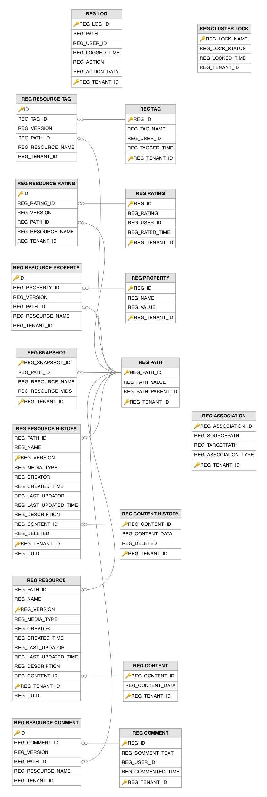

# Registry Related Tables

This section lists out all the registry related tables and their attributes in the WSO2 API Manager database.

---

## Table Definitions

### REG_ASSOCIATION

Defines typed relationships (associations) between registry resource paths, enabling the registry to model dependencies and links between resources. Associations are created when resources are linked through the management console, governance lifecycle transitions, or programmatic API calls. The `REG_ASSOCIATION_TYPE` column defines the nature of the relationship, such as `depends`, `usedBy`, or `ownedBy`.

| Column | Description |
|--------|-------------|
| REG_ASSOCIATION_ID | Primary key (composite with `REG_TENANT_ID`). The auto-generated identifier for this association relationship. |
| REG_SOURCEPATH | The registry path of the source resource from which the relationship originates. |
| REG_TARGETPATH | The registry path of the target resource to which the relationship points. |
| REG_ASSOCIATION_TYPE | The type label that describes the nature of the relationship between the source and target resources (e.g. `depends`, `usedBy`, `ownedBy`). |
| REG_TENANT_ID | Primary key (composite). The identifier of the tenant to which this association belongs. |

---

### REG_CLUSTER_LOCK

Provides distributed locking for registry operations in clustered (multi-node) WSO2 deployments to prevent concurrent modifications to shared registry resources. A record is inserted or updated whenever a node acquires a lock before performing a coordinated registry operation such as cache invalidation or index rebuilding. The `REG_LOCK_STATUS` column tracks whether a lock is currently held, and `REG_LOCKED_TIME` enables stale-lock detection when a node crashes while holding a lock.

| Column | Description |
|--------|-------------|
| REG_LOCK_NAME | Primary key. The name that identifies this distributed lock, used by registry components to coordinate cluster-wide operations such as cache invalidation or index rebuilding. |
| REG_LOCK_STATUS | The current state of the lock, indicating whether it is currently held by a node (e.g. `locked`) or available for acquisition (`unlocked`). |
| REG_LOCKED_TIME | The timestamp when the lock was most recently acquired, used for stale-lock detection when a node crashes while holding the lock. |
| REG_TENANT_ID | The identifier of the tenant to which this lock belongs (default `0` represents the super tenant). |

---

### REG_COMMENT

Stores user comments that can be attached to registry resources through the management console or the registry API. A new record is created each time a user posts a comment on a registry resource. Comments are linked to specific resource versions through the `REG_RESOURCE_COMMENT` table.

| Column | Description |
|--------|-------------|
| REG_ID | Primary key (composite with `REG_TENANT_ID`). The auto-generated identifier for this comment. |
| REG_COMMENT_TEXT | The text content of the comment posted on the registry resource. |
| REG_USER_ID | The username of the user who authored this comment. |
| REG_COMMENTED_TIME | The timestamp when this comment was posted on the resource. |
| REG_TENANT_ID | Primary key (composite). The identifier of the tenant to which this comment belongs. |

---

### REG_CONTENT

Stores the actual binary or text content (payload) of registry resources as large object blobs. A new content record is created whenever a resource is added or updated with new content, and the corresponding `REG_RESOURCE` row points to it via `REG_CONTENT_ID`. Content is stored separately from resource metadata to allow efficient versioning.

| Column | Description |
|--------|-------------|
| REG_CONTENT_ID | Primary key (composite with `REG_TENANT_ID`). The auto-generated identifier for this content blob, referenced by `REG_RESOURCE` to link resources to their payloads. |
| REG_CONTENT_DATA | The actual binary or text payload of the registry resource, stored as a large object to accommodate content of any size. |
| REG_TENANT_ID | Primary key (composite). The identifier of the tenant to which this content blob belongs. |

---

### REG_CONTENT_HISTORY

Preserves historical versions of registry resource content blobs for the registry's built-in versioning system. When a resource's content is updated, the previous content is moved from `REG_CONTENT` to this history table, allowing users to view or restore earlier versions. The `REG_DELETED` flag supports soft deletion so that content history can be retained even after a resource is removed.

| Column | Description |
|--------|-------------|
| REG_CONTENT_ID | Primary key (composite with `REG_TENANT_ID`). The identifier of the historical content blob, corresponding to a previously active content ID from `REG_CONTENT`. |
| REG_CONTENT_DATA | The preserved binary or text payload from a previous version of the registry resource. |
| REG_DELETED | Indicates whether this historical content has been soft-deleted (`1` = deleted), allowing content history to be retained even after resource removal. |
| REG_TENANT_ID | Primary key (composite). The identifier of the tenant to which this historical content belongs. |

---

### REG_LOG

Records an audit trail of every registry operation including resource creation, updates, deletions, and moves. A new entry is appended each time any registry resource is modified, capturing the user, timestamp, affected path, and action code. This table drives cache invalidation in clustered setups by allowing nodes to detect changes made by other nodes since their last sync.

| Column | Description |
|--------|-------------|
| REG_LOG_ID | Primary key (composite with `REG_TENANT_ID`). The auto-generated sequential identifier for this audit log entry. |
| REG_PATH | The full registry resource path that was affected by the logged operation. |
| REG_USER_ID | The username of the user who performed the registry operation being logged. |
| REG_LOGGED_TIME | The timestamp when the registry operation was recorded in the audit trail. |
| REG_ACTION | A numeric code representing the type of registry operation performed (e.g. create, update, delete, move, rename). |
| REG_ACTION_DATA | Supplementary data about the action, such as the destination path for move operations or additional context for the logged event. |
| REG_TENANT_ID | Primary key (composite). The identifier of the tenant to which this log entry belongs. |

---

### REG_PATH

Stores the hierarchical path structure of the WSO2 governance registry as a tree, where each row represents one path segment. A new record is created whenever a resource or collection is added at a path that has not been used before. The `REG_PATH_PARENT_ID` column establishes the parent-child relationship between path nodes. This table is referenced by `REG_RESOURCE` and related tables via `REG_PATH_ID` to locate resources within the registry tree.

| Column | Description |
|--------|-------------|
| REG_PATH_ID | Primary key (composite with `REG_TENANT_ID`). The auto-generated identifier for this path node in the registry tree. |
| REG_PATH_VALUE | The actual path segment string (stored case-sensitively), representing a node in the registry hierarchy. |
| REG_PATH_PARENT_ID | The identifier of the parent path node that this node is nested under, establishing the hierarchical tree structure of the registry. |
| REG_TENANT_ID | Primary key (composite). The identifier of the tenant to which this path node belongs. |

---

### REG_PROPERTY

Stores key-value property pairs that provide extensible metadata for registry resources. Properties are created when resources are added or updated with custom metadata through the management console, registry API, or internal system operations such as lifecycle state tracking. Properties are lightweight metadata attributes that can be queried and filtered without loading the full resource payload.

| Column | Description |
|--------|-------------|
| REG_ID | Primary key (composite with `REG_TENANT_ID`). The auto-generated identifier for this property definition. |
| REG_NAME | The key name of the property (e.g. lifecycle state, custom label), used to identify the metadata attribute. |
| REG_VALUE | The value associated with this property key for the registry resource. |
| REG_TENANT_ID | Primary key (composite). The identifier of the tenant to which this property belongs. |

---

### REG_RATING

Stores numeric ratings (star ratings) that users assign to registry resources through the management console or registry API. A new record is created when a user rates a resource for the first time; subsequent ratings by the same user update the existing record. Ratings are linked to specific resource versions through the `REG_RESOURCE_RATING` table.

| Column | Description |
|--------|-------------|
| REG_ID | Primary key (composite with `REG_TENANT_ID`). The auto-generated identifier for this rating record. |
| REG_RATING | The numeric star rating value assigned by the user to the registry resource. |
| REG_USER_ID | The username of the user who assigned this rating. |
| REG_RATED_TIME | The timestamp when this rating was submitted or last updated. |
| REG_TENANT_ID | Primary key (composite). The identifier of the tenant to which this rating belongs. |

---

### REG_RESOURCE

Holds the current (latest) version of every registry resource, including both files and collections. A record is created when a user or system component adds a new resource to the registry via the management console, REST API, or programmatic registry access. Each resource is identified by its path (via `REG_PATH_ID`) and name, with its payload stored separately in `REG_CONTENT`. The auto-incremented `REG_VERSION` column supports the registry's versioning mechanism, and `REG_UUID` provides a stable identifier that persists across version changes.

| Column | Description |
|--------|-------------|
| REG_PATH_ID | Foreign key to the `REG_PATH` table. The path node in the registry tree where this resource resides. |
| REG_NAME | The name of the resource within its parent path, forming the last segment of the full resource path. |
| REG_VERSION | Primary key (composite with `REG_TENANT_ID`). The auto-incremented version number that tracks each modification to this resource. |
| REG_MEDIA_TYPE | The MIME type of the resource content (e.g. `application/xml`, `text/plain`), used for content negotiation and rendering. |
| REG_CREATOR | The username of the user who originally created this resource in the registry. |
| REG_CREATED_TIME | The timestamp when this resource was initially created in the registry. |
| REG_LAST_UPDATOR | The username of the user who last modified this resource. |
| REG_LAST_UPDATED_TIME | The timestamp when this resource was last modified. |
| REG_DESCRIPTION | A human-readable description of the resource, displayed in the registry browser and resource detail views. |
| REG_CONTENT_ID | Foreign key to the `REG_CONTENT` table. The identifier of the content blob that holds this resource's payload data. |
| REG_TENANT_ID | Primary key (composite). The identifier of the tenant to which this resource belongs. |
| REG_UUID | A universally unique identifier for this resource that remains stable across version changes, enabling persistent external references. |

---

### REG_RESOURCE_COMMENT

Serves as a mapping table that associates comments from `REG_COMMENT` with specific versions of registry resources. A record is inserted whenever a comment is posted on a resource, linking the comment ID to the resource's version, path, and name. This allows multiple comments per resource version and enables comments to be tracked across different versions of the same resource.

| Column | Description |
|--------|-------------|
| ID | Primary key. The auto-generated row identifier for this comment-resource association. |
| REG_COMMENT_ID | Foreign key to the `REG_COMMENT` table. The identifier of the comment being associated with a resource. |
| REG_VERSION | The specific version of the registry resource that this comment is attached to. |
| REG_PATH_ID | Foreign key to the `REG_PATH` table. The path node of the registry resource that this comment is associated with. |
| REG_RESOURCE_NAME | The name of the registry resource that this comment is associated with. |
| REG_TENANT_ID | The identifier of the tenant to which this comment-resource association belongs. |

---

### REG_RESOURCE_HISTORY

Stores all previous versions of registry resource metadata, providing a complete version history for each resource. When a resource in `REG_RESOURCE` is updated, the previous version's metadata is moved to this table before the update is applied. The `REG_CONTENT_ID` column references `REG_CONTENT_HISTORY` to link each historical resource version to its corresponding content blob.

| Column | Description |
|--------|-------------|
| REG_PATH_ID | Foreign key to the `REG_PATH` table. The path node in the registry tree where this historical resource version resided. |
| REG_NAME | The name of the resource within its parent path at the time this version was current. |
| REG_VERSION | Primary key (composite with `REG_TENANT_ID`). The version number of this historical resource snapshot. |
| REG_MEDIA_TYPE | The MIME type of the resource content at the time this version was current. |
| REG_CREATOR | The username of the user who originally created this resource. |
| REG_CREATED_TIME | The timestamp when this resource was initially created in the registry. |
| REG_LAST_UPDATOR | The username of the user who last modified this resource version before it was superseded. |
| REG_LAST_UPDATED_TIME | The timestamp when this resource version was last modified before being archived. |
| REG_DESCRIPTION | A human-readable description of the resource as it existed in this historical version. |
| REG_CONTENT_ID | Foreign key to the `REG_CONTENT_HISTORY` table. The identifier of the historical content blob associated with this resource version. |
| REG_DELETED | Indicates whether this historical version has been soft-deleted (`1` = deleted), allowing version history to be retained after resource removal. |
| REG_TENANT_ID | Primary key (composite). The identifier of the tenant to which this historical resource version belongs. |
| REG_UUID | The universally unique identifier for this resource, consistent across all versions of the same resource. |

---

### REG_RESOURCE_PROPERTY

Serves as a mapping table that associates properties from `REG_PROPERTY` with specific versions of registry resources. A record is created when a property is attached to a resource, linking the property ID to the resource version, path, and name. This structure allows each resource version to carry its own set of properties and supports property-based querying across the registry.

| Column | Description |
|--------|-------------|
| ID | Primary key. The auto-generated row identifier for this property-resource association. |
| REG_PROPERTY_ID | Foreign key to the `REG_PROPERTY` table. The identifier of the property being associated with a resource. |
| REG_VERSION | The specific version of the registry resource that this property is attached to. |
| REG_PATH_ID | Foreign key to the `REG_PATH` table. The path node of the registry resource that this property is associated with. |
| REG_RESOURCE_NAME | The name of the registry resource that this property is associated with. |
| REG_TENANT_ID | The identifier of the tenant to which this property-resource association belongs. |

---

### REG_RESOURCE_RATING

Serves as a mapping table that associates ratings from `REG_RATING` with specific versions of registry resources. A record is inserted whenever a user rates a resource, linking the rating to the resource's version, path, and name. This enables per-version rating tracking and allows the system to compute aggregate ratings for any given resource version.

| Column | Description |
|--------|-------------|
| ID | Primary key. The auto-generated row identifier for this rating-resource association. |
| REG_RATING_ID | Foreign key to the `REG_RATING` table. The identifier of the rating being associated with a resource. |
| REG_VERSION | The specific version of the registry resource that this rating applies to. |
| REG_PATH_ID | Foreign key to the `REG_PATH` table. The path node of the registry resource that this rating is associated with. |
| REG_RESOURCE_NAME | The name of the registry resource that this rating is associated with. |
| REG_TENANT_ID | The identifier of the tenant to which this rating-resource association belongs. |

---

### REG_RESOURCE_TAG

Serves as a mapping table that associates tags from `REG_TAG` with specific versions of registry resources. A record is created each time a tag is applied to a resource, linking the tag ID to the resource's version, path, and name. This allows any resource version to have multiple tags and any tag to be applied to multiple resources.

| Column | Description |
|--------|-------------|
| ID | Primary key. The auto-generated row identifier for this tag-resource association. |
| REG_TAG_ID | Foreign key to the `REG_TAG` table. The identifier of the tag being associated with a resource. |
| REG_VERSION | The specific version of the registry resource that this tag is applied to. |
| REG_PATH_ID | Foreign key to the `REG_PATH` table. The path node of the registry resource that this tag is associated with. |
| REG_RESOURCE_NAME | The name of the registry resource that this tag is associated with. |
| REG_TENANT_ID | The identifier of the tenant to which this tag-resource association belongs. |

---

### REG_SNAPSHOT

Captures point-in-time snapshots of entire registry resource trees, enabling users to checkpoint and restore the state of a collection and all its descendants. A snapshot is created when a user explicitly creates a checkpoint on a registry collection through the management console or API. The `REG_RESOURCE_VIDS` column stores a serialized list of all resource version IDs included in the snapshot, allowing the entire subtree to be restored to that exact state.

| Column | Description |
|--------|-------------|
| REG_SNAPSHOT_ID | Primary key (composite with `REG_TENANT_ID`). The auto-generated identifier for this point-in-time snapshot. |
| REG_PATH_ID | Foreign key to the `REG_PATH` table. The root path node of the registry collection that was checkpointed in this snapshot. |
| REG_RESOURCE_NAME | The name of the root resource or collection that this snapshot was taken of. |
| REG_RESOURCE_VIDS | A serialized list of all resource version identifiers included in this snapshot, enabling full subtree restoration to this exact state. |
| REG_TENANT_ID | Primary key (composite). The identifier of the tenant to which this snapshot belongs. |

---

### REG_TAG

Stores user-defined tags (free-form labels) that can be applied to registry resources for categorization and discovery. A new tag record is created when a user applies a tag string that has not been used before within the tenant. Tags power the tag-based search and tag cloud features in the management console's registry browser.

| Column | Description |
|--------|-------------|
| REG_ID | Primary key (composite with `REG_TENANT_ID`). The auto-generated identifier for this tag definition. |
| REG_TAG_NAME | The free-form label text of the tag, used for categorization and discovery of registry resources. |
| REG_USER_ID | The username of the user who originally applied this tag. |
| REG_TAGGED_TIME | The timestamp when this tag was first applied to a registry resource. |
| REG_TENANT_ID | Primary key (composite). The identifier of the tenant to which this tag belongs. |

---

## Entity Relationship Diagram

