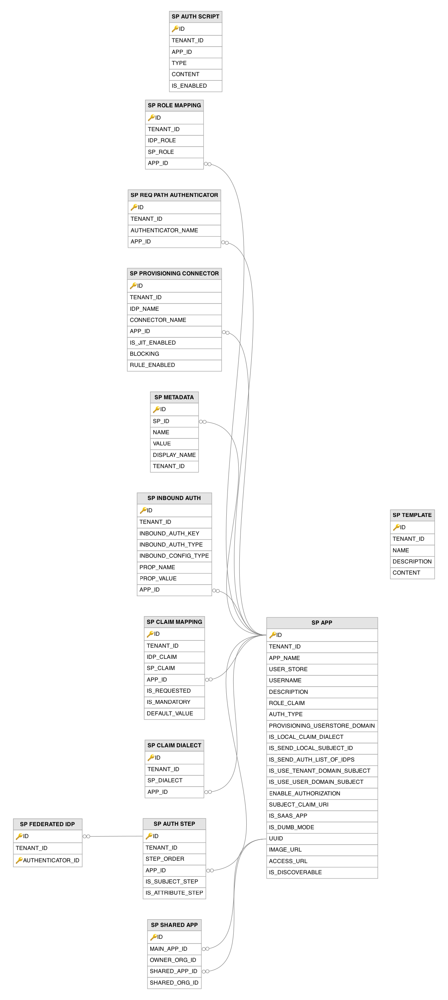

# Service Provider Related Tables

This section lists all the service-provider-related tables and their attributes in the WSO2 API Manager database.

---

## Table Definitions

### SP_APP

Stores the master definition of each service provider (application) registered in the identity framework, serving as the central table around which all SP-related configurations are organized. A record is created when an application is registered through the management console, the application management REST API, or when the API Manager auto-creates a service provider during OAuth app registration. The `UUID` column provides a stable identifier used for cross-organization application sharing.

| Column | Description |
|--------|-------------|
| ID | Primary key. The auto-generated internal identifier for this service provider application. |
| TENANT_ID | The identifier of the tenant to which this application belongs. |
| APP_NAME | The name of the application, unique within the tenant, displayed in the management console and consent screens. |
| USER_STORE | The user store domain of the user who owns this application. |
| USERNAME | The username of the user who registered and owns this application. |
| DESCRIPTION | A human-readable description of the application's purpose. |
| ROLE_CLAIM | The claim URI used to extract role information for role-based authorization within this application. |
| AUTH_TYPE | The authentication type configuration for this application. |
| PROVISIONING_USERSTORE_DOMAIN | The user store domain used for outbound user provisioning when users are provisioned through this application. |
| IS_LOCAL_CLAIM_DIALECT | Indicates whether this application uses the local WSO2 claim dialect (`1`) or a custom/standard dialect for claim mapping. |
| IS_SEND_LOCAL_SUBJECT_ID | Indicates whether the local subject identifier should be sent to the application (`1`) instead of the mapped subject. |
| IS_SEND_AUTH_LIST_OF_IDPS | Indicates whether the list of identity providers used during authentication should be sent to the application (`1`). |
| IS_USE_TENANT_DOMAIN_SUBJECT | Indicates whether the tenant domain should be appended to the subject identifier (`1`) sent to the application. |
| IS_USE_USER_DOMAIN_SUBJECT | Indicates whether the user store domain should be appended to the subject identifier (`1`) sent to the application. |
| ENABLE_AUTHORIZATION | Indicates whether fine-grained authorization (XACML policy-based) is enabled for this application (`1` = enabled). |
| SUBJECT_CLAIM_URI | The claim URI used as the subject identifier in tokens and assertions sent to this application. |
| IS_SAAS_APP | Indicates whether this is a SaaS application (`1`) that can be accessed by users from any tenant. |
| IS_DUMB_MODE | Indicates whether the application operates in dumb mode (`1`), where no authentication is performed. |
| UUID | Unique. A universally unique identifier for this application, used for cross-organization sharing and API-based management. |
| IMAGE_URL | The URL of the application's logo image, displayed in the application catalog and consent screens. |
| ACCESS_URL | The URL used to access the application, displayed in the application catalog for end users. |
| IS_DISCOVERABLE | Indicates whether this application is discoverable (`1`) in the application catalog and self-service portals. |

---

### SP_AUTH_SCRIPT

Stores the adaptive authentication (conditional authentication) JavaScript scripts configured for each service provider. A record is created when an adaptive authentication script is written or updated through the management console's script editor or the application management API. The script is executed during the authentication flow and can dynamically modify the authentication steps based on runtime conditions such as user attributes, request context, or group membership. The `APP_ID` column points to the `SP_APP` table.

| Column | Description |
|--------|-------------|
| ID | Primary key. The auto-generated row identifier for this authentication script. |
| TENANT_ID | The identifier of the tenant to which this authentication script belongs. |
| APP_ID | Foreign key to the `SP_APP` table. The identifier of the service provider application for which this adaptive authentication script is configured. |
| TYPE | The type of the authentication script (e.g. JavaScript). |
| CONTENT | The full content of the adaptive authentication script that is executed during the authentication flow. |
| IS_ENABLED | Indicates whether this authentication script is currently active (`1`) and will be executed during authentication flows. |

---

### SP_AUTH_STEP

Defines the authentication steps configured for each service provider's multi-step (multi-factor) authentication flow. A record is created for each step when the authentication flow is configured through the management console or adaptive authentication script. Each step has a sequence number (`STEP_ORDER`) and flags indicating whether the step should contribute the authenticated subject identity and user attributes. The `APP_ID` column points to the `SP_APP` table, and the authenticators for each step are configured through the `SP_FEDERATED_IDP` table.

| Column | Description |
|--------|-------------|
| ID | Primary key. The auto-generated identifier for this authentication step. |
| TENANT_ID | The identifier of the tenant to which this authentication step belongs. |
| STEP_ORDER | The sequence number that determines the order in which this step is executed within the multi-step authentication flow. |
| APP_ID | Foreign key to the `SP_APP` table. The identifier of the service provider application to which this authentication step belongs. |
| IS_SUBJECT_STEP | Indicates whether the subject identity from this step should be used as the authenticated user's subject identifier (`1` = yes). |
| IS_ATTRIBUTE_STEP | Indicates whether the user attributes from this step should be used for claim mapping and token generation (`1` = yes). |

---

### SP_CLAIM_DIALECT

Records the claim dialects that an application uses when communicating with the identity provider, defining the format of claims the service provider expects to receive. A record is created when the claim dialect for a service provider is configured, choosing between the local WSO2 dialect or a custom/standard dialect such as OIDC or SCIM. The `APP_ID` column points to the `SP_APP` table.

| Column | Description |
|--------|-------------|
| ID | Primary key. The auto-generated row identifier for this claim dialect configuration. |
| TENANT_ID | The identifier of the tenant to which this claim dialect configuration belongs. |
| SP_DIALECT | The URI of the claim dialect used by this service provider for claim communication. |
| APP_ID | Foreign key to the `SP_APP` table. The identifier of the service provider application to which this claim dialect applies. |

---

### SP_CLAIM_MAPPING

Defines the claim transformation rules between local (identity provider side) claim URIs and the claim URIs expected by the service provider. Records are created when claim mappings are configured for an application through the management console's claim configuration section. Each mapping specifies which local claim maps to which service provider claim, whether the claim is requested or mandatory, and an optional default value. The `APP_ID` column points to the `SP_APP` table.

| Column | Description |
|--------|-------------|
| ID | Primary key. The auto-generated row identifier for this claim mapping. |
| TENANT_ID | The identifier of the tenant to which this claim mapping belongs. |
| IDP_CLAIM | The source claim URI from the identity provider or local claim dialect that is being mapped. |
| SP_CLAIM | The target claim URI expected by the service provider in tokens or assertions. |
| APP_ID | Foreign key to the `SP_APP` table. The identifier of the service provider application to which this claim mapping applies. |
| IS_REQUESTED | Indicates whether this claim should be requested from the user store and included in the authentication response. |
| IS_MANDATORY | Indicates whether this claim is mandatory and must have a value for the authentication to proceed. |
| DEFAULT_VALUE | The fallback value used when the claim is not available from the user store or identity provider. |

---

### SP_FEDERATED_IDP

Links federated identity provider authenticators to specific authentication steps defined in the `SP_AUTH_STEP` table. A record is created when a federated authenticator is added to an authentication step in the service provider's login flow. Multiple federated authenticators can be associated with a single step, giving the user a choice of authentication methods. The `ID` column points to the `SP_AUTH_STEP` table.

| Column | Description |
|--------|-------------|
| ID | Primary key (composite). Foreign key to the `SP_AUTH_STEP` table. The identifier of the authentication step to which this federated authenticator is assigned. |
| TENANT_ID | The identifier of the tenant to which this federated identity provider assignment belongs. |
| AUTHENTICATOR_ID | Primary key (composite). The identifier of the federated authenticator being assigned to this authentication step. |

---

### SP_INBOUND_AUTH

Stores the inbound authentication protocol configurations for each service provider, defining how the service provider authenticates users via protocols such as SAML 2.0 SSO, OAuth2/OIDC, or WS-Federation. A record is created when an inbound authentication protocol is configured for an application. The `INBOUND_AUTH_KEY` holds the protocol-specific identifier (e.g. SAML issuer name or OAuth consumer key), while `INBOUND_AUTH_TYPE` identifies the protocol. The `APP_ID` column points to the `SP_APP` table.

| Column | Description |
|--------|-------------|
| ID | Primary key. The auto-generated row identifier for this inbound authentication configuration. |
| TENANT_ID | The identifier of the tenant to which this inbound authentication configuration belongs. |
| INBOUND_AUTH_KEY | The protocol-specific identifier for this application (e.g. SAML issuer name, OAuth2 consumer key). |
| INBOUND_AUTH_TYPE | The inbound authentication protocol type (e.g. `samlsso`, `oauth2`, `wsfed`, `passivests`). |
| INBOUND_CONFIG_TYPE | The configuration type within the protocol, used to distinguish different configuration aspects. |
| PROP_NAME | The name of a configuration property specific to this inbound authentication setup. |
| PROP_VALUE | The value of the configuration property. |
| APP_ID | Foreign key to the `SP_APP` table. The identifier of the service provider application to which this authentication configuration belongs. |

---

### SP_METADATA

Stores extensible key-value metadata properties for service providers that do not have dedicated columns in the `SP_APP` table. Records are created when custom properties are set on an application through the management console or API. This provides a flexible extension mechanism for storing application-specific configuration without requiring schema changes to the `SP_APP` table. The `SP_ID` column points to the `SP_APP` table.

| Column | Description |
|--------|-------------|
| ID | Primary key. The auto-generated row identifier for this service provider metadata entry. |
| SP_ID | Foreign key to the `SP_APP` table. The identifier of the service provider to which this metadata belongs. |
| NAME | The key name of the metadata property. |
| VALUE | The value of the metadata property. |
| DISPLAY_NAME | The human-readable display name for this metadata property, shown in management interfaces. |
| TENANT_ID | The identifier of the tenant to which this metadata entry belongs. |

---

### SP_PROVISIONING_CONNECTOR

Configures outbound provisioning connectors for a service provider, enabling automatic user provisioning to external systems when users are associated with the application. A record is created when a provisioning connector (e.g. SCIM, Google, Salesforce) is added to an application's outbound provisioning configuration. The `IS_JIT_ENABLED` flag controls just-in-time provisioning, while `BLOCKING` determines whether the provisioning call blocks the authentication flow until completion. The `APP_ID` column points to the `SP_APP` table.

| Column | Description |
|--------|-------------|
| ID | Primary key. The auto-generated row identifier for this provisioning connector configuration. |
| TENANT_ID | The identifier of the tenant to which this provisioning configuration belongs. |
| IDP_NAME | The name of the identity provider through which outbound provisioning is performed. |
| CONNECTOR_NAME | The name of the provisioning connector type (e.g. `scim`, `google`, `salesforce`). |
| APP_ID | Foreign key to the `SP_APP` table. The identifier of the service provider application for which this outbound provisioning is configured. |
| IS_JIT_ENABLED | Indicates whether just-in-time provisioning is enabled (`1`), automatically creating users in the external system on first login. |
| BLOCKING | Indicates whether provisioning is synchronous (`1`), blocking the authentication flow until the provisioning operation completes. |
| RULE_ENABLED | Indicates whether rule-based provisioning is enabled (`1`), applying conditional logic to determine when provisioning should occur. |

---

### SP_REQ_PATH_AUTHENTICATOR

Registers request-path authenticators that are enabled for a service provider, allowing authentication credentials to be passed directly in the request (e.g. Basic Auth headers or OAuth bearer tokens) rather than through an interactive login flow. A record is created when a request-path authenticator is enabled for an application. When an authentication request arrives with embedded credentials, the framework checks this table to determine which request-path authenticators are allowed for the target application. The `APP_ID` column points to the `SP_APP` table.

| Column | Description |
|--------|-------------|
| ID | Primary key. The auto-generated row identifier for this request-path authenticator configuration. |
| TENANT_ID | The identifier of the tenant to which this configuration belongs. |
| AUTHENTICATOR_NAME | The name of the request-path authenticator implementation (e.g. `BasicAuthRequestPathAuthenticator`, `OAuthRequestPathAuthenticator`). |
| APP_ID | Foreign key to the `SP_APP` table. The identifier of the service provider application for which this request-path authenticator is enabled. |

---

### SP_ROLE_MAPPING

Defines role transformation rules between internal (local) role names and the role names expected by the service provider. Records are created when role mappings are configured for an application, allowing internal roles to be mapped to service provider-specific roles. These mappings are applied when roles are included in tokens or SAML assertions sent to the application. The `APP_ID` column points to the `SP_APP` table.

| Column | Description |
|--------|-------------|
| ID | Primary key. The auto-generated row identifier for this role mapping. |
| TENANT_ID | The identifier of the tenant to which this role mapping belongs. |
| IDP_ROLE | The source role name from the internal role store or federated identity provider that is being mapped. |
| SP_ROLE | The target role name expected by the service provider in tokens or assertions. |
| APP_ID | Foreign key to the `SP_APP` table. The identifier of the service provider application to which this role mapping applies. |

---

### SP_SHARED_APP

Tracks the sharing of applications across organizations in the WSO2 organization management hierarchy. A record is created when an application in one organization (the owner) is shared with another organization, creating a linked copy in the target organization. The `MAIN_APP_ID` and `SHARED_APP_ID` columns reference the `UUID` column of the `SP_APP` table, establishing the parent-child relationship between the original and shared application instances.

| Column | Description |
|--------|-------------|
| ID | Primary key. The auto-generated row identifier for this application sharing record. |
| MAIN_APP_ID | Foreign key to the `UUID` column of the `SP_APP` table. The UUID of the original application in the parent organization. |
| OWNER_ORG_ID | The UUID of the organization that owns the original application. |
| SHARED_APP_ID | Foreign key to the `UUID` column of the `SP_APP` table. The UUID of the linked copy of the application created in the target organization. |
| SHARED_ORG_ID | The UUID of the organization to which the application has been shared. |

---

### SP_TEMPLATE

Stores reusable service provider configuration templates that can be used as starting points when creating new applications. A record is created when a template is saved through the management console or the template management API. Templates capture a complete serialized service provider configuration (authentication steps, claim mappings, provisioning settings) that can be applied to new applications, reducing repetitive configuration for common application patterns.

| Column | Description |
|--------|-------------|
| ID | Primary key. The auto-generated row identifier for this service provider template. |
| TENANT_ID | The identifier of the tenant that owns this template. |
| NAME | The name of the template, unique within the tenant, used for selection when creating new applications. |
| DESCRIPTION | A human-readable description of the template, explaining the type of application configuration it provides. |
| CONTENT | The serialized service provider configuration content (authentication steps, claim mappings, provisioning settings) that this template captures. |

---

## Entity Relationship Diagram

