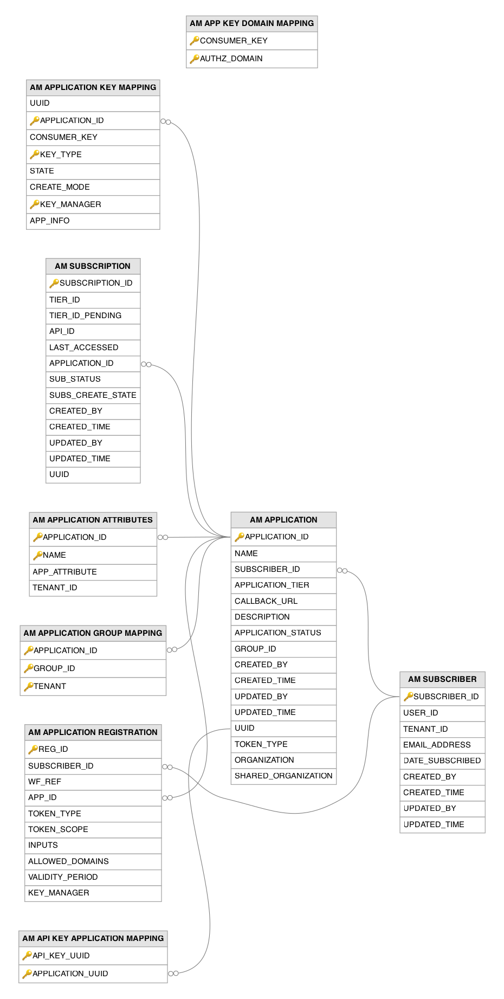

# Subscription and Application Related Tables

This section lists all the subscription- and application-related tables and their attributes in the WSO2 API Manager database.

---

## Table Definitions

### AM_API_KEY_APPLICATION_MAPPING

Links API keys to the applications they belong to, establishing the ownership relationship between keys and applications. A record is created when an API key is generated for a specific application, so that the key inherits the application's subscription context and throttling limits. The `API_KEY_UUID` column is a foreign key to the `AM_API_KEY` table and the `APPLICATION_UUID` column is a foreign key to the `UUID` column of the `AM_APPLICATION` table, enabling the Gateway to resolve the owning application from an API key during request processing.

| Column | Description |
|--------|-------------|
| API_KEY_UUID | Part of the composite primary key. Foreign key to the `AM_API_KEY` table. The API key being linked to an application. |
| APPLICATION_UUID | Part of the composite primary key. Foreign key to the `UUID` column of the `AM_APPLICATION` table. The application that owns this API key, providing subscription context and throttling scope. |

---

### AM_APPLICATION

Represents a logical application created by a subscriber on the Developer Portal to group API subscriptions and manage OAuth credentials. A record is inserted when a developer creates a new application from the Developer Portal UI or via the REST API. Each application is associated with a throttling tier that governs the overall request rate limit and can hold separate PRODUCTION and SANDBOX OAuth key pairs (stored in the `AM_APPLICATION_KEY_MAPPING` table). The `SUBSCRIBER_ID` column is a foreign key to the `AM_SUBSCRIBER` table.

| Column | Description |
|--------|-------------|
| APPLICATION_ID | Primary key. Auto-generated unique identifier for the application. |
| NAME | The name of the application, unique per subscriber within an organization. |
| SUBSCRIBER_ID | Foreign key to the `AM_SUBSCRIBER` table. The subscriber who owns this application. |
| APPLICATION_TIER | The throttling policy tier applied to this application, controlling the overall request rate limit across all subscribed APIs (defaults to `Unlimited`). |
| CALLBACK_URL | The OAuth2 callback/redirect URL used during the authorization code grant flow. |
| DESCRIPTION | A human-readable description of the application's purpose. |
| APPLICATION_STATUS | The current approval status of the application (for example, APPROVED, REJECTED, ON_HOLD), controlled by the application creation workflow (defaults to `APPROVED`). |
| GROUP_ID | The group identifier that enables shared access to this application among multiple developers in the same group. |
| CREATED_BY | The username of the user who created this application. |
| CREATED_TIME | The timestamp when this application was initially created. |
| UPDATED_BY | The username of the user who last modified this application. |
| UPDATED_TIME | The timestamp when this application was last modified. |
| UUID | Unique. The universally unique identifier for this application, used in REST API references. |
| TOKEN_TYPE | The type of access token this application generates (for example, JWT, OAUTH). |
| ORGANIZATION | The organization to which this application belongs. |
| SHARED_ORGANIZATION | The organization from which this application was shared, if applicable in cross-organization scenarios. |

---

### AM_APPLICATION_ATTRIBUTES

Stores custom key-value attributes for applications, providing an extensible metadata mechanism beyond the fixed columns in the `AM_APPLICATION` table. Records are created when a developer sets custom attributes on an application through the Developer Portal or REST API, for use cases such as storing department codes, project identifiers, or billing references. The `APPLICATION_ID` column is a foreign key to the `AM_APPLICATION` table.

| Column | Description |
|--------|-------------|
| APPLICATION_ID | Part of the composite primary key. Foreign key to the `AM_APPLICATION` table. The application that this custom attribute belongs to. |
| NAME | Part of the composite primary key. The key name of the custom attribute. |
| APP_ATTRIBUTE | The value of the custom attribute. |
| TENANT_ID | The identifier of the tenant to which this application attribute belongs. |

---

### AM_APPLICATION_GROUP_MAPPING

Associates applications with group identifiers, enabling shared application access across multiple users within the same group. Records are created when an application is configured for group-based sharing, typically through the Developer Portal, allowing multiple developers in the same group to view and manage a shared application, its subscriptions, and its OAuth keys. The `APPLICATION_ID` column is a foreign key to the `AM_APPLICATION` table.

| Column | Description |
|--------|-------------|
| APPLICATION_ID | Part of the composite primary key. Foreign key to the `AM_APPLICATION` table. The application that is being shared with a group. |
| GROUP_ID | Part of the composite primary key. The identifier of the group that has shared access to this application. |
| TENANT | Part of the composite primary key. The tenant domain in which this group sharing is configured. |

---

### AM_APPLICATION_KEY_MAPPING

Stores the association between applications and their OAuth2 consumer keys, tracking the credentials used for API invocation. A record is created when a developer generates OAuth keys for an application, either by creating new keys or by mapping an existing OAuth application from an external key manager. Each application can have separate key pairs for the PRODUCTION and SANDBOX environments and can be configured against multiple key managers. The `APPLICATION_ID` column is a foreign key to the `AM_APPLICATION` table.

| Column | Description |
|--------|-------------|
| UUID | A unique identifier generated by the application layer for this key mapping record (not auto-generated by the database). |
| APPLICATION_ID | Part of the composite primary key. Foreign key to the `AM_APPLICATION` table. The application that owns these OAuth credentials. |
| CONSUMER_KEY | The OAuth2 consumer key (client ID) used by the application to authenticate with the key manager. |
| KEY_TYPE | Part of the composite primary key. The environment type this key is for (PRODUCTION or SANDBOX), allowing separate credentials per environment. |
| STATE | The current lifecycle state of the key generation request (for example, CREATED, APPROVED, REJECTED, COMPLETED). Keys created directly or mapped from an existing OAuth application are recorded with the COMPLETED state. |
| CREATE_MODE | Indicates whether the key was newly generated (CREATED) or mapped from an existing external OAuth application (MAPPED). |
| KEY_MANAGER | Part of the composite primary key. The name of the key manager (identity provider) that issued these credentials. |
| APP_INFO | Serialized additional application information and metadata associated with this key mapping. |

---

### AM_APPLICATION_REGISTRATION

Tracks OAuth key generation requests initiated from the Developer Portal, linking the registration process to the workflow system. A record is created when a developer requests keys for an application, capturing the requested token type, scopes, and validity period; if a key generation workflow is configured, this table holds the pending request until it is approved. The `SUBSCRIBER_ID` column is a foreign key to the `AM_SUBSCRIBER` table and the `APP_ID` column is a foreign key to the `APPLICATION_ID` column of the `AM_APPLICATION` table.

| Column | Description |
|--------|-------------|
| REG_ID | Primary key. Auto-generated unique identifier for this registration request. |
| SUBSCRIBER_ID | Foreign key to the `AM_SUBSCRIBER` table. The subscriber who initiated the key generation request. |
| WF_REF | The reference to the associated workflow instance, if a key generation workflow is configured. |
| APP_ID | Foreign key to the `APPLICATION_ID` column of the `AM_APPLICATION` table. The application for which OAuth keys are being generated. |
| TOKEN_TYPE | The type of token requested (for example, PRODUCTION, SANDBOX). |
| TOKEN_SCOPE | The default OAuth2 scopes requested for the generated tokens (defaults to `default`). |
| INPUTS | Serialized request parameters needed to complete the OAuth application registration on the key manager. |
| ALLOWED_DOMAINS | The domains allowed to use the generated OAuth credentials. |
| VALIDITY_PERIOD | The requested validity period for access tokens in milliseconds. |
| KEY_MANAGER | The name of the key manager (identity provider) on which the OAuth application will be registered. |

---

### AM_APP_KEY_DOMAIN_MAPPING

Restricts which domains are authorized to use a given application's consumer key, providing an additional layer of security for OAuth token requests. A record is created when a developer configures domain restrictions for an application's OAuth keys. By default, a single entry with the domain `ALL` is created, allowing unrestricted access, which can be narrowed to specific domains to prevent unauthorized token generation.

| Column | Description |
|--------|-------------|
| CONSUMER_KEY | Part of the composite primary key. The OAuth2 consumer key whose domain access is being restricted. |
| AUTHZ_DOMAIN | Part of the composite primary key. The authorized domain from which token requests are permitted (defaults to `ALL` for unrestricted access). |

---

### AM_SUBSCRIBER

Represents a developer who has signed up on the Developer Portal to consume APIs. A new record is created when a user first signs into the Developer Portal or when an administrator creates a subscriber programmatically. Each subscriber can own multiple applications (stored in the `AM_APPLICATION` table) through which they subscribe to APIs, and the `USER_ID` is unique per tenant to enable multi-tenant subscriber isolation.

| Column | Description |
|--------|-------------|
| SUBSCRIBER_ID | Primary key. Auto-generated unique identifier for the subscriber. |
| USER_ID | The username of the subscriber, unique within each tenant to prevent duplicate registrations. |
| TENANT_ID | The identifier of the tenant to which this subscriber belongs, enabling multi-tenant data isolation. |
| EMAIL_ADDRESS | The email address of the subscriber, used for notifications and communication. |
| DATE_SUBSCRIBED | The timestamp when the subscriber first signed up on the Developer Portal. |
| CREATED_BY | The username of the user who created this subscriber record. |
| CREATED_TIME | The timestamp when this record was initially created. |
| UPDATED_BY | The username of the user who last modified this record. |
| UPDATED_TIME | The timestamp when this record was last modified. |

---

### AM_SUBSCRIPTION

Records the relationship between an application and an API, representing a developer's intent to consume a specific API through a given application. A record is created when a developer subscribes to an API from the Developer Portal, selecting one of their applications and a throttling tier, and the subscription must be approved (automatically or via a workflow) before the application can invoke the API. The `API_ID` column is a foreign key to the `AM_API` table and the `APPLICATION_ID` column is a foreign key to the `AM_APPLICATION` table.

| Column | Description |
|--------|-------------|
| SUBSCRIPTION_ID | Primary key. Auto-generated unique identifier for this subscription. |
| TIER_ID | The throttling policy tier selected by the developer, controlling the request rate limit for this API-application pair. |
| TIER_ID_PENDING | The new throttling tier requested in a pending tier change, awaiting approval through the subscription workflow. |
| API_ID | Foreign key to the `AM_API` table. The API that this subscription grants access to. |
| LAST_ACCESSED | The timestamp when this subscription was last used to invoke the API. |
| APPLICATION_ID | Foreign key to the `AM_APPLICATION` table. The application through which the developer subscribes to the API. |
| SUB_STATUS | The current status of the subscription (for example, UNBLOCKED, BLOCKED, PROD_ONLY_BLOCKED, REJECTED, ON_HOLD). |
| SUBS_CREATE_STATE | The workflow state of the subscription creation process (for example, SUBSCRIBE, APPROVED; defaults to `SUBSCRIBE`). |
| CREATED_BY | The username of the developer who created this subscription. |
| CREATED_TIME | The timestamp when this subscription was initially created. |
| UPDATED_BY | The username of the user who last modified this subscription. |
| UPDATED_TIME | The timestamp when this subscription was last modified. |
| UUID | Unique. The universally unique identifier for this subscription, used in REST API references. |

---

## Entity Relationship Diagram

