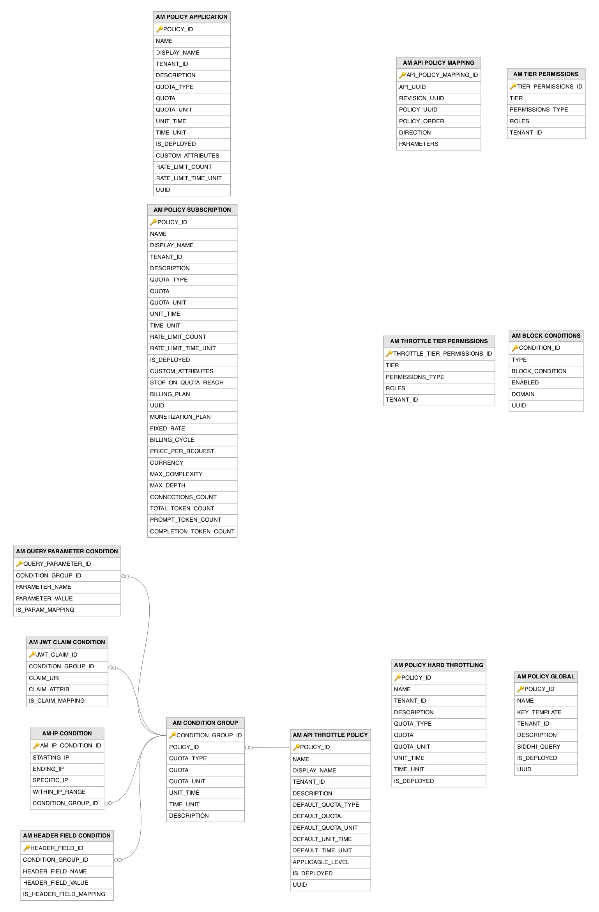

# Throttling and Policy Related Tables

This section lists all the throttling- and policy-related tables and their attributes in the WSO2 API Manager database.

---

## Table Definitions

### AM_API_POLICY_MAPPING

Maps operation policies at the API level rather than at the individual operation level, defining policies that apply globally to all operations within an API. Records are created when a publisher attaches policies at the API level through the Publisher portal. The `API_UUID` column is a foreign key to the `AM_API` table and the `POLICY_UUID` column is a foreign key to the `AM_OPERATION_POLICY` table.

| Column | Description |
|--------|-------------|
| API_POLICY_MAPPING_ID | Primary key. Auto-generated unique identifier for this API-level policy mapping. |
| API_UUID | Foreign key to the `AM_API` table. The API that this global policy is attached to. |
| REVISION_UUID | The revision of the API that this policy mapping is scoped to. |
| POLICY_UUID | Foreign key to the `AM_OPERATION_POLICY` table. The operation policy applied globally across all operations of this API. |
| POLICY_ORDER | The sequential execution order when multiple API-level policies are attached. |
| DIRECTION | The mediation flow in which this policy executes (request, response, or fault). |
| PARAMETERS | The serialized JSON containing runtime parameter values for this API-level policy. |

---

### AM_API_THROTTLE_POLICY

Defines API-level and resource-level throttling policies that control request rates at the API or individual operation level. Records are created by administrators through the Admin portal, and the `APPLICABLE_LEVEL` column determines whether the policy applies to the entire API or to individual resources. Each policy has a default quota and can contain multiple condition groups (stored in the `AM_CONDITION_GROUP` table) that apply different limits based on request attributes such as IP, headers, or JWT claims.

| Column | Description |
|--------|-------------|
| POLICY_ID | Primary key. Auto-generated unique identifier for this API/resource throttling policy. |
| NAME | The internal name of the policy, unique within a tenant. |
| DISPLAY_NAME | The human-readable display name shown when assigning throttling policies to APIs or resources. |
| TENANT_ID | The identifier of the tenant to which this policy belongs. |
| DESCRIPTION | A human-readable description explaining the policy's rate limits and applicable conditions. |
| DEFAULT_QUOTA_TYPE | The type of quota applied when no condition group matches (requestCount or bandwidthVolume). |
| DEFAULT_QUOTA | The default maximum number of requests or amount of bandwidth allowed when no condition group matches. |
| DEFAULT_QUOTA_UNIT | The unit of measurement for the default bandwidth quota (for example, KB, MB). |
| DEFAULT_UNIT_TIME | The duration of the default time window over which the quota is measured. |
| DEFAULT_TIME_UNIT | The time unit for the default quota window (for example, min, hour, day). |
| APPLICABLE_LEVEL | The level at which this policy can be applied (API for the entire API, resource for individual operations). |
| IS_DEPLOYED | Flag indicating whether this policy has been deployed to the Gateway's traffic manager for enforcement. |
| UUID | Unique. The universally unique identifier for this policy, used in REST API references. |

---

### AM_BLOCK_CONDITIONS

Stores administrative block conditions that immediately deny access based on specific criteria such as IP address, API context, application, or user identity. Records are created when an administrator adds block conditions through the Admin portal in response to abuse, security incidents, or maintenance needs. The Gateway evaluates these conditions before processing any request, and the `ENABLED` flag allows conditions to be temporarily deactivated without deletion.

| Column | Description |
|--------|-------------|
| CONDITION_ID | Primary key. Auto-generated unique identifier for this block condition. |
| TYPE | The type of block condition (for example, IP, API, APPLICATION, USER) determining what attribute is blocked. |
| BLOCK_CONDITION | The specific value being blocked (for example, an IP address, API context path, application name, or username). |
| ENABLED | Flag indicating whether this block condition is currently active and being enforced by the Gateway. |
| DOMAIN | The tenant domain in which this block condition is enforced. |
| UUID | Unique. The universally unique identifier for this block condition, used for event-based notification to Gateway nodes. |

---

### AM_CONDITION_GROUP

Defines conditional throttling groups within an API-level throttle policy, enabling different rate limits based on request characteristics. Records are created as part of an API throttle policy definition when an administrator adds conditional rate-limiting rules. Each condition group specifies its own quota and can contain one or more conditions (IP, header, query parameter, JWT claim) that must all match for the group's limits to apply. The `POLICY_ID` column is a foreign key to the `AM_API_THROTTLE_POLICY` table.

| Column | Description |
|--------|-------------|
| CONDITION_GROUP_ID | Primary key. Auto-generated unique identifier for this condition group. |
| POLICY_ID | Foreign key to the `AM_API_THROTTLE_POLICY` table. The parent throttle policy this condition group belongs to. |
| QUOTA_TYPE | The type of quota applied when all conditions in this group match (requestCount or bandwidthVolume). |
| QUOTA | The maximum number of requests or amount of bandwidth allowed when this condition group's conditions are satisfied. |
| QUOTA_UNIT | The unit of measurement for bandwidth quotas in this condition group (for example, KB, MB). |
| UNIT_TIME | The duration of the time window for this condition group's quota. |
| TIME_UNIT | The time unit for this condition group's quota window (for example, min, hour, day). |
| DESCRIPTION | A human-readable description explaining the purpose and conditions of this group. |

---

### AM_HEADER_FIELD_CONDITION

Defines HTTP header-based conditions within a throttle condition group, enabling rate limiting based on specific HTTP header values in incoming requests. Records are created when an administrator configures header conditions for a throttle policy, commonly to apply different rate limits based on client characteristics conveyed through headers. The `CONDITION_GROUP_ID` column is a foreign key to the `AM_CONDITION_GROUP` table.

| Column | Description |
|--------|-------------|
| HEADER_FIELD_ID | Primary key. Auto-generated unique identifier for this header condition. |
| CONDITION_GROUP_ID | Foreign key to the `AM_CONDITION_GROUP` table. The condition group this header condition belongs to. |
| HEADER_FIELD_NAME | The name of the HTTP header to match against in incoming requests. |
| HEADER_FIELD_VALUE | The value that the HTTP header must have to satisfy this condition. |
| IS_HEADER_FIELD_MAPPING | Flag controlling the match mode (true for exact match, false for pattern-based match). |

---

### AM_IP_CONDITION

Defines IP address-based conditions within a throttle condition group, supporting both specific IP matching and IP range-based throttling. Records are created when an administrator adds IP-based conditions to a throttle policy. The condition can match a single IP (`SPECIFIC_IP`) or an IP range (`STARTING_IP` to `ENDING_IP`), and the `WITHIN_IP_RANGE` flag determines whether matching IPs are included or excluded. The `CONDITION_GROUP_ID` column is a foreign key to the `AM_CONDITION_GROUP` table.

| Column | Description |
|--------|-------------|
| AM_IP_CONDITION_ID | Primary key. Auto-generated unique identifier for this IP condition. |
| STARTING_IP | The starting IP address of the range, used when matching an IP range rather than a specific IP. |
| ENDING_IP | The ending IP address of the range, used together with STARTING_IP for range-based matching. |
| SPECIFIC_IP | The specific IP address to match against, used for single-IP conditions. |
| WITHIN_IP_RANGE | Flag indicating whether IPs within the range should be included (true) or excluded (false) from this condition. |
| CONDITION_GROUP_ID | Foreign key to the `AM_CONDITION_GROUP` table. The condition group this IP condition belongs to. |

---

### AM_JWT_CLAIM_CONDITION

Defines JWT claim-based conditions within a throttle condition group, enabling differentiated rate limiting based on claims present in the consumer's JWT access token. Records are created when an administrator configures claim-based throttle conditions, for scenarios such as applying higher rate limits to premium users identified by a custom JWT claim. The `CONDITION_GROUP_ID` column is a foreign key to the `AM_CONDITION_GROUP` table.

| Column | Description |
|--------|-------------|
| JWT_CLAIM_ID | Primary key. Auto-generated unique identifier for this JWT claim condition. |
| CONDITION_GROUP_ID | Foreign key to the `AM_CONDITION_GROUP` table. The condition group this JWT claim condition belongs to. |
| CLAIM_URI | The URI of the JWT claim to evaluate in the consumer's access token (for example, `http://wso2.org/claims/role`). |
| CLAIM_ATTRIB | The expected value of the JWT claim that must be present to satisfy this condition. |
| IS_CLAIM_MAPPING | Flag controlling the match mode (true for exact match, false for pattern-based match). |

---

### AM_POLICY_APPLICATION

Defines application-level throttling policies that set an overall request rate limit across all APIs that an application has subscribed to. Records are created by an administrator through the Admin portal. Unlike subscription-level policies that apply per API-application pair, application-level policies aggregate all traffic from a single application regardless of which API is being called.

| Column | Description |
|--------|-------------|
| POLICY_ID | Primary key. Auto-generated unique identifier for this application throttling policy. |
| NAME | The internal name of the policy, unique within a tenant. |
| DISPLAY_NAME | The human-readable display name shown in portal UIs when selecting an application tier. |
| TENANT_ID | The identifier of the tenant to which this policy belongs. |
| DESCRIPTION | A human-readable description explaining the policy's purpose and aggregate limits. |
| QUOTA_TYPE | The type of quota enforced (requestCount or bandwidthVolume). |
| QUOTA | The maximum number of requests or amount of bandwidth allowed across all API subscriptions for the application. |
| QUOTA_UNIT | The unit of measurement for bandwidth quotas (for example, KB, MB). |
| UNIT_TIME | The duration of the time window over which the aggregate quota is measured. |
| TIME_UNIT | The time unit for the quota window (for example, min, hour, day). |
| IS_DEPLOYED | Flag indicating whether this policy has been deployed to the Gateway's traffic manager for enforcement. |
| CUSTOM_ATTRIBUTES | Serialized custom key-value attributes associated with this policy. |
| RATE_LIMIT_COUNT | The burst rate limit that caps the maximum aggregate requests in a short burst window. |
| RATE_LIMIT_TIME_UNIT | The time unit for the burst rate limit window. |
| UUID | Unique. The universally unique identifier for this policy, used in REST API references. |

---

### AM_POLICY_GLOBAL

Defines global (custom) throttling policies that use Siddhi CEP (Complex Event Processing) queries for advanced throttle scenarios not covered by standard policy types, with IP-based blocking being a primary use case (for example, denying or limiting traffic from specific IP addresses or ranges via the Siddhi query's conditions). Records are created by administrators through the Admin portal when defining cross-cutting throttle rules. The `SIDDHI_QUERY` column contains the Siddhi query that the traffic manager evaluates against the API event stream, and the `KEY_TEMPLATE` column defines how throttle keys are constructed from request attributes.

| Column | Description |
|--------|-------------|
| POLICY_ID | Primary key. Auto-generated unique identifier for this global throttling policy. |
| NAME | The name of the global throttling policy. |
| KEY_TEMPLATE | The template defining how throttle keys are constructed from request attributes (for example, `$userId:$apiContext`). |
| TENANT_ID | The identifier of the tenant to which this policy belongs. |
| DESCRIPTION | A human-readable description explaining the advanced throttling scenario this policy addresses. |
| SIDDHI_QUERY | The Siddhi CEP query that the traffic manager evaluates against the real-time API event stream. |
| IS_DEPLOYED | Flag indicating whether this policy has been deployed to the traffic manager for real-time stream processing. |
| UUID | Unique. The universally unique identifier for this policy. |

---

### AM_POLICY_HARD_THROTTLING

Defines hard throttling limits that enforce absolute rate caps that cannot be exceeded, regardless of other policy tiers. Records are created by administrators to set non-negotiable system-wide limits that protect backend infrastructure from overload. Unlike soft throttling policies where behavior after quota exhaustion is configurable, hard throttling always blocks requests once the limit is reached.

| Column | Description |
|--------|-------------|
| POLICY_ID | Primary key. Auto-generated unique identifier for this hard throttling policy. |
| NAME | The internal name of the policy, unique within a tenant. |
| TENANT_ID | The identifier of the tenant to which this policy belongs. |
| DESCRIPTION | A human-readable description explaining the hard limit and its purpose. |
| QUOTA_TYPE | The type of quota enforced (requestCount or bandwidthVolume). |
| QUOTA | The absolute maximum number of requests or amount of bandwidth that cannot be exceeded. |
| QUOTA_UNIT | The unit of measurement for bandwidth quotas (for example, KB, MB). |
| UNIT_TIME | The duration of the time window over which the hard limit is applied. |
| TIME_UNIT | The time unit for the hard limit window (for example, min, hour, day). |
| IS_DEPLOYED | Flag indicating whether this policy has been deployed to the Gateway's traffic manager for enforcement. |

---

### AM_POLICY_SUBSCRIPTION

Defines subscription-level throttling policies (business plans) that control how many requests an application can make to a subscribed API within a given time window. Records are created by an administrator through the Admin portal, and a developer selects one of these policies as their tier when subscribing to an API. The policy supports request count and bandwidth quotas, burst control (spike arrest) via the `RATE_LIMIT_COUNT` and `RATE_LIMIT_TIME_UNIT` columns, monetization plans, and GraphQL/WebSocket/AI-specific limits such as max complexity, max depth, connection counts, and token limits.

| Column | Description |
|--------|-------------|
| POLICY_ID | Primary key. Auto-generated unique identifier for this subscription throttling policy. |
| NAME | The internal name of the policy, unique within a tenant (for example, Gold, Silver, Bronze). |
| DISPLAY_NAME | The human-readable display name shown in portal UIs when selecting a subscription tier. |
| TENANT_ID | The identifier of the tenant to which this policy belongs. |
| DESCRIPTION | A human-readable description explaining the policy's purpose and limits. |
| QUOTA_TYPE | The type of quota enforced by this policy (requestCount for request-based, bandwidthVolume for data-based). |
| QUOTA | The maximum number of requests or amount of bandwidth allowed within the time window. |
| QUOTA_UNIT | The unit of measurement for bandwidth quotas (for example, KB, MB). |
| UNIT_TIME | The duration of the time window over which the quota is measured. |
| TIME_UNIT | The time unit for the quota window (for example, min, hour, day). |
| RATE_LIMIT_COUNT | The burst-control (spike arrest) limit that caps the maximum number of requests allowed within the short `RATE_LIMIT_TIME_UNIT` window, smoothing out request spikes that would otherwise be permitted within the larger quota window. |
| RATE_LIMIT_TIME_UNIT | The time unit for the burst-control (spike arrest) window over which `RATE_LIMIT_COUNT` is enforced. |
| IS_DEPLOYED | Flag indicating whether this policy has been deployed to the Gateway's traffic manager for enforcement. |
| CUSTOM_ATTRIBUTES | Serialized JSON containing custom key-value attributes associated with this policy. |
| STOP_ON_QUOTA_REACH | Flag controlling whether requests are blocked (true) or allowed with degraded service (false) when the quota is exhausted. |
| BILLING_PLAN | The billing plan type associated with this subscription tier (for example, FREE, COMMERCIAL). |
| UUID | Unique. The universally unique identifier for this policy, used in REST API references. |
| MONETIZATION_PLAN | The monetization model applied to this tier (for example, FixedRate, DynamicRate, PayPerRequest). |
| FIXED_RATE | The fixed monetary rate charged per billing cycle when using the FixedRate monetization plan. |
| BILLING_CYCLE | The billing cycle period for recurring charges (for example, week, month). |
| PRICE_PER_REQUEST | The monetary cost per API request when using the PayPerRequest monetization plan. |
| CURRENCY | The ISO currency code used for monetization charges (for example, USD, EUR). |
| MAX_COMPLEXITY | The maximum allowed query complexity for GraphQL APIs, limiting deeply nested or expensive queries. |
| MAX_DEPTH | The maximum allowed query depth for GraphQL APIs, preventing excessively nested field selections. |
| CONNECTIONS_COUNT | The maximum number of concurrent WebSocket connections allowed under this subscription tier. |
| TOTAL_TOKEN_COUNT | The maximum total token count (prompt and completion) allowed for AI/LLM API calls within the quota window. |
| PROMPT_TOKEN_COUNT | The maximum number of prompt/input tokens allowed for AI/LLM API calls within the quota window. |
| COMPLETION_TOKEN_COUNT | The maximum number of completion/output tokens allowed for AI/LLM API calls within the quota window. |

---

### AM_QUERY_PARAMETER_CONDITION

Defines query parameter-based conditions within a throttle condition group, allowing different rate limits based on specific URL query parameter values. Records are created when an administrator adds a query parameter condition to a throttle policy condition group. The `CONDITION_GROUP_ID` column is a foreign key to the `AM_CONDITION_GROUP` table.

| Column | Description |
|--------|-------------|
| QUERY_PARAMETER_ID | Primary key. Auto-generated unique identifier for this query parameter condition. |
| CONDITION_GROUP_ID | Foreign key to the `AM_CONDITION_GROUP` table. The condition group this query parameter condition belongs to. |
| PARAMETER_NAME | The name of the URL query parameter to match against in incoming requests. |
| PARAMETER_VALUE | The value that the query parameter must have to satisfy this condition. |
| IS_PARAM_MAPPING | Flag controlling the match mode (true for exact match, false for pattern-based match). |

---

### AM_THROTTLE_TIER_PERMISSIONS

Controls role-based visibility of throttle tiers, determining which user roles can see and select specific throttle tiers when subscribing to APIs or creating applications. Records are created when an administrator configures tier permissions through the Admin portal. This is the current tier-permissions table used by the advanced throttling framework and is the preferred path for new deployments; the older `AM_TIER_PERMISSIONS` table is retained for backward compatibility.

| Column | Description |
|--------|-------------|
| THROTTLE_TIER_PERMISSIONS_ID | Primary key. Auto-generated unique identifier for this tier permission entry. |
| TIER | The name of the throttle tier whose visibility is being controlled. |
| PERMISSIONS_TYPE | The permission model applied (allow to whitelist specific roles, deny to blacklist them). |
| ROLES | A comma-separated list of user roles that the permission rule applies to. |
| TENANT_ID | The identifier of the tenant to which this tier permission belongs. |

---

### AM_TIER_PERMISSIONS

Controls which roles can see or use specific throttling tiers, enabling administrators to restrict tier visibility. Records are created when an administrator configures tier permissions through the Admin portal. The `PERMISSIONS_TYPE` column determines whether the listed roles are allowed (allow-list) or denied (deny-list) access to the tier, which is useful for reserving premium tiers for specific user groups. This table is maintained for backward compatibility and is still read and written by the product; new deployments should prefer the `AM_THROTTLE_TIER_PERMISSIONS` table used by the advanced throttling framework.

| Column | Description |
|--------|-------------|
| TIER_PERMISSIONS_ID | Primary key. Auto-generated unique identifier for this permission entry. |
| TIER | The name of the throttling tier whose visibility is being controlled. |
| PERMISSIONS_TYPE | The permission model applied to the tier (allow to whitelist specific roles, deny to blacklist them). |
| ROLES | A comma-separated list of user roles that the permission rule applies to. |
| TENANT_ID | The identifier of the tenant to which this tier permission belongs. |

---

## Entity Relationship Diagram

