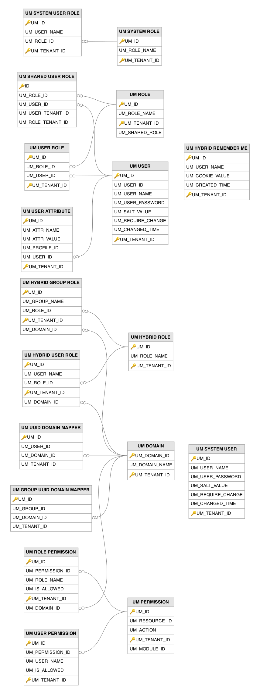
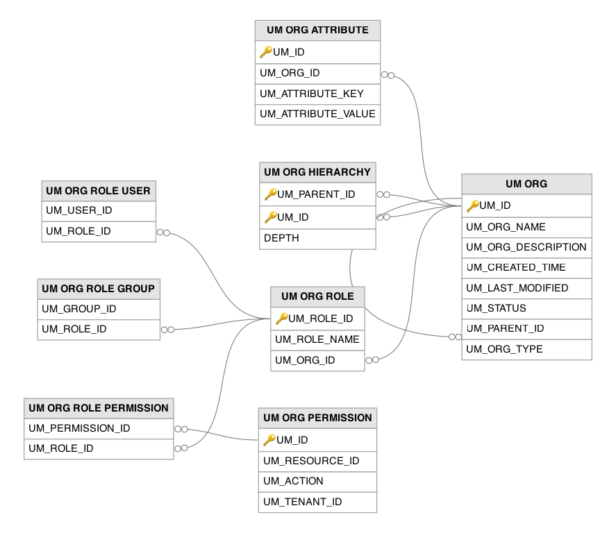
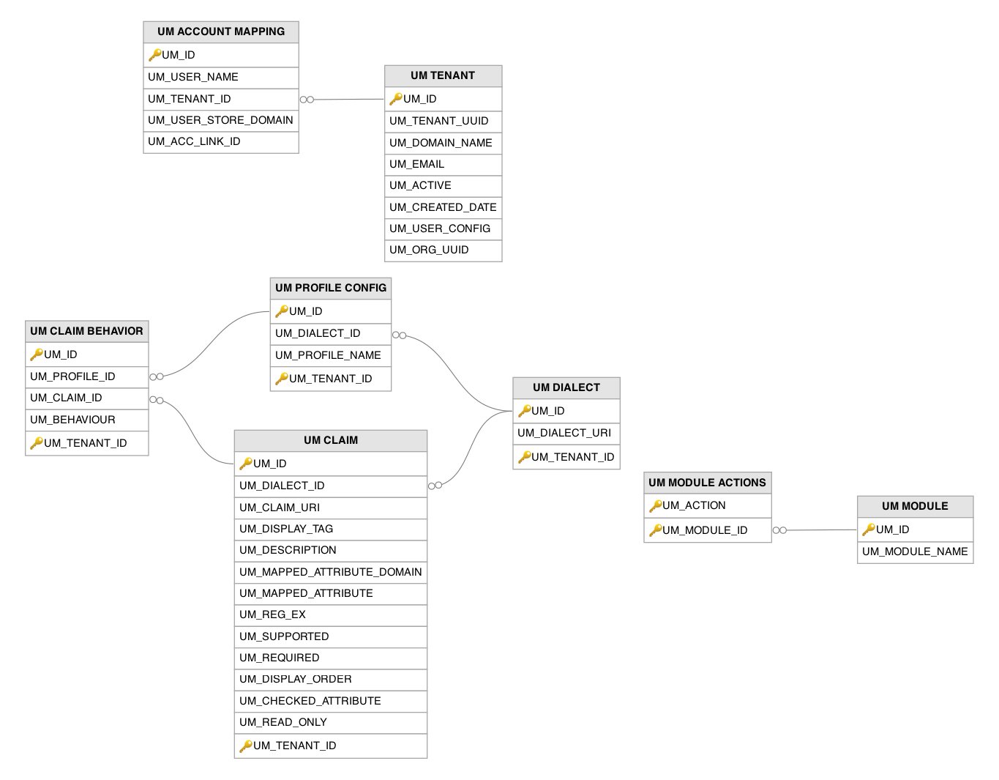

# User Management Related Tables

This section lists out all the user management related tables and their attributes in the WSO2 API Manager database.

---

## Table Definitions

### UM_ACCOUNT_MAPPING

Links user accounts that represent the same person across different user store domains, enabling account association within a tenant. Records are created when an administrator or the system links accounts from different user stores. All accounts belonging to the same person share the same `UM_ACC_LINK_ID` value, which allows the system to treat multiple user store entries as a single logical identity. The `UM_TENANT_ID` column points to the `UM_ID` column of the `UM_TENANT` table.

| Column | Description |
|--------|-------------|
| UM_ID | Primary key. The auto-generated row identifier for this account mapping entry. |
| UM_USER_NAME | The username of the account in the specified user store domain. |
| UM_TENANT_ID | Foreign key to the `UM_TENANT` table. The identifier of the tenant to which this account belongs. |
| UM_USER_STORE_DOMAIN | The name of the user store domain where this account resides (e.g. `PRIMARY`, `LDAP`). |
| UM_ACC_LINK_ID | The link group identifier that associates multiple accounts belonging to the same person; all entries sharing this value represent the same individual. |

---

### UM_CLAIM

Defines individual claim URIs within a claim dialect, along with their metadata such as display labels, validation rules, and mappings to underlying user store attributes. Claims are seeded during initial startup with default WSO2, OIDC, and SCIM claims, and administrators can add custom claims through the management console. The `UM_MAPPED_ATTRIBUTE` column links each claim to the actual user store attribute name, which is how the claim management framework resolves claim values from the underlying user store. The `UM_DIALECT_ID` column points to the `UM_DIALECT` table.

| Column | Description |
|--------|-------------|
| UM_ID | Primary key (composite with `UM_TENANT_ID`). The auto-generated identifier for this claim definition. |
| UM_DIALECT_ID | Foreign key to the `UM_DIALECT` table. The identifier of the claim dialect to which this claim belongs. |
| UM_CLAIM_URI | The URI that uniquely identifies this claim within its dialect (e.g. `http://wso2.org/claims/emailaddress`). |
| UM_DISPLAY_TAG | The human-readable label displayed for this claim in management console forms and user profile views. |
| UM_DESCRIPTION | A human-readable description explaining the purpose and usage of this claim. |
| UM_MAPPED_ATTRIBUTE_DOMAIN | The user store domain to which the mapped attribute applies, enabling different attribute mappings per user store. |
| UM_MAPPED_ATTRIBUTE | The name of the underlying user store attribute that this claim maps to (e.g. `mail` in LDAP). |
| UM_REG_EX | A regular expression pattern used to validate values assigned to this claim. |
| UM_SUPPORTED | Indicates whether this claim is supported and available for use in the current configuration. |
| UM_REQUIRED | Indicates whether this claim is mandatory and must have a value when creating or updating user profiles. |
| UM_DISPLAY_ORDER | The numeric position that determines the display order of this claim in user-facing forms and profile views. |
| UM_CHECKED_ATTRIBUTE | Indicates whether this claim represents a boolean (checkbox) attribute in user-facing forms. |
| UM_READ_ONLY | Indicates whether this claim is read-only and cannot be modified through standard interfaces. |
| UM_TENANT_ID | Primary key (composite). The identifier of the tenant to which this claim definition belongs. |

---

### UM_CLAIM_BEHAVIOR

Stores per-profile behavior overrides for individual claims, controlling how each claim behaves within a specific profile context. A record is created when an administrator customizes claim behavior for a particular profile, such as making a claim mandatory in one profile but optional in another. The `UM_PROFILE_ID` column points to the `UM_PROFILE_CONFIG` table and the `UM_CLAIM_ID` column points to the `UM_CLAIM` table.

| Column | Description |
|--------|-------------|
| UM_ID | Primary key (composite with `UM_TENANT_ID`). The auto-generated row identifier for this claim behavior override. |
| UM_PROFILE_ID | Foreign key to the `UM_PROFILE_CONFIG` table. The identifier of the profile configuration to which this behavior override applies. |
| UM_CLAIM_ID | Foreign key to the `UM_CLAIM` table. The identifier of the claim whose behavior is being overridden for this profile. |
| UM_BEHAVIOUR | A numeric code that determines how the claim behaves within this profile context (e.g. hidden, read-only, required, or optional). |
| UM_TENANT_ID | Primary key (composite). The identifier of the tenant to which this behavior override belongs. |

---

### UM_DIALECT

In claim management, all the claims are grouped into dialects. This table registers claim dialect URIs that group related claims under a common namespace, such as the WSO2 local dialect (`http://wso2.org/claims`) or the OIDC dialect (`http://wso2.org/oidc/claim`). Each dialect contains a set of claims defined in the `UM_CLAIM` table.

| Column | Description |
|--------|-------------|
| UM_ID | Primary key (composite with `UM_TENANT_ID`). The auto-generated identifier for this claim dialect. |
| UM_DIALECT_URI | The URI that uniquely identifies this claim dialect within the tenant (e.g. `http://wso2.org/claims`). |
| UM_TENANT_ID | Primary key (composite). The identifier of the tenant to which this claim dialect belongs. |

---

### UM_DOMAIN

The user store domains of all tenants are stored in this table. By default for a tenant there are domains such as `PRIMARY`, `SYSTEM`, and `INTERNAL`. If a secondary user store is added for a tenant, the user store domain details for that are also stored in this table. Each domain represents a distinct backend that can authenticate users and store credentials.

| Column | Description |
|--------|-------------|
| UM_DOMAIN_ID | Primary key (composite with `UM_TENANT_ID`). The auto-generated identifier for this user store domain configuration. |
| UM_DOMAIN_NAME | The name of the user store domain (e.g. `PRIMARY`, `LDAP_CORP`), unique within the tenant and used to scope user and role lookups. |
| UM_TENANT_ID | Primary key (composite). The identifier of the tenant to which this user store domain belongs. |

---

### UM_GROUP_UUID_DOMAIN_MAPPER

Maps each group's unique UUID to its user store domain, serving the same purpose as `UM_UUID_DOMAIN_MAPPER` but for groups rather than users. A record is created when a group is provisioned via SCIM 2.0 or when a UUID is assigned to an existing group. This enables the system to resolve group identifiers across different user store domains using the stable UUID. The `UM_DOMAIN_ID` column points to the `UM_DOMAIN` table.

| Column | Description |
|--------|-------------|
| UM_ID | Primary key. The auto-generated row identifier for this group UUID-to-domain mapping. |
| UM_GROUP_ID | The universally unique identifier assigned to the group, enabling stable group references across user store domains. |
| UM_DOMAIN_ID | Foreign key to the `UM_DOMAIN` table. The user store domain in which this group is defined, enabling fast domain resolution from the UUID. |
| UM_TENANT_ID | The identifier of the tenant to which this group belongs. |

---

### UM_HYBRID_GROUP_ROLE

Maps user groups (typically originating from external user stores such as LDAP or Active Directory) to hybrid (internal) roles defined in the `UM_HYBRID_ROLE` table. A record is created when an administrator assigns a group to an internal role, enabling all members of that external group to inherit the internal role's permissions. The `UM_DOMAIN_ID` column points to the `UM_DOMAIN` table.

| Column | Description |
|--------|-------------|
| UM_ID | Primary key (composite with `UM_TENANT_ID`). The auto-generated row identifier for this group-to-hybrid-role assignment. |
| UM_GROUP_NAME | The name of the user group (typically from an external user store) being assigned to the internal role. |
| UM_ROLE_ID | Foreign key to the `UM_HYBRID_ROLE` table. The identifier of the internal role being assigned to the group. |
| UM_TENANT_ID | Primary key (composite). The identifier of the tenant to which this assignment belongs. |
| UM_DOMAIN_ID | Foreign key to the `UM_DOMAIN` table. The user store domain where the group is defined. |

---

### UM_HYBRID_REMEMBER_ME

Stores `Remember Me` cookie tokens for users who select the `Remember Me` option during login to the management console or authentication endpoints. A record is created when a user authenticates with the option enabled, and the cookie value is stored to allow automatic re-authentication on subsequent visits. The `UM_CREATED_TIME` column enables expiry-based cleanup of stale tokens.

| Column | Description |
|--------|-------------|
| UM_ID | Primary key (composite with `UM_TENANT_ID`). The auto-generated row identifier for this remember-me token. |
| UM_USER_NAME | The username of the user who selected the `Remember Me` option during login. |
| UM_COOKIE_VALUE | The remember-me cookie token value stored in the user's browser for automatic re-authentication. |
| UM_CREATED_TIME | The timestamp when this remember-me token was issued, used for expiry-based cleanup of stale tokens. |
| UM_TENANT_ID | Primary key (composite). The identifier of the tenant to which this remember-me token belongs. |

---

### UM_HYBRID_ROLE

Stores internal (hybrid) roles that exist within the WSO2 platform's internal role store rather than in an external user store such as LDAP or Active Directory. These roles are created when an administrator adds an `Internal` role through the management console or when the system creates built-in roles such as `Internal/everyone`. Hybrid roles allow role-based access control without modifying a read-only external directory.

| Column | Description |
|--------|-------------|
| UM_ID | Primary key (composite with `UM_TENANT_ID`). The auto-generated identifier for this internal (hybrid) role. |
| UM_ROLE_NAME | The name of the internal role, unique within the tenant (e.g. `Internal/everyone`, `Internal/admin`). |
| UM_TENANT_ID | Primary key (composite). The identifier of the tenant to which this internal role belongs. |

---

### UM_HYBRID_USER_ROLE

Maps individual users to hybrid (internal) roles defined in the `UM_HYBRID_ROLE` table. A record is created when an administrator assigns a user to an internal role through the management console or API. The `UM_DOMAIN_ID` column identifies which user store domain the user belongs to, enabling the system to correctly resolve users from different user stores when they are assigned to the same internal role.

| Column | Description |
|--------|-------------|
| UM_ID | Primary key (composite with `UM_TENANT_ID`). The auto-generated row identifier for this user-to-hybrid-role assignment. |
| UM_USER_NAME | The username of the user being assigned to the internal role. |
| UM_ROLE_ID | Foreign key to the `UM_HYBRID_ROLE` table. The identifier of the internal role being assigned to the user. |
| UM_TENANT_ID | Primary key (composite). The identifier of the tenant to which this assignment belongs. |
| UM_DOMAIN_ID | Foreign key to the `UM_DOMAIN` table. The user store domain that the user belongs to, enabling correct user resolution across multiple user stores. |

---

### UM_MODULE

Registers pluggable authorization modules that define the available authorization actions in the system. Module records are typically created during server startup when authorization components register themselves. Each module groups a set of related actions (stored in the `UM_MODULE_ACTIONS` table) that can be used when defining permissions.

| Column | Description |
|--------|-------------|
| UM_ID | Primary key. The auto-generated identifier for this authorization module. |
| UM_MODULE_NAME | The name of the pluggable authorization module that defines a set of available authorization actions. |

---

### UM_MODULE_ACTIONS

Defines the specific authorization actions available within each pluggable authorization module registered in the `UM_MODULE` table. Records are populated during module registration at server startup and define action strings such as `ui.execute`. These actions are referenced by `UM_PERMISSION` entries to specify what type of operation a permission grants on a given resource path. The `UM_MODULE_ID` column points to the `UM_MODULE` table.

| Column | Description |
|--------|-------------|
| UM_ACTION | Primary key (composite with `UM_MODULE_ID`). The authorization action string defined by this module (e.g. `ui.execute`). |
| UM_MODULE_ID | Primary key (composite). Foreign key to the `UM_MODULE` table. The identifier of the authorization module that defines this action. |

---

### UM_ORG

Stores organization definitions in the WSO2 organization management framework, which provides a hierarchical multi-tenancy model where organizations can contain sub-organizations. A record is created when an administrator creates a new organization through the organization management API or when the system initializes the root `Super` organization during first startup. The `UM_PARENT_ID` column establishes the parent-child hierarchy by referencing this same table.

| Column | Description |
|--------|-------------|
| UM_ID | Primary key. The universally unique identifier for this organization, used for API-based management and cross-table references. |
| UM_ORG_NAME | The human-readable display name of the organization. |
| UM_ORG_DESCRIPTION | A human-readable description of the organization's purpose or scope. |
| UM_CREATED_TIME | The timestamp when this organization was initially created in the hierarchy. |
| UM_LAST_MODIFIED | The timestamp when this organization's properties were last modified. |
| UM_STATUS | The current status of the organization (default `ACTIVE`); deactivated organizations cannot process requests. |
| UM_PARENT_ID | Foreign key to the `UM_ORG` table (self-reference). The UUID of the parent organization in the hierarchy (null for the root `Super` organization). |
| UM_ORG_TYPE | The type classification of the organization (e.g. `TENANT`), determining its capabilities and behavior in the hierarchy. |

---

### UM_ORG_ATTRIBUTE

Stores extensible key-value attribute pairs associated with organizations, allowing custom metadata to be attached to any organization in the hierarchy. Records are created when an administrator sets attributes during organization creation or updates them later via the organization management API. The `UM_ORG_ID` column points to the `UM_ORG` table.

| Column | Description |
|--------|-------------|
| UM_ID | Primary key. The auto-generated row identifier for this organization attribute. |
| UM_ORG_ID | Foreign key to the `UM_ORG` table. The UUID of the organization to which this attribute belongs. |
| UM_ATTRIBUTE_KEY | The key name of the attribute, unique within the organization (e.g. billing identifier, contact details, custom metadata). |
| UM_ATTRIBUTE_VALUE | The value associated with this attribute key for the organization. |

---

### UM_ORG_HIERARCHY

Implements a closure table pattern for the organization tree, storing all ancestor-descendant relationships (not just direct parent-child links) to enable efficient hierarchical queries. Records are automatically maintained by the system whenever an organization is created, moved, or deleted. The `DEPTH` column indicates the distance between the ancestor and descendant. Both `UM_PARENT_ID` and `UM_ID` columns point to the `UM_ORG` table.

| Column | Description |
|--------|-------------|
| UM_PARENT_ID | Primary key (composite). Foreign key to the `UM_ORG` table. The UUID of the ancestor organization in the hierarchy. |
| UM_ID | Primary key (composite). Foreign key to the `UM_ORG` table. The UUID of the descendant organization in the hierarchy. |
| DEPTH | The number of levels between the ancestor and descendant in the hierarchy (`0` = self-referencing row, `1` = direct parent-child). |

---

### UM_ORG_PERMISSION

Defines permission entries (resource-path and action pairs) used specifically within the organization management role-based access control framework. Records are created when organization-level permissions are registered by components or configured by administrators. These permissions are assigned to organization-scoped roles through the `UM_ORG_ROLE_PERMISSION` table.

| Column | Description |
|--------|-------------|
| UM_ID | Primary key. The auto-generated identifier for this organization-level permission entry. |
| UM_RESOURCE_ID | The resource path being protected by this organization-level permission. |
| UM_ACTION | The action that this permission governs on the protected resource within the organization. |
| UM_TENANT_ID | The identifier of the tenant to which this organization-level permission belongs. |

---

### UM_ORG_ROLE

Defines roles that are scoped to a specific organization within the organization management hierarchy, as opposed to tenant-wide roles in the `UM_ROLE` table. A record is created when an administrator defines a new role within an organization through the organization management API. The `UM_ORG_ID` column points to the `UM_ORG` table.

| Column | Description |
|--------|-------------|
| UM_ROLE_ID | Primary key. The unique identifier for this organization-scoped role. |
| UM_ROLE_NAME | The name of the role within the organization, used for display and management purposes. |
| UM_ORG_ID | Foreign key to the `UM_ORG` table. The UUID of the organization to which this role is scoped. |

---

### UM_ORG_ROLE_GROUP

Maps user groups to organization-scoped roles defined in the `UM_ORG_ROLE` table, enabling group-based access control within the organization hierarchy. A record is created when an administrator assigns a group to an organization role. All members of the assigned group inherit the permissions of the organization role. The `UM_ROLE_ID` column points to the `UM_ORG_ROLE` table.

| Column | Description |
|--------|-------------|
| UM_GROUP_ID | The identifier of the user group being assigned to the organization-scoped role. |
| UM_ROLE_ID | Foreign key to the `UM_ORG_ROLE` table. The identifier of the organization-scoped role being assigned to the group. |

---

### UM_ORG_ROLE_PERMISSION

Maps permissions from the `UM_ORG_PERMISSION` table to organization-scoped roles in the `UM_ORG_ROLE` table, completing the organization-level role-based access control model. A record is created when an administrator grants a permission to an organization role. This table is queried during authorization checks for organization-scoped operations.

| Column | Description |
|--------|-------------|
| UM_PERMISSION_ID | Foreign key to the `UM_ORG_PERMISSION` table. The identifier of the organization-level permission being granted to the role. |
| UM_ROLE_ID | Foreign key to the `UM_ORG_ROLE` table. The identifier of the organization-scoped role receiving this permission. |

---

### UM_ORG_ROLE_USER

Maps individual users to organization-scoped roles defined in the `UM_ORG_ROLE` table. A record is created when an administrator assigns a user to an organization role. This enables users to have different role assignments in different organizations within the hierarchy. The `UM_ROLE_ID` column points to the `UM_ORG_ROLE` table.

| Column | Description |
|--------|-------------|
| UM_USER_ID | The identifier of the user being assigned to the organization-scoped role. |
| UM_ROLE_ID | Foreign key to the `UM_ORG_ROLE` table. The identifier of the organization-scoped role being assigned to the user. |

---

### UM_PERMISSION

The permission tree is stored in this table. Permission entries are defined as resource-path and action pairs used by the WSO2 authorization framework. A permission record is created when a new resource path and action combination is introduced, typically through the management console's permission tree or when components register their protected resources during startup. Permissions are then assigned to roles via the `UM_ROLE_PERMISSION` table.

| Column | Description |
|--------|-------------|
| UM_ID | Primary key (composite with `UM_TENANT_ID`). The auto-generated identifier for this permission entry. |
| UM_RESOURCE_ID | The resource path being protected by this permission (e.g. `/permission/admin/manage/api/create`). |
| UM_ACTION | The action that this permission governs on the protected resource (e.g. `ui.execute`). |
| UM_TENANT_ID | Primary key (composite). The identifier of the tenant to which this permission belongs. |
| UM_MODULE_ID | The identifier of the authorization module that defines the action type for this permission. |

---

### UM_PROFILE_CONFIG

Stores named claim profile configurations within each dialect, allowing different claim visibility and behavior settings for different user profiles. Records are created when an administrator configures a profile (beyond the default profile) for a dialect. The behavior settings for individual claims within a profile are defined in the `UM_CLAIM_BEHAVIOR` table. The `UM_DIALECT_ID` column points to the `UM_DIALECT` table.

| Column | Description |
|--------|-------------|
| UM_ID | Primary key (composite with `UM_TENANT_ID`). The auto-generated identifier for this profile configuration. |
| UM_DIALECT_ID | Foreign key to the `UM_DIALECT` table. The identifier of the claim dialect to which this profile configuration applies. |
| UM_PROFILE_NAME | The name of the claim profile (e.g. `default`, `work`, `personal`) that this configuration defines. |
| UM_TENANT_ID | Primary key (composite). The identifier of the tenant to which this profile configuration belongs. |

---

### UM_ROLE

When a JDBC user store is used as a primary or secondary user store, the role details are stored in this table upon creation of a role. Roles serve as the primary mechanism for role-based access control and are assigned permissions through the `UM_ROLE_PERMISSION` table and linked to users through the `UM_USER_ROLE` table. The `UM_SHARED_ROLE` flag indicates whether a role can be shared across multiple tenants.

| Column | Description |
|--------|-------------|
| UM_ID | Primary key (composite with `UM_TENANT_ID`). The auto-generated internal identifier for this role. |
| UM_ROLE_NAME | The name of the role, unique within the tenant, used for role-based access control assignments. |
| UM_TENANT_ID | Primary key (composite). The identifier of the tenant to which this role belongs. |
| UM_SHARED_ROLE | Indicates whether this role can be shared across multiple tenants in multi-tenant deployments, enabling cross-tenant role assignments. |

---

### UM_ROLE_PERMISSION

Maps permissions from the `UM_PERMISSION` table to roles, forming the core of the role-based access control system. A record is created when an administrator grants or denies a specific permission to a role. The `UM_IS_ALLOWED` column enables both allow and deny semantics, and `UM_DOMAIN_ID` scopes the assignment to a specific user store domain. The `UM_PERMISSION_ID` column points to the `UM_PERMISSION` table.

| Column | Description |
|--------|-------------|
| UM_ID | Primary key (composite with `UM_TENANT_ID`). The auto-generated row identifier for this role-permission assignment. |
| UM_PERMISSION_ID | Foreign key to the `UM_PERMISSION` table. The identifier of the permission being granted or denied to the role. |
| UM_ROLE_NAME | The name of the role receiving this permission assignment. |
| UM_IS_ALLOWED | Indicates whether the permission is granted (`1`) or explicitly denied (`0`) for this role. |
| UM_TENANT_ID | Primary key (composite). The identifier of the tenant to which this permission assignment belongs. |
| UM_DOMAIN_ID | Foreign key to the `UM_DOMAIN` table. The user store domain to which this permission assignment is scoped. |

---

### UM_SHARED_USER_ROLE

Enables cross-tenant user-to-role assignments for roles that are marked as shared (via `UM_SHARED_ROLE` in the `UM_ROLE` table). A record is created when a user in one tenant is assigned a shared role that belongs to a different tenant. The separate `UM_USER_TENANT_ID` and `UM_ROLE_TENANT_ID` columns track which tenant owns the user and which tenant owns the role.

| Column | Description |
|--------|-------------|
| ID | Primary key. The auto-generated row identifier for this cross-tenant user-role assignment. |
| UM_ROLE_ID | Foreign key to the `UM_ROLE` table. The identifier of the shared role being assigned. |
| UM_USER_ID | Foreign key to the `UM_USER` table. The identifier of the user receiving the shared role. |
| UM_USER_TENANT_ID | The identifier of the tenant to which the user belongs. |
| UM_ROLE_TENANT_ID | The identifier of the tenant that owns the shared role being assigned. |

---

### UM_SYSTEM_ROLE

Stores system-level roles that are used internally by the platform for privileged operations and are not exposed through user-facing management interfaces. These roles are created automatically during server startup or component activation. System roles are kept separate from regular roles (`UM_ROLE`) and hybrid roles (`UM_HYBRID_ROLE`) to prevent accidental modification or deletion.

| Column | Description |
|--------|-------------|
| UM_ID | Primary key (composite with `UM_TENANT_ID`). The auto-generated identifier for this system-level role. |
| UM_ROLE_NAME | The name of the system role, unique within the tenant, used internally by the platform for privileged operations. |
| UM_TENANT_ID | Primary key (composite). The identifier of the tenant to which this system role belongs. |

---

### UM_SYSTEM_USER

Stores internal system-level service accounts that are used by the platform itself rather than by human users. These accounts are created during server initialization or component activation and are used for internal operations such as system-to-system authentication and background task execution. System users are kept separate from regular users in the `UM_USER` table.

| Column | Description |
|--------|-------------|
| UM_ID | Primary key (composite with `UM_TENANT_ID`). The auto-generated internal identifier for this system user record. |
| UM_USER_NAME | The login name of the system service account, unique within the tenant. |
| UM_USER_PASSWORD | The salted hash of the system user's password, computed using the configured hashing algorithm. |
| UM_SALT_VALUE | The cryptographic salt value used to produce the password hash for this system user. |
| UM_REQUIRE_CHANGE | Indicates whether the system user is required to change their password upon next authentication. |
| UM_CHANGED_TIME | The timestamp when this system user's password was last changed. |
| UM_TENANT_ID | Primary key (composite). The identifier of the tenant to which this system user belongs. |

---

### UM_SYSTEM_USER_ROLE

Maps users to system-level roles defined in the `UM_SYSTEM_ROLE` table, granting them access to internal platform functions. Records are created automatically by the system when users need to be assigned system-level privileges, such as during tenant provisioning. The `UM_ROLE_ID` column points to the `UM_ID` column of the `UM_SYSTEM_ROLE` table.

| Column | Description |
|--------|-------------|
| UM_ID | Primary key (composite with `UM_TENANT_ID`). The auto-generated row identifier for this user-to-system-role assignment. |
| UM_USER_NAME | The username of the user being assigned the system-level role. |
| UM_ROLE_ID | Foreign key to the `UM_SYSTEM_ROLE` table. The identifier of the system role being assigned to the user. |
| UM_TENANT_ID | Primary key (composite). The identifier of the tenant to which this system role assignment belongs. |

---

### UM_TENANT

When creating a tenant, the details of the tenant are stored in this table. `UM_ID` is the auto-generated tenant ID. The `UM_DOMAIN_NAME` serves as the unique tenant identifier used in login URLs and API contexts, while `UM_USER_CONFIG` holds the serialized user store configuration specific to that tenant.

| Column | Description |
|--------|-------------|
| UM_ID | Primary key. The auto-generated internal identifier for this tenant, used as a foreign key throughout the system for tenant scoping. |
| UM_TENANT_UUID | A universally unique identifier for this tenant, used for API-based tenant management operations. |
| UM_DOMAIN_NAME | The domain name that uniquely identifies this tenant (e.g. `carbon.super` for the super tenant), used in login URLs and API contexts. |
| UM_EMAIL | The email address of the tenant administrator, used for tenant-related notifications and administrative communication. |
| UM_ACTIVE | Indicates whether this tenant is currently active and accessible; deactivated tenants cannot authenticate users or process requests. |
| UM_CREATED_DATE | The timestamp when this tenant was initially provisioned in the system. |
| UM_USER_CONFIG | The serialized user store configuration specific to this tenant, defining how users are stored and authenticated. |
| UM_ORG_UUID | The UUID of the organization associated with this tenant in the organization management hierarchy. |

---

### UM_USER

When a JDBC user store is used as a primary or secondary user store, the user details are stored in this table upon user creation. The password is stored as a salted hash, with the salt value kept in `UM_SALT_VALUE`. The `UM_USER_ID` column holds a UUID that serves as the stable, immutable user identifier used across the system, while `UM_USER_NAME` is the human-readable login name.

| Column | Description |
|--------|-------------|
| UM_ID | Primary key (composite with `UM_TENANT_ID`). The auto-generated internal identifier for this user record. |
| UM_USER_ID | The immutable UUID that serves as the stable user identifier across the system, used by APIs and tokens instead of the mutable username. |
| UM_USER_NAME | The human-readable login name of the user, unique within the tenant and used for authentication. |
| UM_USER_PASSWORD | The salted hash of the user's password, computed using the hashing algorithm configured in `user-mgt.xml`. |
| UM_SALT_VALUE | The cryptographic salt value used in conjunction with the hashing algorithm to produce the password hash. |
| UM_REQUIRE_CHANGE | Indicates whether the user is required to change their password upon next login, typically set during administrative password resets. |
| UM_CHANGED_TIME | The timestamp when the user's password was last changed, used for enforcing password expiry policies. |
| UM_TENANT_ID | Primary key (composite). The identifier of the tenant to which this user belongs. |

---

### UM_USER_ATTRIBUTE

When a JDBC user store is used and a user is created in that user store, attributes can be added for the user profile. Each attribute is stored as a key-value pair where the `UM_ATTR_NAME` and `UM_ATTR_VALUE` columns contain the attribute name and value respectively. The `UM_USER_ID` column points to the `UM_ID` column of the `UM_USER` table. The profile that the attribute belongs to is given in the `UM_PROFILE_ID` column.

| Column | Description |
|--------|-------------|
| UM_ID | Primary key (composite with `UM_TENANT_ID`). The auto-generated row identifier for this user attribute entry. |
| UM_ATTR_NAME | The name of the user attribute or claim URI (e.g. `http://wso2.org/claims/emailaddress`). |
| UM_ATTR_VALUE | The value of the user attribute, populated during user provisioning, profile updates, or SCIM operations. |
| UM_PROFILE_ID | The name of the user profile to which this attribute belongs (typically `default`), supporting multiple attribute profiles per user. |
| UM_USER_ID | Foreign key to the `UM_USER` table. The identifier of the user to whom this attribute belongs. |
| UM_TENANT_ID | Primary key (composite). The identifier of the tenant to which this user attribute belongs. |

---

### UM_USER_PERMISSION

Assigns permissions directly to individual users, bypassing the role-based assignment model. A record is created when an administrator grants or denies a specific permission to a user. User-level permissions take precedence over role-level permissions, allowing fine-grained access control exceptions without creating dedicated roles. The `UM_PERMISSION_ID` column points to the `UM_PERMISSION` table.

| Column | Description |
|--------|-------------|
| UM_ID | Primary key (composite with `UM_TENANT_ID`). The auto-generated row identifier for this user-permission assignment. |
| UM_PERMISSION_ID | Foreign key to the `UM_PERMISSION` table. The identifier of the permission being granted or denied to the user. |
| UM_USER_NAME | The username of the user receiving this direct permission assignment. |
| UM_IS_ALLOWED | Indicates whether the permission is granted (`1`) or explicitly denied (`0`) for this user, taking precedence over role-level permissions. |
| UM_TENANT_ID | Primary key (composite). The identifier of the tenant to which this permission assignment belongs. |

---

### UM_USER_ROLE

The relationship between users and roles is stored in this table. One user can have multiple roles assigned, and similarly one role can have multiple users assigned to it. The user is mapped with `UM_USER_ID` (pointing to the `UM_USER` table) and the role is mapped with `UM_ROLE_ID` (pointing to the `UM_ROLE` table). This table is queried on every login and authorization check.

| Column | Description |
|--------|-------------|
| UM_ID | Primary key (composite with `UM_TENANT_ID`). The auto-generated row identifier for this user-role mapping. |
| UM_ROLE_ID | Foreign key to the `UM_ROLE` table. The identifier of the role assigned to the user. |
| UM_USER_ID | Foreign key to the `UM_USER` table. The identifier of the user who is assigned this role. |
| UM_TENANT_ID | Primary key (composite). The identifier of the tenant to which this user-role assignment belongs. |

---

### UM_UUID_DOMAIN_MAPPER

Maps each user's unique UUID to their user store domain, providing a fast lookup to determine which user store a user belongs to given only their UUID. A record is created when a user is provisioned or when a UUID is first assigned to an existing user. This mapping is essential for the UUID-based user identification model where APIs and tokens reference users by UUID. The `UM_DOMAIN_ID` column points to the `UM_DOMAIN` table.

| Column | Description |
|--------|-------------|
| UM_ID | Primary key. The auto-generated row identifier for this UUID-to-domain mapping. |
| UM_USER_ID | The universally unique identifier assigned to the user, providing a stable reference that persists even if the username changes. |
| UM_DOMAIN_ID | Foreign key to the `UM_DOMAIN` table. The user store domain to which this user belongs, enabling fast domain resolution from the UUID. |
| UM_TENANT_ID | The identifier of the tenant to which this user belongs. |

---

## Entity Relationship Diagrams

