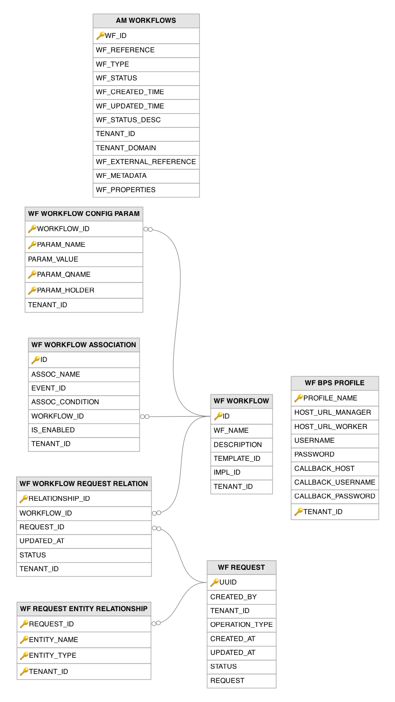

# Workflow Related Tables

This section lists out all the workflow related tables and their attributes in the WSO2 API Manager database.

---

## Table Definitions

### AM_WORKFLOWS

Manages human-approval and automated workflow instances for various API Manager operations such as application creation, subscription, user sign-up, application registration, API/API-product state changes, and API revision deployment. A record is created when an operation triggers a configured workflow (e.g., a subscription request that requires admin approval). Workflows are driven by a pluggable `WorkflowExecutor` architecture: Simple executors auto-approve in-process, Approval executors hold the request for a human decision, and WS executors delegate the human task to an external BPM engine — WSO2 BPS (via BPEL) or Camunda. The `WF_STATUS` column tracks the workflow state (CREATED on initiation, then APPROVED or REJECTED on the decision, with REGISTERED used for application-registration flows), and `WF_EXTERNAL_REFERENCE` holds the correlation reference to the external engine when a WS executor is configured. Workflow metadata and properties are stored as serialized blobs for flexibility.

| Column | Description |
|--------|-------------|
| WF_ID | Primary key. Auto-generated unique identifier for this workflow instance. |
| WF_REFERENCE | The identifier of the entity this workflow pertains to (e.g., application ID, subscription ID). |
| WF_TYPE | The type of workflow operation (e.g., AM_APPLICATION_CREATION, AM_APPLICATION_DELETION, AM_SUBSCRIPTION_CREATION, AM_SUBSCRIPTION_DELETION, AM_SUBSCRIPTION_UPDATE, AM_USER_SIGNUP, AM_APPLICATION_REGISTRATION_PRODUCTION, AM_APPLICATION_REGISTRATION_SANDBOX, AM_API_STATE, AM_API_PRODUCT_STATE). |
| WF_STATUS | The current state of the workflow: CREATED on initiation, then APPROVED or REJECTED once the decision is made (REGISTERED is used by application-registration flows). |
| WF_CREATED_TIME | The timestamp when this workflow instance was initiated. |
| WF_UPDATED_TIME | The timestamp when this workflow instance was last updated. |
| WF_STATUS_DESC | A human-readable description providing additional context about the current workflow status. |
| TENANT_ID | The identifier of the tenant in which this workflow was initiated. |
| TENANT_DOMAIN | The domain name of the tenant in which this workflow was initiated. |
| WF_EXTERNAL_REFERENCE | Unique. The correlation reference linking this instance to an external BPM engine (e.g., WSO2 BPS via BPEL, or Camunda) when a WS (web service) workflow executor is configured; used to match the engine's asynchronous callback back to this workflow. |
| WF_METADATA | Serialized metadata associated with this workflow instance, containing context-specific information. |
| WF_PROPERTIES | Serialized properties providing additional configuration for workflow execution. |

---

### WF_BPS_PROFILE

Stores connection profiles for external BPEL/BPS (Business Process Server) engines that execute workflow definitions. A record is created when an administrator configures a connection to a BPS instance through the management console's workflow engine settings. The profile includes the BPS manager and worker node URLs, authentication credentials, and callback configuration that the workflow framework uses to deploy and monitor workflow processes on the external BPS engine.

| Column | Description |
|--------|-------------|
| PROFILE_NAME | Primary key (composite). The name of this BPS connection profile, used for referencing in workflow configurations. |
| HOST_URL_MANAGER | The URL of the BPS manager node, used for workflow deployment and administrative operations. |
| HOST_URL_WORKER | The URL of the BPS worker node, used for runtime workflow task execution. |
| USERNAME | The username for authenticating with the BPS manager node. |
| PASSWORD | The encrypted password for authenticating with the BPS manager node. |
| CALLBACK_HOST | The hostname that the BPS engine calls back to report workflow completion. |
| CALLBACK_USERNAME | The username for authenticating callback requests from the BPS engine. |
| CALLBACK_PASSWORD | The encrypted password for authenticating callback requests from the BPS engine. |
| TENANT_ID | Primary key (composite). The identifier of the tenant to which this BPS profile belongs. |

---

### WF_REQUEST

Stores pending workflow requests that require human approval before an operation can be completed. A record is created when an event (such as user registration, role assignment, or application creation) triggers a workflow that requires manual approval. The `OPERATION_TYPE` identifies the type of operation, `STATUS` tracks whether the request is pending, approved, or rejected, and the `REQUEST` blob contains the serialized operation payload that will be executed upon approval.

| Column | Description |
|--------|-------------|
| UUID | Primary key. The universally unique identifier for this workflow request. |
| CREATED_BY | The username of the user whose action initiated this workflow request. |
| TENANT_ID | The identifier of the tenant to which this workflow request belongs. |
| OPERATION_TYPE | The type of operation that triggered this workflow (e.g., user self-registration, role creation, application update). |
| CREATED_AT | The timestamp when this workflow request was initially submitted. |
| UPDATED_AT | The timestamp when this workflow request was last modified (e.g., approved, rejected, or escalated). |
| STATUS | The current status of the workflow request: `PENDING` (awaiting approval), `APPROVED`, or `REJECTED`. |
| REQUEST | The serialized payload containing the full details of the operation that will be executed upon approval. |

---

### WF_REQUEST_ENTITY_RELATIONSHIP

Tracks the entities (users, roles, applications) that are affected by a pending workflow request. Records are created when a workflow request is submitted, linking the request to all entities involved in the operation. This enables the system to prevent conflicting operations on the same entity while a workflow is pending (e.g., blocking a second role-assignment request for the same user until the first one is resolved) and to display affected entities in the approval interface. The `REQUEST_ID` column is a foreign key to the `WF_REQUEST` table.

| Column | Description |
|--------|-------------|
| REQUEST_ID | Primary key (composite). Foreign key to the `WF_REQUEST` table. The UUID of the workflow request that affects this entity. |
| ENTITY_NAME | Primary key (composite). The name of the entity affected by the workflow request (e.g., username, role name). |
| ENTITY_TYPE | Primary key (composite). The type of the affected entity (e.g., `USER`, `ROLE`, `APPLICATION`). |
| TENANT_ID | Primary key (composite). The identifier of the tenant to which this entity relationship belongs. |

---

### WF_WORKFLOW

Stores the definitions of workflows that can be triggered by events in the system. A record is created when an administrator defines a new workflow through the management console's workflow management section. Each workflow references a template (defining the workflow pattern, e.g., single-step or multi-step approval) and an implementation (defining the execution engine, e.g., BPS). Workflows are associated with events through the `WF_WORKFLOW_ASSOCIATION` table and their configuration parameters are stored in the `WF_WORKFLOW_CONFIG_PARAM` table.

| Column | Description |
|--------|-------------|
| ID | Primary key. The unique identifier for this workflow definition. |
| WF_NAME | The human-readable name of this workflow definition. |
| DESCRIPTION | A human-readable description of this workflow's purpose and behavior. |
| TEMPLATE_ID | The identifier of the workflow template that defines the approval pattern (e.g., single-step, multi-step approval). |
| IMPL_ID | The identifier of the workflow implementation that defines the execution engine (e.g., BPS, embedded). |
| TENANT_ID | The identifier of the tenant to which this workflow definition belongs. |

---

### WF_WORKFLOW_ASSOCIATION

Maps workflow definitions from the `WF_WORKFLOW` table to events that trigger them, such as user self-registration, role creation, or application updates. A record is created when an administrator configures a workflow to be triggered by a specific event through the management console. The `ASSOC_CONDITION` column can contain an expression that further filters when the workflow should be triggered (e.g., only for users in a specific domain). Multiple workflows can be associated with the same event. The `WORKFLOW_ID` column is a foreign key to the `WF_WORKFLOW` table.

| Column | Description |
|--------|-------------|
| ID | Primary key. The auto-generated row identifier for this workflow-event association. |
| ASSOC_NAME | The human-readable name of this workflow-event association. |
| EVENT_ID | The event that triggers this workflow (e.g., `ADD_USER`, `ADD_ROLE`, `UPDATE_APPLICATION`). |
| ASSOC_CONDITION | An optional condition expression that further filters when the workflow should be triggered (e.g., only for users in a specific domain). |
| WORKFLOW_ID | Foreign key to the `WF_WORKFLOW` table. The identifier of the workflow to execute when the event fires. |
| IS_ENABLED | Indicates whether this workflow-event association is currently active (`1` = enabled). |
| TENANT_ID | The identifier of the tenant to which this association belongs. |

---

### WF_WORKFLOW_CONFIG_PARAM

Stores the configuration parameters for each workflow definition, providing the runtime settings needed by the workflow template and implementation to execute. Records are created when an administrator configures a workflow's parameters through the management console, such as approval roles, notification settings, or escalation timeouts. The primary key spans `WORKFLOW_ID`, `PARAM_NAME`, `PARAM_QNAME`, and `PARAM_HOLDER`, which scopes each parameter to a specific workflow definition and configuration section. The `WORKFLOW_ID` column is a foreign key to the `WF_WORKFLOW` table.

| Column | Description |
|--------|-------------|
| WORKFLOW_ID | Primary key (composite). Foreign key to the `WF_WORKFLOW` table. The identifier of the workflow definition to which this parameter belongs. |
| PARAM_NAME | Primary key (composite). The name of the configuration parameter. |
| PARAM_VALUE | The value of the configuration parameter. |
| PARAM_QNAME | Primary key (composite). The qualified name that scopes this parameter to a specific section of the workflow configuration. |
| PARAM_HOLDER | Primary key (composite). The holder type that further categorizes which component of the workflow owns this parameter. |
| TENANT_ID | The identifier of the tenant to which this workflow parameter belongs. |

---

### WF_WORKFLOW_REQUEST_RELATION

Links running workflow instances to the workflow requests that initiated them, tracking the execution status of each workflow-request pair. A record is created when a workflow request triggers a workflow instance execution (in-process or on an external BPM engine such as WSO2 BPS or Camunda). The `STATUS` column tracks whether the workflow instance is in progress, completed, or failed, and `UPDATED_AT` records the most recent state change. This table enables the system to correlate workflow execution with the original operation request. The `WORKFLOW_ID` column is a foreign key to the `WF_WORKFLOW` table and the `REQUEST_ID` column is a foreign key to the `WF_REQUEST` table.

| Column | Description |
|--------|-------------|
| RELATIONSHIP_ID | Primary key. The unique identifier for this workflow-request relationship. |
| WORKFLOW_ID | Foreign key to the `WF_WORKFLOW` table. The identifier of the workflow definition being executed. |
| REQUEST_ID | Foreign key to the `WF_REQUEST` table. The UUID of the operation request that triggered this workflow execution. |
| UPDATED_AT | The timestamp when the status of this workflow-request relationship was last changed. |
| STATUS | The current execution status of the workflow instance (e.g., in progress, completed, failed). |
| TENANT_ID | The identifier of the tenant to which this workflow-request relationship belongs. |

---

## Entity Relationship Diagram

