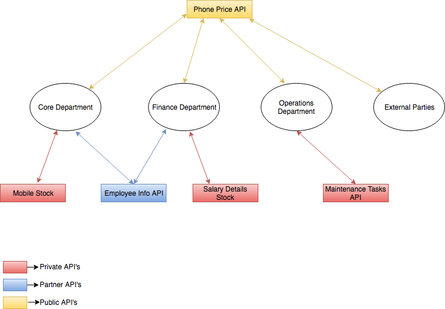
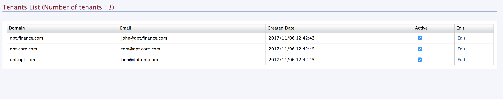

# API Development

## Managing Public, Partner vs Private APIs Sample Documentation

### Usecase

* Enable the internal use of APIs

* Help pick and choose subset of those to be used with partners

* Enabling building API ecosystems with partners that can unlock partnerships that cross industries (book a hotel and a car when you book a flight)

        * Connect with APIs from partners

        * Enable partners to connect with ours

* A further subset to be exposed as public APIs. Many of the same APIs used internally and with partners can be used as public APIs to drive additional business and help obtain new customers.

*The sample scenario I have created is mentioned below.*

### Business Story

* Let ABC organisation is an organisation that has separate departments for finance and operations other than their core business department which is mobile phone manufacturing.

* Let the core business department be department_core while finance department be depratment_finance and operations department be department_operations.

* Let the finance department handle salaries of employees while core department is responsible to maintain the mobile phone manufacturing stock while operations department handles maintenance work of the organization

### Business Use Cases

1. For the above mentioned business scenario, deparment_finance needs to get salaries of each and every employee. This data is private to the Finance Department.

2. Further, department_core needs to know details of stocks such as current stock price. This too is private to the Core Department.

3. Both Finance and Core departments need to know the employee details of employees working in Core department. This data is only provided to the Core and Finance departments, and the Operations department should not be able to access this data.

4. Further, department_core and the public needs to know the current prices of the mobile phones.

5. Operations department needs to know the maintenance tasks required for the day.

6. When a public user gets a phone price of a phone in Brand "A" and model “B”, that user should be able predicted the prices of the pouches for the relevant model phone. 

### Sample Business Use Cases Related to Sample One

#### **API Development**

Managing Public, Partner vs Private APIs

* Enable the internal use of APIs (business use case #1, #2)

* Help pick and choose subset of those to be used with partners (business use case #3)

* Enabling building API ecosystems with partners that can unlock partnerships that cross industries (book a hotel and a car when you book a flight)

    * Connect with APIs from partners

    * Enable partners to connect with ours

((business use case  #6)

* A further subset to be exposed as public APIs. Many of the same APIs used internally and with partners can be used as public APIs to drive additional business and help obtain new customers. (business use case  #4)

Above defines how the business story is related to a real world business scenario

.

### **How this Business Scenario can be Achieved Using WSO2 API Manager**

In our API manager we need to create

* Three different tenants for the three departments with users that can create APIs

* An API only visible to the tenant relevant of finance department to get employee salary details.

* An API only visible to the tenant relevant of core department to get current mobile stock details

* An API only visible to the tenant relevant of operations department to get required maintenance task for the day.

* An API subscription only visible to finance and core departments but restricted to operations departments to get the employee details of employees working in the core departments.

* API visible to public to get mobile phone prices by exposing a api to mobile phone prices. This API should be tagged as "mobile". An API to get mobile pouch princess. This should also have the tag “mobile”. In this scenario when an application client calls the mobile phone prices it will call another API to the API’s which has the same tag and get the relevant results. (When a user buys a mobile, matching pouches are predicted to buy.)

### How to run the sample to populate the above mentioned sample data

* Start wso2am-2.2.0-updateX is distribution by executing [APIM_HOME]/bin/wso2server.sh or [APIM_HOME]/bin/wso2server.bat

* Run the file run.sh in sample root directory as ./run.sh

#### User credentials needed for login to API Manager instance which the sample data is populated

##### Finance department user

Username: [john@finance.abc.com](mailto:john@finance.abc.com)

Password: 123123

##### Manufacturing department user

Username: [tom@core.abc.com](mailto:tom@core.abc.com)

Password: 123123

##### Maintenance department user

Username: [bob@operations.abc.com](mailto:bob@operations.abc.com)

Password: 123123

Screenshots on how to create tenants and how to control API visibility is mentioned below.

Created APIs looks like below screenshot

Created Tenants looks like below

Below screenshot show that user john can subscribe to the Salary_details_API since he belongs to the finance department.

Below screenshot show that john can see the api in his publisher view as well so that he can develop it.

Below screenshot show that John can not subscribe to Mobile_stock_API since he is not belongs to the core manufacturing department.

Below screenshot show that user Tom can subscribe to the Mobile_stock_API since he belongs to the core manufacturing department.

Below screenshot shows that Tom can develope the  Mobile_stock_API since he belongs to core manufacturing department.

Below two screenshots shows that both John and TOm can subscribe to Employee_info_API since both of them are are given privilege to access the Employee_info_API.

### References

[1] -[ https://docs.wso2.com/display/AM210/Key+Concepts#KeyConcepts-APIvisibilityandsubscription](https://docs.wso2.com/display/AM210/Key+Concepts#KeyConcepts-APIvisibilityandsubscription)

You can invoke and check the API’s giving results after subscribing to the relevant API’s and generating the keys.

