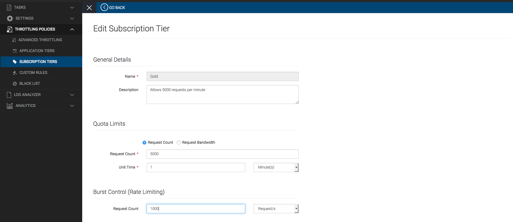
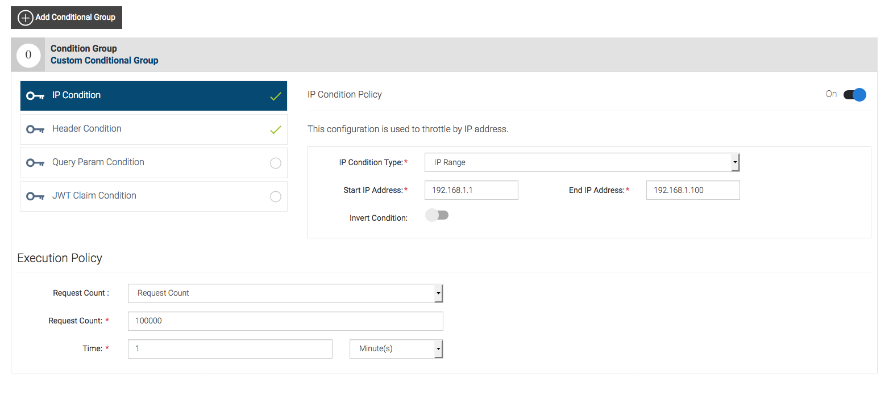

# API Rate Limiting

### Sample use case

##### API Rate Limiting

* For monetization purposes, to enforce limits on an Application based on its subscriptions

* Enforce fair usage policy among an application’s users

* Allow privileged rate limits based on location, device type, user credentials, etc.

* Enforce a peak limit on back-end services to prevent total outages.

### Business Story

* Let ABC organization has an API to expose there mobile phone prices. For the time bean let's assume this organization exposes prices to the sales agents and they have big number of third party sales agents.

* Further they need to limit the total number of API calls(50PerMin) for this mobile price API

* Hence this organisation need to limit the number of requests(5000 requests) that a specific third party agent can call to the mobile price API.

* Further they only need to allow the API calls comes from a specific locations(IP address - 192.168.1.1 to 192.168.1.100) and they need to restrict specific device types such as mobiles

* Further even though they allow a specific number of API calls per a given period of time they need to limit the API call that comes at a given time to restrict the bust requests and to prevent their back end service.

### Business Use Cases

* For the above mentioned business story ABC organization needs to have and API manager solution to expos there mobile price API.

* They need to limit the the number of API calls that invokes by a specific third party agent

* They need to limit the number of API calls that invokes by all the agents in a given period of time frame

* They need to control the number of request comes from specific devices, locations

* They need to control the number of requests comes at given time to limit the burst requests.

### How this Business Scenario can be achieved Using WSO2 API Manager ?

In WSO2 API MAnager we need to,

* Create an API to expose there mobile phone prices.

* Create a Application throttle policy to the number of API calls that comes from all the third party agents that subscribes through that application

* Create a Subscription throttle policy to limit the number of API calls from a specific third party agent

* Add a Burst Control (Rate Limiting) to the subscription policy to prevent the burst requests that can come for a given time.

By executing the scenario 10 using the run.sh as mentioned below will add the sample data relate the the above business use case to WSO2 API Manager distribution

### How to run the sample to populate the above mentioned sample data

1. Start wso2am-2.2.0-updateX is distribution by executing **[APIM_HOME]**/bin/wso2server.sh or **[APIM_HOME]**/bin/wso2server.bat

2. Run the file run.sh in sample scenarios root directory**[APIM_HOME/sample-scenarios] **as ./run.sh and enter number 10.

#### User credentials needed for login to API Manager instance which the sample data is populated

Username: admin

Password: admin

### Screenshots on how this can be seen in API Manager 2.1.0

Subscription tiers

Application tiers

Advance throttle policy

Header condition to block

Ip range to accept

### References

https://docs.wso2.com/display/AM210/Introducing+Throttling+Use-Cases

				 				 				 

				 				 				 

