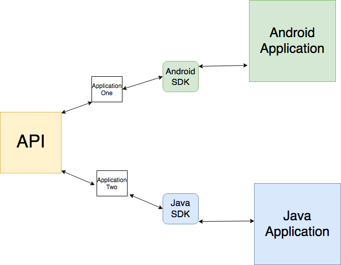

## **API Development**

### **Developer Optimized APIs Development - Sample Documentation**

### Sample Use Case

* Business APIs can be accessed by different parties via different devices. Providing optimized and personalized experience for these different user stories is the key success of digital transformation.  

* Same API can be accessed by different clients.

  	ex: mobile devices, PC, TV etc.

* API developer should be able to optimize API output by identifying its client

* Optimization can be a composition of the multiple backend or stripdown.

* APIs are prioritized based on the client

### Business Scenario

As an example, let’s take ABC organization which is a bank which provides financial facilities such as loans, fixed deposits etc. For these financial services they have a requirement to produce the loan and fixed deposit rates. Further, they have an online facility for clients to log in and check their account information and perform transactions. Their requirement extends to developing a mobile banking solution as well.

### How this Business Scenario can be Achieved Using WSO2 API Manager?

For the above sample business scenario, the organization will need an API to 

1. Expose the exchange rates

2. Send clients’ relevant account information

3. Grant access to the online banking solution as well as the mobile banking solution

In the future, they will need more and more functionality exposed through APIs, but as for now, let’s consider only the above mentioned three APIs and consider how we could achieve this using WSO2 API Manager.

### Business APIs can be access different parties via different devices

WSO2 API Manager provides a SDK feature that generates SDKs for a variety of programming languages. This particular feature will address the first part of the sample scenario, i.e. "Business APIs can be access different parties via different devices", where different SDKs can address the needs of the different types of consumers involved.

Here the API consumers can create different clients using the programming language they prefer. For an example, let’s consider two parties that needs an application that consumes the APIs using Python and Java. They can develop two applications using the SDK’s for Python and Java separately. The SDK which is automatically generated through WSO2 API Manager, will handle the API invocation logic while the application developer only needs to focus on the business logic of the client and call the method with the respective parameters in the SDK.

### Same API can be access by different clients

In WSO2 API Manager, clients can create separate Applications for the same API and access the API. In our example, different users can get bank loan and fixed deposit rates by subscribing to the Applications that provide relevant APIs which the bank will be exposing to the public. 

Furthermore, the client may be accessing this using a mobile device. For this they can develop the client application using android SDK. same as for a java application they can get the java SDK and develop the client application by calling the SDK methods. 

### API developer should be able to optimize API output by identifying its client

API developers can use the headers that the client send and detect the type of the client (ex: if the client is a mobile device or not). For an example, consider a client who is accessing the banks API’s and performing online account balance checking. In this scenario, if the API developer needs to restrict the mobile device clients from accessing all of the account information, instead restrict access to a select set of data of the account, and expose all the data to desktop application clients, that can be achieved by having a custom sequence in the API definition. A detailed guide on adding custom sequences can be found in this [documentation](https://docs.wso2.com/display/AM210/Adding+Mediation+Extensions).

Consider a scenario where the developer needs to restrict sending the address element for the mobile device clients.

<xml>

<name>John Smith</name>

<address>No 4, Streat One, San Francisco.</address>

<mobile>0718123456</mobile>

</xml>

The following custom sequences can be added to the API definition to achieve this. In the IN-sequence, it reads the **User-Agent **header and store it in a custom property in API Manager

<sequence xmlns="http://ws.apache.org/ns/synapse" name="custom-in">

	<description> Description</description>

	<property name="ClientAccessDevice" expression="$trp:User-Agent" />

</sequence>

In the custom OUT-sequence, a filter is introduced to read that property and send the custom payload to the back end as follows,

<sequence xmlns="http://ws.apache.org/ns/synapse" name="custom-out">

	<description>Custom out sequence to remove Address element</description>

	<filter source="get-property('ClientAccessDevice')" regex="iphone">

   	<then>

    	<log level="custom">

      	<property name="ClientAccessDevice" value="then" />

    	</log>

     	

   	</then>

   	<else>

   	</else>

	</filter>

	<property name="Client user device" expression="$trp:User-Agent" />

</sequence>

The above API can be tested using the following two CURL commands.

#### Mobile Device Client

curl -X GET --header 'User-Agent: iphone' 'Accept: application/json' --header 'Authorization: Bearer <key>' 'https://10.100.5.168:8243/information/1.0.0/getCustomerInfo'

Output for the mobile devices will be as follows,

<xml>

<name>John Smith</name>

<mobile>0718123456</mobile>

</xml>

#### Desktop Device Client

curl -X GET --header 'User-Agent: chrome 'Accept: application/json' --header 'Authorization: Bearer <key>' '[https://10.100.5.168:8243/information/1.0.0/getCustomerInfo](https://10.100.5.168:8243/information/1.0.0/getCustomerInfo)'

Output for the mobile devices will be as follows,

<xml>

<name>John Smith</name>

<address>No 4, Streat One, San Francisco.</address>

<mobile>0718123456</mobile>

</xml>

### Optimization can be a composition of the multiple backend or stripdown

This is currently identified as a gap in API manager 2.1.0 implementation and a new feature addressing this via API composition is being developed in WSO2 Carbon 5.0 based release of the API Manager.

### Client based prioritization of the APIs

This is also currently identified as a gap in the API Manager 2.1.0 implementation, and will be addressed in the new features that will be delivered in the WSO2 Carbon 5.0 based release of the API Manager.

