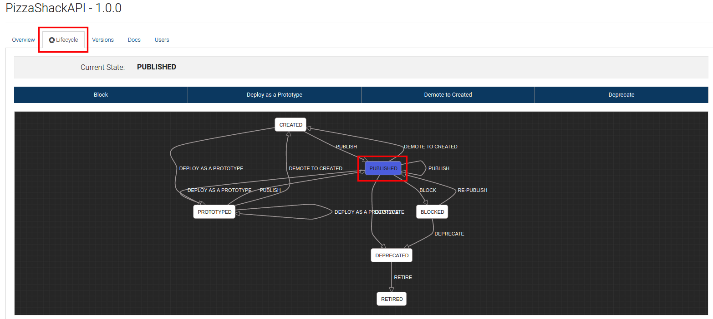
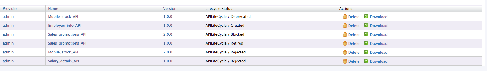

## API Lifecycle Management

### Usecase

* Ability to run full lifecycle API Management from the inception stage of an API until retirement

* Notification mechanisms for informing developers on API changes.

* App lifecycle management mechanisms in sync with API lifecycle management 

* Introduce and execute organization specific lifecycle states

### Business Story

API lifecycle on of the key factors in API development. API lifecycle has predefined states. Thes state represent the the stages that API has in the process of stating developing an API to the retirement of the API. Following is a diagram that describes the current states of the API lifecycle.

#### Current API lifecycle states

**PUBLISHED** : When the API is ready to be used for store users the API is in Published state

**CREATED**: When the API is the process of creating the API it is in CREATED state

**PROTOTYPED** : An **API prototype** is created for the purpose of early promotion and testing. You can deploy a new API or a new version of an existing API as a prototype. It gives subscribers an early implementation of the API that they can try out without a subscription

**BLOCKED**: When an API is temporally blocked its in BLOCKED state. Publisher can Publish the API from the BLOCKED state.

**DEPRECATED**: When a new API version is introduced and need to stop using the older version in future the old API is moved to DEPRECATED state.

**RETIRED**: When a specific API is no longer in use it will be moved to RETIRED state.

### Business Use Cases

As an example Let  say organisation ABC is a mobile phone manufacturing company which has the following requirements. 

ABC organisation need to get employee  salary details

ABC organisation need to get employee personal details

ABC organisation need to get get available Stock details

ABC organisation need to get produce sales_promotions

ABC organisation need to needs to stop offering promotions when they capture the market.

### How this Business Scenario can be achieved Using WSO2 API Manager ?

Need to have separate API’s for the following scenario 

* API to get employee Salary details in PUBLISHED state

* API to the is still not published which is in created state to get employee personal details in CREATED state

* Old API to get available Stock details in DEPRECATED STATE

* A New API version of the API which is to get available  Stock details PUBLISHED state

* API to produce sales_promotions which will be in PUBLISHED state and BLOCKED state when there are no promotions available.

* API developers must get notifications when a specific API is promoted to published state. This point is by subscribing to the lifecycle state change notification. How to subscribe will be explained below. 

To enable notification for new API versioning can be done according to this documentation [2]

For Change lifecycle State notifications

Login to carbon console (https://<hostname>:9443/carbon)

Select API media type

Select the API from the API list

Go to the API resource and add a subscription to CHange_LC_State

Now you will be getting notification for the api that you have subscribed. These two documentations explain how the notification can be configurable. [3, 4]. 

* API to produce sales_promotions will be in REJECTED state once the organization decides there will be no longer promotions available in future. (Since we need to represent the sales_promotions api in BLOCKING state as well, we are creating a new AP sales_promotions_2 to represent the REJECTED state)

### How to run the sample to populate the above mentioned sample data

1. Execute the run.sh in [APIM_HOME]/sample-scenarios/ directory, which will guide you to selectively populate the sample scenarios data according to the sample scenario number.

Following are the the screenshots after running the sample to create the API’S  in different states. 

List of all the API’s in different statesTwo Published and Blocked API’s in same API

### References

[1] -[https://docs.wso2.com/display/AM210/Customize+API+Life+Cycle](https://docs.wso2.com/display/AM210/Customize+API+Life+Cycle)

[2] - https://docs.wso2.com/display/AM210/Enabling+Notifications

[3] - https://wso2.com/library/articles/eventing-notifications-wso2-governance-registry/

[4] - [https://docs.wso2.com/display/Governance530/Adding+a+Subscription](https://docs.wso2.com/display/Governance530/Adding+a+Subscription)

