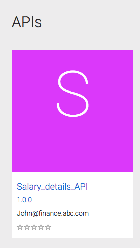
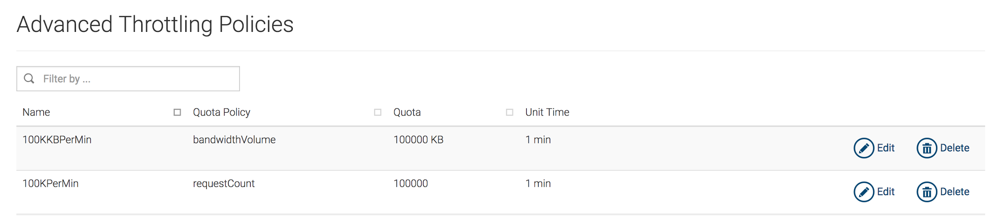

## API Governance

### Usecase

* Control and track the broader operational character of how APIs get exposed

* Manage and maintain policy characteristics such as metering, SLAs, availability and performance

* Different partners and developers specific policy management 

* People & persona driven governance models (who can do what when?)

* Dependency analysis. Track which services fuel which APIs and which APIs fuel which Apps.

### Business Story

* Let assume that there is an organization that need to get data related to their API usage. Then they need to give more traffic to the API’s that was accessed mostly and out of them they need to give more traffic to the a particular API’s particular resource. 

* Further let's assume this organization has a separate unit that needs to manage traffic management policies for their API’s separately.

* Further Let's assume there are users that need only to invoke the API’s and they are are not supposed to offer API developer capability. 

* Further let's assume they need to know how the services are consumed by the end users.

### Business Use Cases

* Let ABC company is a mobile phone manufacturing company. Assume they had a requirement to publish  mobile phone stock availability through an API and they need to give more traffic availability to this API’s getStock resource.

* Further they have a separate finance department which they need to allocate less traffic since this API is only accessed by the finance department.

* Further they have users that does not have privilege to develop the APIs and which only has writes to consume the API’s

* Further let's assume they need to monitor the API usage of the API’s which they can used to manage the traffic allocations that they have done the the API’s

### How this Business Scenario can be achieved Using WSO2 API Manager ?

* We need to place wso2am-analytics-2.2.0-updateX pack in the same location which is the wso2am-2.2.0-updateX is placed.

* We need custom advance throttling policies that can be engage to the API’s

* We need a separate tenant for the finance department and need custom advance throttling policies to that tenant as well

* We need two APIs, one for the super tenant which exposes the mobile phone prices and the other for the tenant created for the finance department which is a private API to get Salary details of the employees.

* We need to engage the new advance throttle policies for the newly created above two APIs.

* We need to create a user that does not have permission for the publisher.

* We need to invoke the APIs and check the analytics graphs to check the API usability statistics. 

Below are the screenshots that shows the OLD and New API’s with there lifecycle states.

Created API for super tenant

Created API for finance department

Engage advance throttle policy for the stock get request in super tenant

User tom can login to store

User tom can not login into publisher since it has been restricted

Advance throttle policy engaged to finance department

Added advance throttling policies in Admin app

 

#### After users starts invoking statistics will appear as follows in publisher

### How to run the sample to populate the above mentioned sample data

* Start wso2am-analytics-2.2.0-updateX distribution by executing [ANALYTICS_HOME]/bin/wso2server.sh or [ANALYTICS_HOME]/bin/wso2server.bat

* Start wso2am-2.2.0-updateX is distribution by executing [APIM_HOME]/bin/wso2server.sh or [APIM_HOME]/bin/wso2server.bat after starting the APIM analytics node.

* Run the file run.sh in sample scenarios root directory[APIM_HOME/sample-scenarios] as ./run.sh

#### User credentials needed for login to API Manager instance.

##### For Super tenant

Username: admin

Password: admin

For Store only user

Username: tom

Password: 123123

##### Finance department user

Username: [john@finance.abc.com](mailto:john@finance.abc.com)

Password: 123123

### References

https://wso2.com/library/articles/2016/09/article-generating-insights-with-wso2-api-manager-analytics/#apistore

